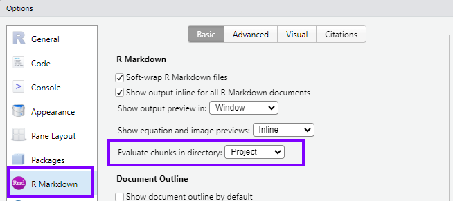
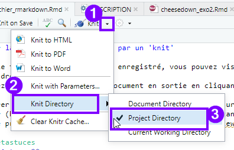

# Bien commencer {#get-started}

## Créer un projet sous Rstudio pour vous permettre de recenser vos travaux.

```{r collecte prez projet rstudio, warning=FALSE, echo=FALSE, results='asis'}
# Utilisation du chapitre de présentation des projets RStudio présent dans https://github.com/MTES-MCT/parcours-r
cat(text = stringi::stri_read_lines("https://raw.githubusercontent.com/MTES-MCT/parcours-r/master/parties_communes/bien_commencer.Rmd", encoding = "UTF-8"), sep = '\n')
```

### Spécificité du répertoire de travail d'un script Rmarkdown {#piege}

Attention, le répertoire par défaut d'un projet R n'est pas toujours celui utilisé par les fichiers Rmarkdown.

{#id .class width="200"}

C'est une subtilité parfois déconcertante avec les fichiers .Rmd.

#### Paramétrage global de Rstudio

Pour être tranquille, il est conseillé de paramétrer son logiciel RStudio, une fois pour toutes, au niveau des options globales (Menu Tools/Global Options/R Markdown)...



en y choisissant "Project" au niveau de "Evaluate chuncks in directory :"

Ce paramétrage est bien sûr à renouveler à chaque fois que vous (ré-)installez RStudio, et est à partager avec les collègues susceptibles d'exécuter votre travail.

#### Paramétrage fichier par fichier

Si besoin, on peut paramétrer le répertoire de travail fichier par fichier : 

#### Le Package `{here}`, une reproductibilité garantie

Pour s'assurer que tous les utilisateurs d'un script utilisent le répertoire du projet R comme répertoire de travail, quelque soit leur paramétrage, il est recommandé d'y utiliser le package [`{here}`](https://here.r-lib.org/index.html).

On applique sa fonction `here()` au chemin qui mène au fichier auquel on veut accéder, par exemple `here("chemin/vers/mes/donnes")` pour indiquer que l'on souhaite le faire démarrer au niveau de la racine du projet (c'est à dire au niveau du dossier qui contient le fichier .Rproj.)

{.class width="400"}

## Utilisation du package `{savoirfR}`

```{r collecte prez savoirfR, echo=FALSE, warning=FALSE, results='asis'}
# Utilisation du chapitre de présentation de savoirfR présent dans https://github.com/MTES-MCT/parcours-r
a <-  knitr::knit_child(text = stringi::stri_read_lines("https://raw.githubusercontent.com/MTES-MCT/parcours-r/master/parties_communes/savoir_faire.Rmd", encoding = "UTF-8"), quiet = TRUE)
cat(a, sep = '\n')
```

## Créer votre arborescence de projet

- Créer un répertoire `/src` où vous mettrez vos scripts R.

- Créer un répertoire `/figures` où vous mettrez vos illustrations issues de R.

## Activer les packages nécessaires

Commencez par rajouter un script dans le répertoire `/src` à votre projet qui commencera par :

- activez l'ensemble des packages nécessaires,

- chargez les données dont vous aurez besoin.

<!--# Mettre à jour la liste des packages après finalisation des exercices -->

```{r all_packages}


```

## Bien structurer ses projets data

Plusieurs documents peuvent vous inspirer sur la structuration de vos projets data par la suite.

En voici quelques uns :

- <https://www.inwt-statistics.com/read-blog/a-meaningful-file-structure-for-r-projects.html>
- <http://projecttemplate.net/architecture.html>

A partir du moment où quelques grands principes sont respectés (un répertoire pour les données brutes en lecture seule par exemple), le reste est surtout une question d'attirance plus forte pour l'une ou l'autre solution. L'important est de vous tenir ensuite à garder toujours la même structure dans vos projets afin de vous y retrouver plus simplement.
