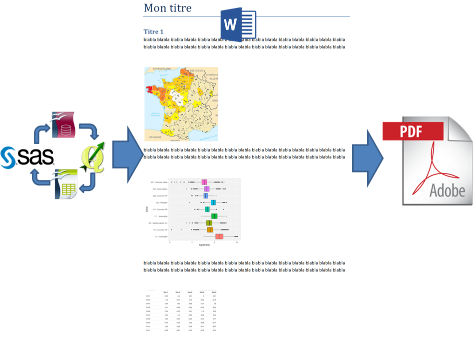
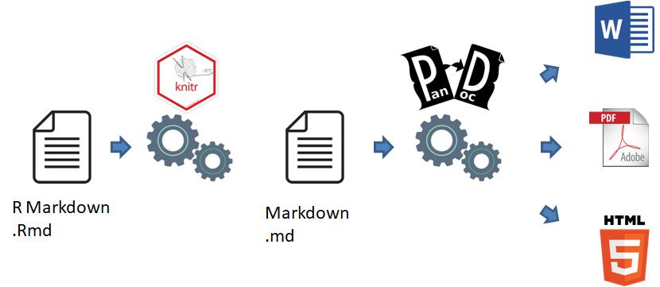

# La publication reproductible

## Définition

Le schéma classique pour produire un rapport ou une publication ressemble à ça :



Les données mobilisées proviennent de bases de données, de tables ou de SIG, et rien que pour les lire, il y a besoin de plusieurs logiciels selon les formats.

Les données sont ensuite nettoyées (valeurs manquantes ou aberrantes, recodages, discrétisation, renommages ...), puis traitées (sélection, agrégation, modélisation) et visualisées (tables, graphiques, cartes). Les éléments visuels sont insérés dans un traitement de texte qui sert aussi à la rédaction, et enfin la version diffusable est produite au format pdf.

Plusieurs inconvénients à cette chaîne d'opérations :

- Beaucoup d'opérations manuelles chronophages et sources potentielles d'erreurs.
- Si quelque chose change, il faut tout recommencer (mise à jour, adaptation à une autre zone géographique ou fenêtre temporelle).
- La publication finale n'est pas "reproductible" au sens où la traçabilité est insuffisante pour qu'un autre auteur, avec les mêmes données, arrive à la même publication $\Rightarrow$ la recherche d'erreurs est difficile et les passations délicates.
- Les contenus sont statiques, ce qui est peu attractif par rapport aux possibilités d'interactivité offertes par les technologies web.

Le fil conducteur de ce module est la production de A à Z d'un portrait de territoire, à partir de données variées, en travaillant entièrement dans RStudio au format R Markdown.

>On appelle ici "publication reproductible" un document élaboré à partir de données et dont tout le code est fourni. C'est la disponibilité du code qui rend l'analyse réplicable, indépendament de la qualité de la documentation qui peut être fournie. 

Travailler ainsi a pour avantages majeurs une plus grande facilité quand il s'agit de :

+ Rechercher d'éventuelles erreurs
+ Justifier précisément les analyses réalisées, les pré-traitements et autres choix méthodologiques
+ Mettre à jour la publication
+ Modifier le code par exemple pour l'adapter à unnouveau document
+ Partager une méthode

La transparence dans le traitement de l'information est importante en termes de crédibilité pour les institutions. [Selon Wikipedia](https://fr.wikipedia.org/wiki/Crise_de_la_reproductibilit%C3%A9),  qui parle de "crise de la reproductibilité", une part très importante des études publiées dans des revues prestigieuses ne sont pas réplicables.

Un MOOC intitulé "Recherche reproductible : principes méthodologiques pour une science transparente" est périodiquement proposé sur la [plateforme France Université Numérique](https://www.fun-mooc.fr/). Contrairement à ce que suggère son titre, des non-chercheurs peuvent tout à fait le suivre car ses principes sont pleinement applicables aux métiers qui font appel à la donnée en général. Tous les exercices peuvent être faits avec R et RStudio.

## Bonnes pratiques

On vise à assurer la continuité et la traçabilité coomplète de la chaîne de traitement depuis la donnée brute (fichiers sources fournis par les producteurs, millésimés) jusqu'au document final. Par exemple on ne supprime pas "à la main" des données qui sembleraient aberrantes.

Les choix méthodologiques sont documentés.

Travail est organisé en mode projet avec des fichiers localisés dans une arborescence classique avec archivage des millésimes des jeux de données mobilisés.

## Origine du format *R markdown*

```{r, echo = F, out.width='25%', fig.align='center', fig.cap=''}
knitr::include_graphics('images/rmarkdown.png')
```

Ce format de document a été introduit en 2012 à la sortie du package `knitr`.

Auparavant, il existait Markdown, un "langage de balisage léger", sorte d'intermédiaire entre du texte brut et du traitement de texte. La syntaxe de Markdown est très simplifiée. On peut le saisir avec un éditeur de texte comme *Notepad* et il est lisible même non formaté.

Pourquoi utiliser un langage de balisage léger ? Des avantages majeurs :

- Séparer le fond de la forme. On peut taper "au kilomètre" en se concentrant sur le contenu, et voir ensuite les questions de forme (y compris le format de sortie, HTML, PDF, traitements de texte, diaporamas, tableaux de bord, voire EPUB).
- Cette simplicité permet le suivi de version par des outils comme [Git](https://fr.wikipedia.org/wiki/Git).

Par contre, la simplicité signifie peu de fonctionnalités donc des sorties assez pauvres.

L'idée, avec R Markdown, était garder les avantages du langage existant Markdown mais en lui ajoutant des fonctionnalités d'interprétation de code R, intégré aux documents sous formes de `chunks`. En fait, les versions actuelles du package `knitr` permettent d'interpréter d'autres langages comme du $\LaTeX$ ou du code Python.

R Markdown est en quelque sorte un cadre pour travailler en data science. Un même document permet de sauvegarder et exécuter du code ainsi que de produire des rapports mis en forme pouvant contenir une grande diversité d'objets statiques ou dynamiques.


## Du .Rmd au format de sortie



On distingue deux étapes :

- La première, réalisée par le package knitr, interprète le document R Markdown et exécute les morceaux de code. Elle produit un fichier Markdown contenant le texte, le code et le résultat de l'exécution du code.
- Puis, le convertisseur de formats Pandoc se charge de produire le document de sortie au format choisi.

Ca peut paraître compliqué mais en pratique, chacune des fonctions `render` de `knitr` exécute la chaîne du début à la fin.


