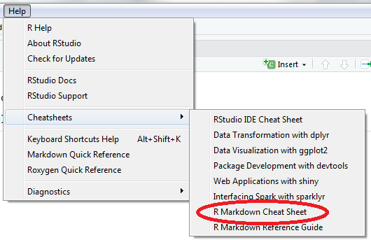
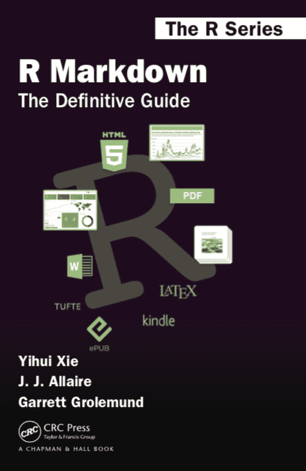
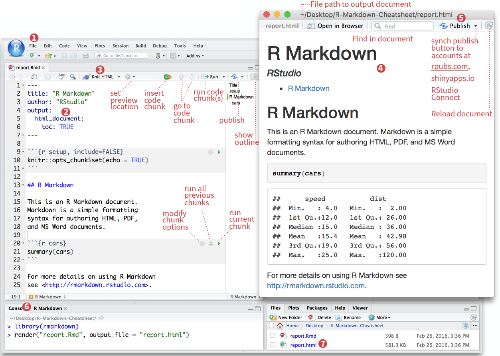
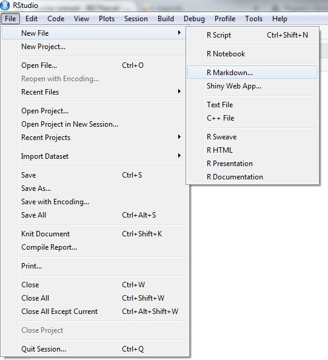
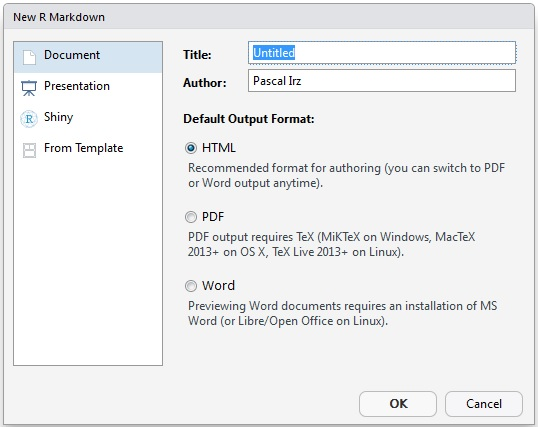
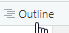
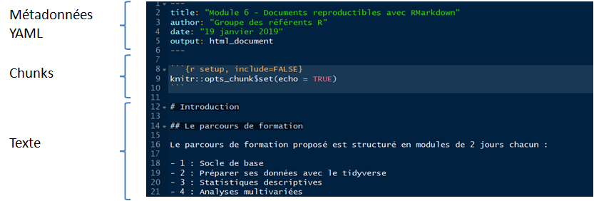
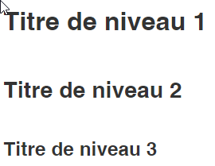
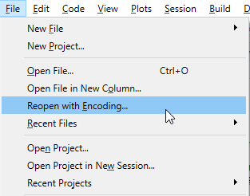
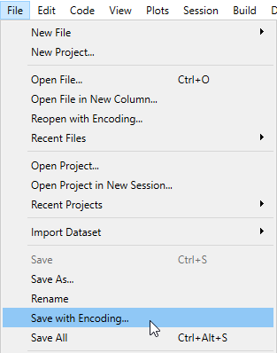

# Le fichier R Markdown

La logique et les principaux points à retenir sur Rmarkdown sont rassemblés dans la ["cheatsheet" Rmarkdown](https://rstudio.github.io/cheatsheets/rmarkdown.pdf).



:::: {style="display: flex; gap: 50px;"}

::: {}
[Le guide définitif de Rmarkdown](https://bookdown.org/yihui/rmarkdown/markdown-syntax.html) est un document très complet pour qui veut se lancer ou se perfectionner dans R markdown.

{.centered width="40%"}   

:::
    
::: {}

Le [livre de recettes Rmarkdown](https://bookdown.org/yihui/rmarkdown-cookbook/) prolonge le guide Rmarkdown. 
C'est un florilège d'exemples pratiques répondant à des besoins exprimés sur des forums.

{.centered width="30%"}

::: 
:::: 


## R Markdown dans RStudio

Pour utiliser R Markdown, il faut que le package `rmarkdown` soit installé :

```{r install2, eval = FALSE, warning = FALSE, error = FALSE}
install.packages ("rmarkdown")
library (rmarkdown)
```

Dans l'environnement de développement intégré RStudio de votre bureau, le développeur dispose d'outils qui simplifient la production d'un fichier R Markdown.



Le travail comprend généralement les étapes suivantes :

1.  Ouvrir un nouveau fichier .Rmd (pré-rempli avec des exemples ou vierge)
2.  Écrire des instructions de traitement des données
3.  Compléter le document en ajoutant du texte
4.  Adapter l'en-tête
5.  Lancer la génération du document
6.  Publier le document si besoin est

Le travail est généralement itératif et les étapes 2 à 4 peuvent être effectuées dans n'importe quel ordre.

### Créer un fichier .Rmd

On crée un nouveau fichier de type Rmarkdown en allant dans le menu File $\Rightarrow$ New file $\Rightarrow$ R Markdown...



Une pop-up s'ouvre alors pour donner quelques informations afin d'initialiser le fichier qui va être créé en remplissant quelques champs imposés ou fortement recommandés par le processus global.



Pour commencer simplement, on choisit un format de sortie HTML. 
C'est le format de sortie par défaut, très utilisé. 
D'autres types de sorties existent, elles seront détaillées pat la suite. 
RStudio crée un fichier contenant des exemples d'éléments structurant un fichier Rmarkdown. 
L'extension de ce type de fichier est `.Rmd`.

### Lancer la génération du document par un 'knit'

Une fois le fichier .Rmd complété et enregistré, vous pouvez visualiser la table des matières en cliquant sur l'icône  en haut à droite. 
Vous pouvez aussi prévisualiser le document en sortie en cliquant sur le bouton "Visual" qui donne accès au mode visuel de l'éditeur de fichier.  

Pour générer un document à partir du fichier .Rmd, on clique sur le bouton **knit**.  
Un fichier (html si vous avez choisi ce format de sortie) portant le même nom que le fichier.Rmd est alors créé dans le répertoire de travail (là où vous avez créé votre projet R), et le document généré s'ouvre dans le viewer de R Studio (ou dans une pop-up).

::: trucsetastuces
**Trucs & Astuces**

On peut générer le document en ligne de commande :

```         
rmarkdown::render(nom_fichier.Rmd)
```

ou grâce au raccourci [Ctrl + Shift + K]{.kbd}
:::


Le document produit contient l'ensemble des informations du fichier .Rmd, que cela soit le texte (mis en forme), la visualisation du code intégré (si celle-ci est demandée) et ce qui est produit par ce code.


## Les éléments d'un fichier .Rmd

Un fichier R Markdown est constitué de 3 éléments principaux.



L'**en-tête** contient les métadonnées pour guider la génération du document. Il est suivi du corps du futur document, constitué de **morceaux de code** (les *chunks*) à éxécuter et de partie de **textes** à afficher avec des éléments de mise en forme.

Dans les sections suivantes ces composants seront détaillés un par un.

### L'en-tête

L'en-tête s'écrit au format YAML c'est un [format](https://fr.wikipedia.org/wiki/YAML) ayant pour objectif de représenter des informations plus élaborées que le simple CSV en gardant cependant une lisibilité presque comparable.

L'en-tête est parfois appelé le Header ou le YAML. 
Il sert à définir des paramètres comme les informations basiques sur le document ainsi que des choix relatifs au format de sortie (PDF, HTML, DOCX, etc.).  
Il est délimité par deux séries de `---`.

::: trucsetastuces
**Trucs & Astuces**

Pour modifier l'en-tête, attention à bien respecter l'alignement des indentations. Ce sont elles qui indiquent la hiérarchie entre les éléments texte.
:::

C'est dans le YAML que vous allez définir notamment :

-   le titre (initialisé lors de la création du fichier)
-   les auteurs
-   la date de votre document (qui peut être fixe en texte ou appelée en R depuis l'horloge système)
-   le format de sortie (initialisé lors de la création du fichier)
-   des options
-   des paramètres.

````{verbatim}
---
title: "mon_premier_document"
author: "Moi"
date: "`r format(Sys.Date(), '%d %B %Y')`"
output: html_document
---
````

On peut rajouter plusieurs auteurs :

````{verbatim}
---
title: "mon_premier_document"
author: 
  - "Moi"
  - "Toi"
date: "`r format(Sys.Date(), '%d %B %Y')`"
output: html_document
---
````

On peut rajouter des options pour un output, ce qui sera vu en détail dans le paragraphe \@ref(outputs).

Il est possible de rajouter plusieurs types d'outputs :

````{verbatim}
---
title: "mon_premier_document"
author: 
  - "Moi"
  - "Toi"
date: "`r format(Sys.Date(), '%d %B %Y')`"
output: 
  pdf_document: default
  html_document:
    toc: true
    theme: flatly
---
````

::: exo
**Exercice 1**

-   Ouvrir Rstudio
-   Créer un fichier Rmarkdown, format html
-   prévisualiser le document avant toutes modifications
-   Mettez-vous en auteur du document
-   Rajouter un theme spécifique
-   Cliquer sur *knit* pour compiler le document et identifier les correspondances entre fichier .Rmd et fichier html
:::

### Les éléments texte

Le texte s'écrit en syntaxe Markdown, qui est en fait du PANDOC pour Markdown. Vous trouverez la documentation complète sur le PANDOC pour Markdown [ici](https://pandoc.org/MANUAL.html#pandocs-markdown).

::: trucsetastuces
**Trucs & Astuces**

De manière générale, il est préférable de laisser au moins une ligne blanche entre différentes éléments (par exemple entre un titre et le paragraphe).\
Cela évite toute confusion lors de la génération du document (tous les processus de génération n’interprètent pas exactement la même chose pour une même synthaxe).
:::

#### Le texte simple

Le texte simple est directement interprété sans besoin de balisage.

#### La mise en forme à la volée

Pour les *caractères en italique*, entourer de deux `*` ou deux `_` : `*caractères italiques*`.\

Pour les **caractères gras**, entourer de deux `**` ou deux `__` : `**caractères gras**`.\

Pour les ~indices~ et les ^exposants^, entourer des caractères `~indices~`ou `^exposants^` respectivement.\

Pour les ~~barrés~~, entourer des caractères `~~barrés~~`.\

Pour un style `code`, entourer des caractères `` `code` ``.\

Pour un bloc de code, entourer des caractères ```` ``` ```` ou on commence chaque ligne par au moins 4 espaces.

Pour forcer le retour à la ligne, terminer par un double espace ou un `\` ou sauter une ligne.

##### Les titres

Contrairement à la pratique en R, le `#` indique les titres. Par défaut, dans Rmarkdown, ils ne sont pas numérotés.

- `#` pour les titres de niveau 1     
- `##` pour les titres de niveau 2  
- `###` pour les titres de niveau 3  

Rend:



Si l'on souhaite qu'une section ne soit pas numérotée, par exemple pour l'introduction ou les annexes, il faut faire suivre son titre de {-}. Exemple : # Annexe A {-}.

##### Les listes

**Liste à puces**

Les listes à puces, sans ordre, commencent par `-` ou `*` ou `+`, en précédant la liste par une ligne vide. 
On peut créer des listes imbriquées en indentant la sous-liste.

```         
- Premier élément  
- Deuxième élément     
      - Sous-élément 1  
          - ezgtz  
          - aergtg  
      - Sous-élément 2  
```

Rend :

-   Premier élément\
-   Deuxième élément\
    -   Sous-élément 1\
        -   aaaa\
        -   bbbb\
    -   Sous-élément 2

**Liste numérotée**

```         
1. Premier élément  
2. Deuxième élément     
      1) Sous-élément 1  
          a- aaaa  
          b- bbbb  
      1) Sous-élément 2  
```

Rend :

1.  Premier élément\

2.  Deuxième élément

    1)  Sous-élément 1\
        a- aaaa  
        b- bbbb  

    1) Sous-élément 2
    
Notez qu'une erreur de numérotation sera automatiquement corrigée tant que l'indentation et le style de numérotation sont corrects. 


##### Les mentions

Les "mentions" ou citations sont pratiques pour mettre en valeur les éléments "à retenir".

```         
> Texte à mettre en mention
```

Rend :

> Texte à mettre en mention

##### Liens et notes de bas de page

Pour faire un **lien** vers un site internet, on met le texte affiché entre `[]` et l'adresse http entre `()`

`[Cliquer sur le lien](https://mtes-mct.github.io/parcours-r/)`

rend

[Cliquer sur le lien](https://mtes-mct.github.io/parcours-r/)


Pour faire des **liens internes**, on peut utiliser la même syntaxe, après avoir inséré une balise là où on souhaite rediriger le lecteur.

Exemple de placement de la balise :

`### Commentaires ? {#commentaires}`

Puis pour faire un lien dessus :

`[Aller au § Commentaires](#commentaires)`


La balise `\@ref(commentaires)` crée également un lien vers le paragraphe 'Commentaires', mais renvoie son numéro. 

| texte saisi | résultat après knit |
| ----------- | ------------------- |
| ` \@ref(commentaires) ` | \@ref(commentaires) | 


Les **notes de bas de page** s'écrivent à l'intérieur de `^[]`. 

`...pour approfondir^[on ajoute une note de bas de page]` rend '...pour approfondir^[on ajoute une note de bas de page]'.


#### Commentaires 

Pour mettre une partie du fichier en commentaires, non traitée, il
faut encadrer la partie par `<!-- commentaires -->`.

Pour cela on peut utiliser le raccourci clavier [Ctrl + Shift + C]{.kbd} ou
la commande dans le menu "Code".

## Insérer des images

La syntaxe la plus simple pour insérer une image est la suivante :

``

On peut adapter les dimensions de l'image :

`{ width=50% }`


::::: {.trucsetastuces}::::::    
**Trucs & Astuces**

NB : Pour définir les dimensions de l'image, les caractères 'espace' ne sont pas autorisés autour du signe
égal `=`, 
ni entre la parenthèse fermante et l'accolade ouvrante.
On a `){`.
:::::::::::::::::::::::::::::


On peut aussi utiliser la fonction `knitr::include_graphics` :

```{r}

```

Cette dernière méthode, préconisée quand le format de sortie n'est pas
du html, permet de mieux contrôler l'affichage de l'image.

Cela se fait à l'intérieur d'un chunk et ça, on le verra au chapitre \@ref(chunks)


## Encodage 

Pour le bon fonctionnement général, tous les fichiers R Markdown doivent être encodés en UTF-8, notamment pour les langages
présentant des caractères accentués (comme le français).

:::: {.blackbox data-latex=""}
::: {.center data-latex=""}
**Trucs & Astuces**
:::

  RStudio facilite la gestion de l'encodage des fichiers édités :
  
  - pour ouvrir un fichier avec l'encodage qui vous convient 
  
  Fichier $\Rightarrow$ Réouvrir avec encodage...
  

  
  - pour enregistrer un fichier au bon encodage 
  
  Fichier $\Rightarrow$ Sauvegarder avec l'encodage...
    


  Remarquez la case à cocher au niveau de la fenêtre de dialogue "Réouvrir avec encodage...",
  sélectionner UTF-8 et cocher l'option : "Définir comme encodage par défaut pour
  les fichiers sources", ce sera fait une fois pour toute.

::::

::: exo
**Exercice 2**

-   Partir du fichier .Rmd de l'exercice précédent
-   Saisir un titre, un paragraphe, une liste d'item, un encart et un lien
-   Appuyer sur `visual` pour avoir un aperçu du rendu final
:::
