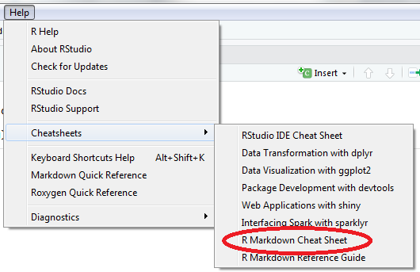
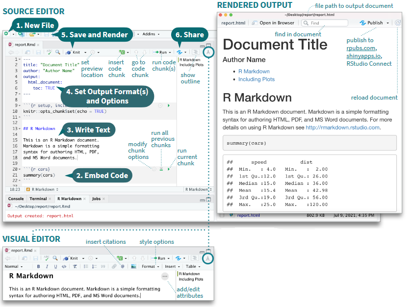
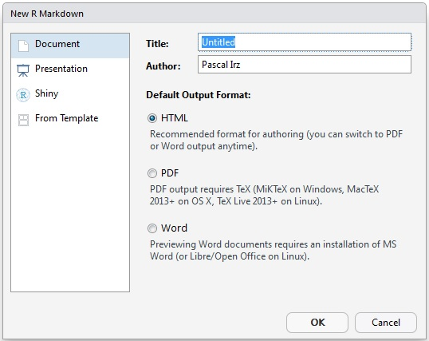

# Le fichier *R Markdown*

Ce chapitre n'a pas l'ambition de se substituer au [Le guide définitif de Rmarkdown](https://bookdown.org/yihui/rmarkdown/markdown-syntax.html) (un des auteurs, Yihui Xie, est le créateur du package `rmarkdown`) ou au [guide de référence](https://www.rstudio.com/wp-content/uploads/2015/03/rmarkdown-reference.pdf) mais peut faciliter à un certain nombre de lecteurs francophones l'approche et la compréhension du système de production de documents **R Markdown** car à notre connaissance ces guides n'ont pas encore été traduits.

{.centered width="30%"}

Au-delà de ces manuels de référence, certes complets mais imposants, il existe une [anti-sèche (cheatsheet) rmarkdown](https://raw.githubusercontent.com/rstudio/cheatsheets/main/rmarkdown.pdf) qui réussit en deux pages à synthétiser l'essentiel de ce qu'il faut savoir pour exploiter le système de production proposé au travers de RStudio. La formation proposée et le présent chapitre ont d'ailleurs pour principal objectif de permettre à tout un chacun de pouvoir complètement en tirer profit.

Le guide officiel (R Markdown Reference Guide) ainsi que l'antisèche (R Markdown Cheat Sheet) sont accessibles facilement depuis RStudio en passant par le menu Aide/Help.



## R markdown dans RStudio

Pour utiliser R Markdown, il faut que le package `rmarkdown` soit installé :

```{r install2, eval = FALSE, warning = FALSE, error = FALSE}
install.packages ("rmarkdown")
library (rmarkdown)
```

Dans l'environnement de développement intégré RStudio de votre bureau, le développeur dispose d'outils qui simplifient la production d'un fichier R Markdown.



Le travail comprend généralement les étapes suivantes, toutefois les étapes 2 à 4 peuvent se faire dans n'importe quel ordre :

1.  Ouvrir un nouveau fichier .Rmd (prérempli avec des exemples)
2.  Écrire des instructions de traitement des données
3.  Compléter le document en ajoutant du texte
4.  Adapter l'en-tête
5.  Lancer la génération du document
6.  Publier le document (cas particulier, facultatif)

### Créer un fichier .Rmd

> ASK: Début d'un TD (travail dirigé) ? --- LBn ANS: le mettre avant et inclure la modif de l'entete dans le TD 2 --- CCn ok!!!!!

On crée un nouveau fichier de type Rmarkdown en allant dans le menu File $\Rightarrow$ New file $\Rightarrow$ R Markdown


Une pop-up s'ouvre alors pour donner quelques informations afin d'initialiser le fichier qui va être créé en remplissant quelques champs imposés ou fortement recommandés par le processus global.



Pour commencer simplement, on choisit un format de sortie HTML. C'est le format de sortie par défaut, très utilisé (nous verrons les autres formats de sortie par la suite). RStudio crée un fichier contenant des exemples des éléments structurant un fichier R markdown. L'extension de ce type de fichier est `.Rmd`.

### Lancer la génération du document

Une fois le fichier .Rmd complété et enregistré, vous pouvez visualiser la table des matières en cliquant sur l'icône . Vous pouvez aussi prévisualiser le document en sortie en cliquant sur l'icône **compas** qui donne accès au "visual editor".

Pour générer un document à partir du fichier .Rmd, il suffit de cliquer sur le bouton **knit**. Un fichier (html si vous avez choisi ce format de sortie) portant le même nom que le fichier.Rmd est alors créé dans le repertoire de travail (là où vous avez créé votre projet R), et en même temps le document généré s'ouvre dans le viewer de R Studio (ou dans une pop-up).

::: trucsetastuces
**Trucs & Astuces**

On peut générer le document d'autres façons:

```         
rmarkdown::render(nom_fichier.Rmd)
```

ou grâce au raccourci [Ctrl + Shift + K]{.kbd}
:::

Ce document contient l'ensemble des informations du fichier .Rmd, que cela soit le texte (mis en forme), la visualisation du code intégré (si celle-ci est demandée) et ce qui est produit par ce code.

> ASK: Est ce qu'on met une image des icones? Est ce qu'on met une image du document généré par le fichier de base? cela permettrait que les stagiaires visualisent directement de quoi on parle OK --- CCn

## Les éléments d'un fichier .Rmd

Un fichier R Markdown est constitué de 3 éléments principaux.


L'**en-tête** contient les métadonnées pour guider la génération du document. Il est suivi du corps du futur document, constitué de **morceaux de code** (les *chunks*) à éxécuter et de partie de **textes** à afficher avec des élements de mise en forme.

Dans les sections suivantes ces composants seront détaillés un par un.

### L'en-tête

L'en-tête s'écrit au format YAML c'est un [format](https://fr.wikipedia.org/wiki/YAML) ayant pour objectif de représenter des informations plus élaborées que le simple CSV en gardant cependant une lisibilité presque comparable.

L'en-tête est parfois appelé le Header ou le YAML. Il sert à définir les paramètres de votre document comme les informations basiques sur le document ainsi que des choix relatifs au format de sortie (PDF, HTML, DOCX, etc.). Il est délimité par deux séries de `---`.

::: trucsetastuces
**Trucs & Astuces**

Pour modifier l'en-tête, attention à bien respecter l'alignement des indentations. Ce sont elles qui indiquent la hiérarchie entre les éléments texte.
:::

C'est dans le YAML que vous allez définir notamment :

-   le titre (initialisé lors de la création du fichier)
-   les auteurs
-   la date de votre document
-   le format de sortie (initialisé lors de la création du fichier)
-   des options
-   des paramètres.

``` md
title: "mon_premier_document"
author: "Moi"
date: "31/10/2022"
output: html_document
```

On peut rajouter plusieurs auteurs :

``` md
title: "mon_premier_document"
author: 
  - "Moi"
  - "Toi"
date: "31/10/2022"
output: html_document
```

On peut rajouter des options pour un output, ce qui sera vu en détail dans le paragraphe 1.3.1.

Il est possible de rajouter plusieurs outputs :

``` md
title: "mon_premier_document"
author: 
  - "Moi"
  - "Toi"
date: "31/10/2022"
output: 
  pdf_document: default
  html_document:
    toc: true
    theme: flatly
```

::: exo
**Exercice 1**

-   Ouvrir Rstudio
-   Créer un fichier markdown, format html
-   prévisualiser le document avant toutes modifications
-   Mettez-vous en auteur du document
-   Rajouter un theme spécifique
-   Cliquer sur *knit* pour compiler le document et identifier les correspondances entre fichier .Rmd et fichier html
:::

### Les éléments texte

Le texte s'écrit en syntaxe Markdown, qui est en fait du PANDOC pour Markdown. Vous trouverez la documentation complète sur le PANDOC pour Markdown [ici](https://pandoc.org/MANUAL.html#pandocs-markdown).

::: trucsetastuces
**Trucs & Astuces**

De manière générale, il est préférable de laisser au moins une ligne blanche entre différentes éléments (par exemple entre un titre et le paragraphe).\
Cela évite toute confusion lors de la génération du document (tous les processus de génération n'interpretent pas exactement la même chose pour une même synthaxe).
:::

#### Le texte simple

Le texte simple est directement interprété sans besoin de balisage.

#### La mise en forme à la volée

Pour les *caractères en italique*, entourer de deux `*` ou deux `_` : `*caractères italiques*`.\

Pour les **caractères gras**, entourer de deux `**` ou deux `__` : `**caractères gras**`.\

Pour les ~indices~ et les ^exposants^, entourer des caractères `~indices~`ou `^exposants^` respectivement.\

Pour les ~~barrés~~, entourer des caractères `~~barrés~~`.\

Pour un style `code`, entourer des caractères `` `code` ``.\

Pour un bloc de code, entourer des caractères ```` ``` ```` ou on commence chaque ligne par au moins 4 espaces.

Pour forcer le retour à la ligne, terminer par un double espace ou un `\` ou sauter une ligne.

##### Les titres

Contrairement à la pratique en R, le `#` indique les titres. Par défaut, dans Rmarkdown, ils ne sont pas numérotés.

-   `#` pour le Titre1
-   `##` pour le Titre2
-   `###` pour le Titre3
-   `####` pour le Titre4
-   `#####` pour le Titre5
-   `######` pour le Titre6

Rend:\


Pour une numérotation automatique des titres, tableaux, figures, cartes, équations, etc. il faut passer au package `bookdown` (voir partie suivante).

##### Les listes

**Liste à puces**

Les listes à puces, sans ordre, commencent par `-` ou `*` ou `+`, en précédant la liste par une ligne vide. On peut créer des listes imbriquées en indentant la sous-liste.

```         
- Premier élément  
- Deuxième élément     
      - Sous-élément 1  
          - ezgtz  
          - aergtg  
      - Sous-élément 2  
```

Rend :

-   Premier élément\
-   Deuxième élément\
    -   Sous-élément 1\
        -   aaaa\
        -   bbbb\
    -   Sous-élément 2

**Liste numérotée**

```         
1. Premier élément  
2. Deuxième élément     
      1) Sous-élément 1  
          a- aaaa  
          b- bbbb  
      ii) Sous-élément 2  
```

Rend :

1.  Premier élément\

2.  Deuxième élément

    1)  Sous-élément 1\
        a- aaaa\
        b- bbbb 

    <!-- -->

    ii) Sous-élément 2

##### Les mentions

Les "mentions" sont pratiques pour mettre en valeur les éléments "à retenir".

```         
> Texte à mettre en mention
```

Rend :

> Texte à mettre en mention

##### Liens et note de bas de page

Pour faire un lien vers un site internet, on met le texte affiché entre `[]` et l'adresse http entre `()`

`[Cliquer sur le lien](https://mtes-mct.github.io/parcours-r/)`

rend

[Cliquer sur le lien](https://mtes-mct.github.io/parcours-r/)

Les notes de bas de page s'écrivent à l'intérieur de `^[]`. `^[Ceci est une note de bas de page]` rend [^03_le_fichier_rmarkdown-1].

[^03_le_fichier_rmarkdown-1]: Ceci est une note de bas de page


#### Commentaires 

Pour mettre une partie du fichier en commentaires, non traitée, il
faut encadrer la partie par `<!-- commentaires -->`.

Pour cela on peut utiliser le raccourci clavier `Ctrl + Shift + C` ou
la commande dans le menu "Code".

## Insérer des images

La syntaxe la plus simple pour insérer une image est la suivante :

``

On peut adapter les dimensions de l'image :

`{ width=50% }`


::::: {.trucsetastuces}::::::    
**Trucs & Astuces**

NB : les caractères 'espace' ne sont pas autorisés autour du signe
égal `=`, 
ni entre la parenthèse fermante et l'accolade ouvrante.
On a `){`.
:::::::::::::::::::::::::::::


On peut aussi utiliser la fonction `knitr::include_graphics` :

```{r eval=TRUE}
knitr::include_graphics("assets/img/couleuvre.jpg")
```

Cette dernière méthode, préconisée quand le format de sortie n'est pas
du html, permet de mieux controller l'affichage de l'image.
Mais cela se fait à l'intérieur d'un chunck et ça, on le verra au chapitre suivant.

::: exo
**Exercice 2**

-   Partir du fichier .Rmd de l'exercice précédent
-   Créer un texte avec un titre, un paragraphe, une liste d'item, un encart et un lien
-   Appuyer sur `visual` pour avoir un aperçu du rendu final
:::
