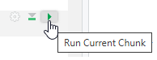
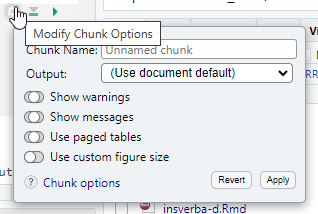

# Intégrer du code à exécuter dans les Rmd {#chunks}

## Les *chunks*

### La base

Les parties de code R sont contenues dans des blocs, appelés *chunks*.  
Lors de la compilation du Rmd, knitr va exécuter le code contenu dans ces blocs et 'tricoter' leurs résultats avec le texte saisi en dehors.

Ces chunks commencent et finissent par les balises ```` ``` ````. 

C'est dans les chunks que l'on insère le code R que l'on veut voir exécuté dans le rapport.

````{verbatim}
```{r cars, echo=FALSE}
summary(cars)   
```
````

On peut créer un nouveau chunk en cliquant sur le bouton :    

 ou grâce au raccourci clavier [Ctrl + Alt + I]{.kbd}. 


On peut contrôler le résultat du code en l'exécutant : 

- comme dans un script R, en sélectionnant les ligne(s) puis en utilisant le raccourci clavier [Ctrl + Entrée]{.kbd},  
- ou en utilisant le bouton en triangle vert, situé en haut à droite de chaque chunk 

RStudio contient d'autres boutons pour exécuter le code d'un fichier Rmd : ils sont placés dans le menu déroulant 'Run' en haut à droite. Ils sont rappelés dans le menu "Code" tout en haut, au niveau de l'entrée 'Run Region". 

Dans l'environnement de travail (cadran 'Global Environnement', situé en haut à droite généralement dans RStudio), on retrouve les objets créés par R lors des exécutions de chunks précédents.  
La commande 'Run All Chunks Above' que l'on peut déclencher en clic bouton ou avec le raccourci  [Alt + Ctrl + Maj + P]{.kbd} permet d'être certains de travailler sur les objets tels que créés précédemment par le programme. 
Lors du knit, R utilise au démarrage un environnement R vierge. 

### Le nom des chunks

Les chunks peuvent être nommés (avec des caractères alphanumériques minuscules et majuscules et des tirets `-`).  
Dans l'exemple précédent, le nom du chunk est 'cars'.  
Nommer les chunks est utile, principalement pour se repérer dans le document.  

Un chunk nommé "setup" a des propriétés spéciales. 
Il sera systématiquement exécuté avant les autres chunk du document, ça en fait le lieu tout indiqué pour placer les commandes de chargement des packages (`library(dplyr)`...) ou de lecture des données qui seront exploitées par la suite.
Il est généralement placé en début de document, en dessous de l’en-tête. 

### Les options des *chunks*

Au début de chaque chunk se trouve une accolade contenant la lettre r : elle indique à knitr que le code à exécuter est en langage R, cf \@ref(autres-langages).

C'est dans cette accolade, après la lettre r, que les options vont pouvoir être passées. 

Elles permettent de contrôler finement ce qui est produit par le chunk, pour choisir de faire apparaître, ou non, le code dans le rapport dynamique, ainsi que les résultats, ou encore pour définir la taille des plots.

Chaque chunk peut recevoir une ou des options. Voici quelques exemples utilisés fréquemment :

- `eval = TRUE` : Le chunk est exécuté.

- `include = FALSE` : Le code contenu dans le chunk est executé sans que soient affichés ni le code ni son résultat.  
Cela rend ses résultats utilisables par d'autres chunks.

- `echo = FALSE` : permet de ne pas afficher le code dans le rendu. En revanche, le résultat est affiché.

- `message = FALSE` : empêche l'affichage des messages d'information générés par le code.

- `warning = FALSE` : empêche l'affichage des messages d'alerte générés par le code.

- `error = FALSE` : bloque la compilation du document si une erreur est renvoyée.

- `fig.cap = "..."` : ajoute une légende (un 'caption') aux graphiques.

- `fig.align = "..."` : aligne les graphiques (choix : `left`, `right` ou `center`).

- `fig.height = 6, fig.width = 8` : permet de modifier les dimensions de la figure (en pouces).

Pour éviter de se rappeler de tout cela, les options les plus fréquentes sont paramétrables en clic/bouton depuis la roue crantée à côté du triangle vert d'exécution du chunk : 



Il y a plus de 50 options possibles pour un chunk, on trouve l'ensemble des possibilités [dans la documentation de `{knitr}`](https://yihui.org/knitr/options/), sur lequel `{Rmarkdown}` se base pour gérer les chunks.


Il est possible de définir globalement les options de chunks, pour éviter de les saisir à chaque fois, grâce à la fonction `knitr::opts_chunk$set()`. 
Elles s'appliqueront alors à chacun des chunks du document Rmd, sauf spécification contraire au niveau des options d'un chunk particulier.

````{verbatim}
```{r setup, include=FALSE}
knitr::opts_chunk$set(
  message = FALSE, 
  warning = FALSE
)
```
````


Dans cet exemple, on demande à ne pas faire apparaître les messages ou les warnings parfois générés lors de l'exécution de code, et qui viendraient polluer le rapport mis en forme.


### Intégrer des visualisations R 

A l'intérieur du chunk, de nombreuses choses peuvent être faites, comme traiter des données, produire une table, des graphiques ou du texte.

Pour cela, on utilise différentes fonctions R comme `plot` ou `kable` dans un chunk.

On peut par exemple produire un **graphique** : 
````{verbatim}
```{r, echo=FALSE}
plot(pressure)
```
````

ce qui affiche le graphique dans le document, directement après le chunk :

```{r, echo=FALSE}
plot(pressure)
```

Ou des **données** non mises en forme :

````{verbatim}
```{r, echo=FALSE}
summary(cars)
```
````


```{r, echo=FALSE}
summary(cars)
```

Ou des **tableaux** :

````{verbatim}
```{r, echo=FALSE}
knitr::kable(iris[1:5, ], caption = 'Le titre du tableau')
```
````

qui rend 

```{r, echo=FALSE}
knitr::kable(iris[1:5, ], caption = 'Le titre du tableau')
```


## Les insertions de code dans le texte : le code inline

Enfin, il est possible d'**insérer la valeur d'objets R** (variable, liste, résultat de calcul simple...) dans du texte. 
Pour cela il faut inclure l'objet R entre `` `r knitr::inline_expr("...code...")` ``. 
C'est très utile pour commenter des résultats sans saisir en "dur" des valeurs issues d'un calcul qui dépend de données d'entrée, susceptibles d'être modifiées. 

Par exemple le code suivant:

````{verbatim}
```{r, echo=FALSE}
numero <-  6  
```
Je suis actuellement en train de me former au module  `r numero`.
````


permet d'afficher dans le document :
```{r echo=FALSE, include=FALSE}
numero <- 6
```

Je suis actuellement en train de me former au module  `r numero`.


### Autres langages {#autres-langages}

Les portions de code d'un document .Rmd peuvent être formulées dans d'autres langages grâce au package knitr.

Le [guide Rmarkdown liste les langages possibles](https://bookdown.org/yihui/rmarkdown/language-engines.html) et présente comment les mobiliser. 

Pour retrouver cette liste : 
```r
names(knitr::knit_engines$get())
```

Pour utiliser un autre langage, on change l'appel entre accolades en haut du chunk, par exemple :
````{verbatim}
```{python}
x = 'hello, python world!'
print(x.split(' '))
```
````


Cela permet d'employer des langages faits pour l'interactivité évaluée côté client comme le JavaScript et s'affranchir d'un déploiement sur serveur R.

Attention, si le format Rmarkdown (fichier avec extension .Rmd) supporte d'autres langages, l'inverse n'est pas vrai.
Vous ne pourrez pas nativement ouvrir un fichier .Rmd dans votre console python par exemple.

Pour une cross compatibilité complète, il faudra utiliser le format Quarto (extension .qmd) qui sera présenté dans le chapitre \@ref(quarto).

#### Cas particulier du SQL
Pour utiliser du SQL, il faut impérativement ajouter un paramètre de connexion à l'aide d'une variable préalablement fixée dans un chunk R :

````{verbatim}
```{r, include = FALSE}
library(RPostgres)
library(DBI)

conn <- dbConnect(drv = Postgres(),
                  dbname = "ma_base", 
                  host = "adresse_serveur", 
                  port = "port", 
                  user = "utilisateur", 
                  password = "mdp")
```
````


````{verbatim}
```{sql connection=conn}
SELECT * FROM mon_schema.matable
```
````

Cette instruction renvoie le résultat de la requête SQL (les données sélectionnées).

Pour pouvoir stocker ce résultat afin de le mobiliser ultérieurement, il faut ajouter le nom de l'objet entre "" dans les options du chunk au niveau `output.var=` : 
````{verbatim}
```{sql, connection=conn, output.var="resultat"}
SELECT * FROM mon_schema.matable
```
````

Dans cet exemple, les données sélectionnées seront stockées dans `resultat`.


## Exercice 3
::: {.exo}
- Partir du fichier .Rmd de l'exercice précédent
- Définir des options générales
- Ajouter un chunk créant une table, qui sera traitée mais non affichée dans le document final
- Ajouter un chunk créant un graphique, qui sera traité et affiché dans le document final 
- Ajouter une image
- Générer le document
:::


