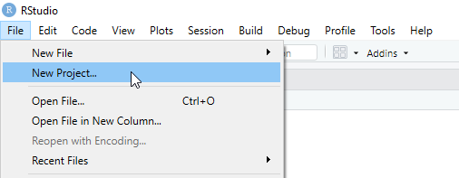
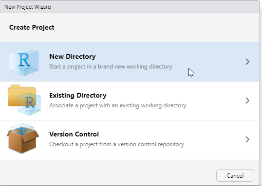
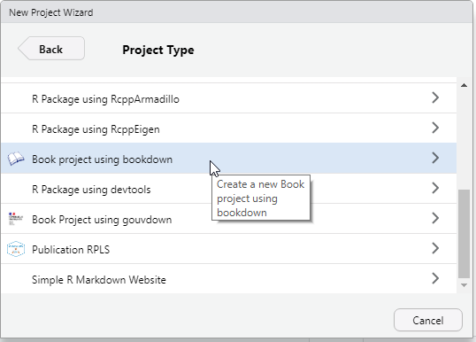
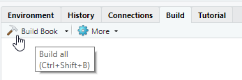
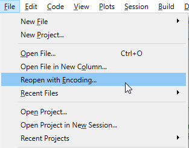
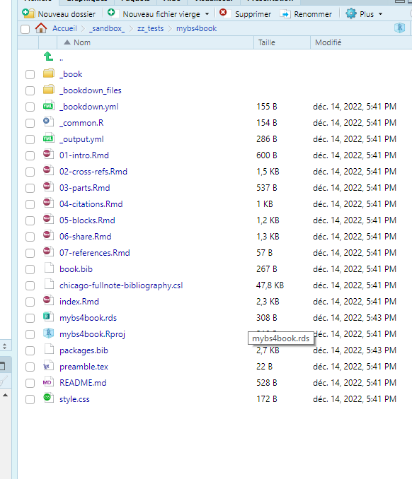

# Composer des livres, le package bookdown

Le paquet bookdown est construit sur les fondations données par R
Markdown <http://rmarkdown.rstudio.com>. Il s'appuie ainsi sur la
simplicité de la syntaxe Markdown aussi bien que sur l'éventail des
multiples formats de rendus possibles. 
Il apporte, quant à lui, un certain nombre de fonctionnalités complémentaires :
  - générer un ensemble HTML multipages, 
  - établir des liens internes de renvoi vers des illustrations, 
  des tableaux, des sections spécifiques du document ou encore des équations,
  - faciliter la gestion d'annexes.
Pour ne citer que les fonctionnalités par lesquelles l'extension bookdown 
enrichit significativement l'écosystème R Markdown.

En dépit du nommage du paquet qui contient explicitement le terme
'book' ('livre' en anglais), le paquet bookdown ne trouve pas sa seule
utilité dans la production de livres. Ou plutôt, le "livre" qu'il
produit peut-être vu comme l'agrégation d'un
ensemble de documents R Markdown destinés à être lus de manière
linéaire, tels qu'une compilation de cours, un rapport d'étude, un
manuel d'utilisation, une thèse ou même un journal.

Il faut cependant signaler l'esprit qui a conduit l'auteur Yihui Xie à
élaborer ce paquet : faciliter la
génération d'un livre sous de multiples formats, tout en restant
sobre, c'est-à-dire en essayant de ne couvrir que les fonctionnalités
communes à tous ces formats et en préservant la même syntaxe à travers
la sélection de formats retenus dans son projet : html, pdf, epub.

## Démarrer un projet de livre de la page blanche

Après cette présentation rapide du paquet bookdown, il est temps
d'aborder les aspects pratiques de son utilisation en essayant de
répondre à une première question : comment puis-je créer mon
premier livre avec bookdown ?

### Installer le package bookdown


```{r install, eval = FALSE, warning = FALSE, error = FALSE}
install.packages ("bookdown")
library (bookdown)
```


:::: {.blackbox data-latex=""}
::: {.center data-latex=""}
**Remarque**
:::

Il faudrait se mettre d'accord sur la manière de renvoyer vers 
les différentes méthodes d'installation.

::::

> ANS: Je suis d'accord. l'installation "de base" pourrait etre faite dans la 
1ere partie de la formation. 
Dans la 2eme partie nous allons installer TinyTex pour générer du PDF. On 
pourrait compléter cette partie et faire un renvoi.
> --- CCn

Pour un environnement avec un éventail de fonctionnalités aussi
complète que possible tel présenté et discuté dans les lignes qui
suivent il vous faudra installer aussi un distribution $ \LaTeX $.

Très grossièrement l'environnement $ \LaTeX $ est un des rares
produits libres à pouvoir générer du pdf. C'est un environnement qui
repose sur des concepts très soucieux du respect de conventions
typographiques. Ainsi, des commandes insérées dans le texte permettent
d'en dicter avec une précision extrême la répresentation finale, la
mise en forme pour impression.

Si vous ne souhaitez pas vous cassez la tête et si vous n'avez pas les
droits d'administration sur votre poste, procédez à l'installation de
la distribution `TinyTex` tout spécialement préparée pour cela par
l'auteur même du package `bookdown` Xie Yihui, d'autant qu'il l'a
rendue c'est extrêmement simple cette opération pour quiconque
pratique un peu de R} puisque tout se
passe justement dans sa console : 

```r
# Note : il faut avoir un windows au moins de version 10
install.packages('tinytex')
prop_inst_path <- file.path(Sys.getenv('LOCALAPPDATA'), 'TinyTex', fsep='\\')
create.dir(prop_inst_path)
tinytex::install_tintex(dir=prop_inst_path)
```

### Initialiser un modèle de livre

Il s'agit non pas de chercher l'entrée de menu correspondante dans
l'entrée `Fichier>Nouveau fichier` mais bien sous le chemin
`Fichier>Nouveau projet...`. En effet, à la différence des
manipulations qui ont été abordées précédemment dans ce guide, le
système bookdown est tout entier tourné vers la conversion d'un
ensemble de fichiers pour les assembler en une série logique
monolithique.

Il est donc intéressant de s'en rendre compte en utilisant les modèles
de démonstration mis à notre disposition par RStudio. En effet,
lorsque nous recourrons au menu de création d'un nouveau `bookdown`
ce n'est pas une structure vierge qui va être initialisée mais bien un
document modèle complètement fonctionnel. Il va être établi dans le
répertoire que nous aurons préalablement désigné.

### Générer le livre et le (re)lire

Pour créer un nouveau livre, il faut aller dans `Fichier>Nouveau projet...`. 



Une pop-up apparait nous demandant à partir de quoi créer ce nouveau projet. 
Comme nous souhaitons créer un livre à partir de rien alors on choisit 
`Nouveau Dossier`.


Apparait alors une selection de type de projet possible. Cette liste dépend 
des packages installés dans votre RStudio. Il faut selectionner 
`Book project using bookdown`.



Enfin, il faut spécifier une localisation dans 
notre espace de fichier et éventuellement de préciser un format (soit gitbook, 
soit bs4_book.


Nous avons alors à disposition un exemple de source
complètement fonctionnel. Mais ce ne sont que des sources, comme nos
fichiers `Rmarkdown` précédents, pour véritablement se rendre compte
du résultat final, il faut procéder à l'étape de rendu.

Ce qui nous amène à explorer plus avant les principes d'organisation
de RStudio en tant qu'interface. Si l'organisation initiale n'a pas
été trop bouleversée, le cadran haut-droit regroupe un certain nombre
d'onglets qui ont tous plus ou moins trait à l'environnement du projet
et à son pilotage. Il y réside notamment un onglet Build (Construire)
qui dans son menu propose un bouton avec une icône représentant un
marteau qui va nous permettre de lancer le rendu (la construction) de
l'ensemble de fichiers Rmarkdown. 



Par défaut le rendu sera sous une forme de "site
web" très en usage en ce qui concerne les manuels logiciels sur
Internet.

La construction de manière effective s'éxécute en appuyant sur le
bouton et, après le défilé d'un certain volume d'informations rendant
compte des différent traitements effectués, si tout se passe bien, une
fenêtre (navigateur web interne de RStudio) s'ouvre au
premier plan. Elle présente le rendu final et un bouton qui
permet d'ouvrir et d'explorer le rendu dans le navigateur web
configuré pour le système hôte.

Le document résultant de la phase de construction est pour le coup une
véritable vitrine qui présente et montre à l'oeuvre les principales
fonctionnalité de `bookdown`.

**3 pour le prix d'1 !** Si vous avez la curiosité d'explorer le
sous-répertoire `_book` du dossier projet, vous y trouverez aussi le
rendu sous forme d'un "livre" en pdf (format reconnu princpalement pour
sa portabilité en matière d'impression) et encore en epub (format
adapté pour la lecture notament sur liseuse mais plus généralement
pour tout écran portafif). 

### Se lancer dans l'écriture

À ce stade rien de plus simple, ni rien de bien différent de ce qui
a été vu précédemment: il s'agit d'éditer des fichiers R Markdown,
(extensions `.Rmd`).

Relancer la construction (compilation?) pour se rendre compte de
l'évolution du contenu.

Des chapitres en trop, ou des chapitres à rajouter ? Il suffit de 
supprimer ou de créer les fichiers `Rmarkdown` correspondant. 
Ils seront ordonnés automatiquement selon leur ordre
alphabétique, c'est pour cela que bien souvent vous trouverez des
fichiers numérotés `01-...`, `02-...` ce qui est une manière très
explicite de maîtriser l'ordre de composition du document général.

## Composer son livre quand la matière est déjà disponible

Un rapport bookdown contient de manière caractéristique plusieurs
chapitres et chacun de ces chapitres est un fichier R Markdown,
portant l'extension `.Rmd`. Ces fichiers R Markdown doivent débuter
**immédiatement après l'en-tête** par le titre du chapitre en utilisant le marquage
propre à un titre de premier niveau, par exemple : `# Titre du
chapitre`. Pour le bon fonctionnement général, tous les fichiers R
Markdown doivent être encodés en UTF-8, notamment pour les langages
présentant des caractères accentués (comme le français).


:::: {.blackbox data-latex=""}
::: {.center data-latex=""}
**Trucs & Astuces**
:::

  Sans être très féru de tout ce qui concerne l'encodage, vous
  trouverez un certain nombre de facilités dans RStudio:
  
  - pour ouvrir un fichier avec l'encodage qui vous convient 
  
  Fichier $\Rightarrow$ Réouvrir avec encodage...
  

  
  - pour enregistrer un fichier au bon encodage 
  
  Fichier $\Rightarrow$ Sauvegarder avec l'encodage...
    


  Concernant la première fonctionnalité "Réouvrir avec encodage...",
  dans la fenêtre de dialogue n'hésitez surtout pas à sélectionner
  UTF-8 et cocher l'option : "Définir comme encodage par défaut pour
  les fichiers sources", vous n'aurez ainsi quasiment plus de question
  à vous poser par la suite.

::::


### Illustration pratique d'une composition

#### Faire d'un ensemble une unité

Allons maintenant au-delà de l'interface RStudio et du système
relativement mécanique de ce que nous appelons le
clique-bouton. Non que le clique-bouton n'ait pas sa raison d'être,
mais parce que les contingeances auxquelles il est soumis nous brident,
pour l'instant encore, dans notre capacité d'exploration et d'analyse.

Pour se faire déconnetez votre souris de l'ordinateur, ou
désactivez-en le clavier tactile ... ... vous n'êtes évidemment pas
obligés d'en arriver jusqu'à cette extrémité, mais vous avez compris
l'idée. Il s'agit maintenant de communiquer en language
R.

Rappellons-nous que pour rendre (transformer) un fichier source R
Markdown en un format de consultation plus généraliste (odt, pdf,
docx, html ...), le package `rmarkdown` nous fournit la fonction
`rmarkdown::render()`. `bookdown` en offre une du même niveau : 
`bookdown::render_book()`.

La première prend logiquement comme paramètre d'entrée obligatoire un
fichier R Markdown (ou markdown tout simple, voire même simplement du
R), quand la seconde n'exige même pas d'information car par défaut elle
prendra le répertoire en cours pour tenter d'exploiter tous les
fichiers `.Rmd` disponibles afin d'en constituer un **livre**. Le
paramètre `input` permet toutefois un peu de souplesse en indiquant
plus spécifiquement quel répertoire `rendre` sans être forcément
obligé par avance de le définir comme répertoire de travail courant
(current working directory : `getwd`/`setwd`).

Travail dirigé : 

Objectif

Utiliser les 3 .Rmd vu précédemment pour expérimenter la composition
d'un book.

Prérequis


Etapes


#### Vous aviez promis des formats !


Nous espérons que l'expérimentation précédente vous aura
permis de vous rendre compte concrètement de ce qui fait une
distinction visible entre les packages `rmarkdown` et `bookdown`.

À ce stade, nous nous rendons manifestement compte que `bookdown`
satisfait un de ses premiers engagements c'est-à-dire : permettre de
constituer une unité offrant une lecture séquentielle (à
partir de plusieurs fichiers dans les coulisses).

Mais somme toute `bookdown` ne serait-il qu'un énième générateur de
site web statique ? 

Car enfin ce premier résultat ne détonne finalement
pas de ce que nous avons l'habitude de rencontrer maintenant sur le
net pour nous aider à comprendre le fonctionnement de tel ou tel
programme. D'ailleurs hors les couleurs retenues, fonctionnellement
cela ressemble assez aux usuels bouquets de présentation accompagnant
les packages alliés au tidyverse
[dplyr](https://dplyr.tidyverse.org/), 
[readr](https://readr.tidyverse.org/),
toutefois nous pourrons -- en y regardant bien -- voir au bas de la
page, généralement à droite, que ceux-ci ont été réalisés avec
`pkgdown`. La formule a tellement séduit que d'autres groupes
l'utilisent aussi comme rOpenSci avec son ensemble des paquets dont
entre autres
[dataspice](https://docs.ropensci.org/dataspice/).

Mais, dans l'histoire des recettes pour mettre en lumière de la
documentation le site <https://readthedocs.org/> a lui aussi ses
adeptes et nous y trouverons des vestiges d'initiatives fort
intéressantes comme 
[r-snippets](https://r-snippets.readthedocs.io/en/latest/) même si
elle ne semble plus maintenue.
Pourquoi parler de <https://readthedocs.org/> ? 
Parce que justement la lecture linéaire est ce qui construit la force
du système de présentation d'un nouvel outil en structurant
l'information dans une construction progressive. C'est le propre du
mode d'emploi et le système 
[sphinx](https://www.sphinx-doc.org/en/master/)
(en [python](https://www.python.org/)) 
duquel il readthedoc a tiré son inspiration semble avoir devancé un
peu l'avènement d'une compagnie qui a eu un certain succès pour la
mise en forme de documentations utilisateur https://www.gitbook.com/.
D'où le fameux nom `gitbook` rendant honeur à l'esthétique
particulière que fit émerger l'entreprise. D'ailleurs dans
l'extraordinaire base d'archive que constitue github avec laquelle
gitbook faisait la passerelle (mais qui ne sont pas structurellement
liées en tant qu'entreprises à notre connaissance) nous retrouvons une
[initiative](https://github.com/jbryer/Rgitbook)
pour exploiter directement les service gitbook depuis les sources d'un
package tout autant qu'il existe un 
[package](https://github.com/ropenscilabs/r2readthedocs/) 
pour produire de la documentation sur le modèle `readthedoc`.

Après cette petite digression, pour faire un tout petit zoom sur l'une
des nombreuses rivières qui alimentent la quête perpétuelle visant à
trouver le système de documentation parfait (S'il n'y en avait pas
?!), retrounons à la distinction que nous faisions entre `pkgdown` et
`bookdown`. En effet, nous appelions l'ensemble de pages web formées
par `pkgdown` un bouquet car les pages regroupées font sens ensemble
et la barre des menus vient même structurer cet ensemble par une
certaine codification, convention. Mais dans `bookdown`, il y a
vraiment un ordre, une progression, une linéarité.

Et mécaniquement cette linéarité peut s'apposer successivement sur un
ensemble de pages et forme naturellement un livre et c'est aussi cet
engagement que porte `bookdown`.

Dans la pratique, comment devons-nous poursuivre nos manipulations
pour obtenir un fichier pdf ?

Et bien simplement en passant option spécifiant que c'est le format
attendu.

```r
bookdown::render_book(output_format = 'bookdown::pdf_book')
```

à l'issu du traitement vous aurez un retour d'information vous
signalant que votre pdf est servi !

```
Output created: _book/_main.pdf
```

La valeur de retour de la fonction elle-même est d'ailleurs le chemin
complet vers le fichier créé.

Et si nous voulions générer plusieurs mode de document simultanément ?

```r
bookdown::render_book(output_format = c('bookdown::pdf_book','bookdown::gitbook'))
```


Laissez libre court à vos envies et explorez parmi les multiples
[modèles de sortie
proposés](https://pkgs.rstudio.com/bookdown/reference/index.html#book-output-formats) 
 soyez conscient de leur limite et des contraintes qu'ils imposeront 
 mais aussi posez-vous la question de ce que vous voulez vraiment
 faire :

  - les formats dits : *Book output format* qui justifient notre
    intérêt jusqu'ici parce qu'ils travaillent sur un ensemble de
    fichiers :
    - gitbook
    - pdf_book
    - epub_book
    - bs4_book 
    - bs4_book_theme
    - html_chapters 
    - html_book 
    - tufte_html_book
  - les formats dit : "Single document output formats" qui ne
    travaillent que sur un seul fichier .Rmd mais qui rétro-portent à
    `rmarkdown` certaines fonctionnalités comme les renvois internes :
    - html_document2
    - html_fragment2
    - html_notebook2
    - html_vignette2
    - ioslides_presentation2
    - slidy_presentation2
    - tufte_html2
    - pdf_document2
    - beamer_presentation2
    - tufte_handout2
    - tufte_book2
    - markdown_document2
    - context_document2
    - github_document2
    - odt_document2

    - powerpoint_presentation2
    - rtf_document2
    - word_document2


#### Maîtrise des méta-données

Si jusqu'ici vous vous êtes prétés au jeux des manipulations que nous
vous proposons, il n'aura pas échappé à votre oeil aguerri que la
gestion des métadonnées (titre, auteur, date) n'est pas si intuitive
que cela.

Confirmons-le par une petite manipulation.


TD


Dans les faits le dernier header yaml écrase les précédents.

Aussi, l'usage veux que le premier chapitre débute dans le fichier
index.Rmd, convention qui nous vient du monde du web, des serveurs et
de l'html, et que seul ce fichier comporte un header yaml.


### Organisation des sources d'un bookdown

Après avoir mis les mains dans le cambouis et constitué notre *book*,
notre livre ou notre rapport à la main, appelez-le comme il vous
convient, revenons à l'exemple standard pour démystifier les nombreux
fichiers nécessaires de prime abord et en comprendre l'utilité.

```r
bookdown::create_bs4_book('../mybs4book')
setwd('../mybs4book')
list.files()
bookdown::render_book(output_format = 'bookdown::bs4_book')
```


  - 17:41 01-intro.Rmd
  - 17:41 02-cross-refs.Rmd
  - 17:41 03-parts.Rmd
  - 17:41 04-citations.Rmd
  - 17:41 05-blocks.Rmd
  - 17:41 06-share.Rmd
  - 17:41 07-references.Rmd
  -  d17:43 _book
  - 17:41 book.bib
  -  d17:43 _bookdown_files
  - 17:41 _bookdown.yml
  - 17:41 chicago-fullnote-bibliography.csl
  - 17:41 _common.R
  - 17:41 index.Rmd
  - 17:43 mybs4book.rds
  - 17:41 mybs4book.Rproj
  - 17:41 _output.yml
  - 17:43 packages.bib
  - 17:41 preamble.tex
  - 17:41 README.md
  - 17:41 style.css




## Au-délà du fond s'attaquer aux goûts et couleurs


### Les "formats" de sorties


### Couleurs et polices de caractères, un style


### Un choix esthétique cadré


## Quelques options et détails techniques complémentaires 


### Options triées sur le volet


### Retour sur le fonctionnement global


## Etude d'un exemple bookdown : propre.rpls


### Exemple d'appropriation d'une publication Rpls


### Compréhension globale de l'architecture du paquet propre.rpl


## Focus sur l'envoi au photocopieur du livre ou comment imprime


## Bookdown, maintenant et au-delà


