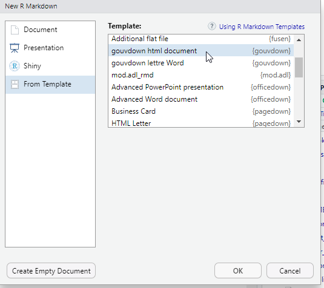

# Les formats de sortie {#outputs}

Lors de la création du fichier .Rmd, vous avez dû choisir le format de sortie par défaut du document qui sera généré. Ce choix se retrouve dans l'option `output`de l'en-tête.

Il est possible de modifier le format du document généré, soit en modifiant l'option de l'en-tête ou celle de la fonction knit (via la flèche vers le bas du bouton knit ou via les options de la ligne de code).

Il existe deux types de format dans le package `{rmarkdown}`: documents et présentations.

Tous les formats de sorties inclus dans le package `{rmarkdown}` sont listés ci-dessous:

- beamer_presentation
- context_document
- github_document
- html_document
- html_vignette
- ioslides_presentation
- latex_document
- md_document
- odt_document
- pdf_document
- powerpoint_presentation
- rtf_document
- slidy_presentation
- word_document

Chaque format a son propre lot d'options, qui sont documentées au niveau de la fonction associée (par exemple `?rmarkdown::html_document`).

Comme souvent avec R, il existe de nombreuses extensions qui complètent les possibilités offertes par `{rmarkdown}`. 
Elles sont listées sur <https://rmarkdown.rstudio.com/formats.html/> et, pour les plus connues d'entre elles, présentées dans le [guide Rmarkdown au niveaux des chapitres 5 à 10](https://bookdown.org/yihui/rmarkdown/dashboards.html).

::: trucsetastuces
**Trucs & Astuces**

Attention : quand on inclut du code R dans un document, il faut s'assurer de la compatibilité entre les visualisations produites et le(s) format(s) de document(s) choisi(s). 
Généralement, quand on perfectionne une visualisation pour un meilleur affichage au format HTML, on perd la possibilité de produire une sortie vers un autre type de format.
:::

Lorsqu'on fait appel à un package externe pour définir notre format de sortie, il est nécessaire de le préciser dans l'entête yaml, au niveau de `output:`.

Par exemple, pour utiliser le format 'html_gouv' du [package `{gouvdown}`](https://spyrales.github.io/gouvdown/) qui sert mettre les productions R à la marque Etat, voici ce qu'il faut indiquer :

``` yaml
---
output: gouvdown::html_gouv
---
```

La plupart des packages proposant des modèles de documents Rmd les rendent également accessibles en clic bouton depuis le menu File $\Rightarrow$ New file $\Rightarrow$ R Markdown...

\
Ces menus apparaissent une fois le package qui les contient installé.

Nous allons vous présenter les formats les plus utiles.

## HTML avec html_document

A l'origine, Markdown a été conçu pour générer du HTML, c'est ce format qui a le plus de possibilités parmi tous les formats. 
C'est aussi le plus compatible avec les différents packages R de production de visualisation.

Pour obtenir un document HTML basique, il faut mettre l'option `output:html_document` dans l'en-tête.

Voici les options utilisées fréquemment propres au format `html_document` :

- `toc: true` permet d'ajouter une table des matières (table of contents en anglais) à notre document.
- `toc_depth: 2` permet de définir le niveau de titre le plus bas à mettre dans la table des matières (par défaut 3).
- `toc_float: true` permet de rendre la table des matières flottante. Elle sera systématiquement visible, meme si on défile le document. Ce paramètre accepte des options.
- `number_sections : true` permet de numéroter les titres.
- `theme: flatly` permet de changer le thème du document (tiré de la librairie [Bootswatch](https://bootswatch.com/3/)).
- `fig_width : 7` et `fig_height : 5` permettent de définir par défaut la largeur et la hauteur des figures.
- `fig_caption : true` permet de définir que les figures contiennent une légende.
- `css: adresse/fichier/css` permet d'appliquer un css particulier au document HTML rendu (cf. [Personnaliser le css])
- `self_contained: TRUE/FALSE` pour générer ou non un fichier HTML autoportant (cf [Option self_contained])

L'ensemble des options est accessible depuis l'aide de la fonction rmarkdown::html_document (`?rmarkdown::html_document`)

``` yml
---
title: "mon_premier_document"
author: 
  - "Moi"
  - "Toi"
date: "31/10/2025"
output: 
  html_document:
    toc: true
    theme: flatly
---
```

### Personnaliser le css

L'un des avantages du format HTML est la possibilité d'appliquer un style personnalisé à l'aide d'un fichier CSS. 
Ces documents, qui servent à mettre en forme tous les éléments d'une page HTML par la définition de styles à appliquer, utilisent une syntaxe spécifique mais relativement simple :

- il faut cibler un élément de la page à partir de sa classe (pour styliser tous les éléments de ce type) ou de son identifiant (pour styliser uniquement cet élément là), on peut assigner une classe spécifique à un élément ;
- il faut spécifier le(s) paramètre(s) qu'on veut styliser (la police, la couleur, l'alignement, l'espacement, etc.) ;
- il faut fixer une valeur pour ce(s) paramètre(s) ;
- les paramètres sont rassemblés entre accolades, séparés de leurs valeurs par un double point, séparés entre eux par un point virgule.

Par exemple, si on veut que tous les titres de niveau H1 soient en gras rouge on écrira :

````{verbatim}
```{css, eval = F}

h1 {
  font_weight: bold;
  color: red;
}

```
````

Il est possible d'intégrer directement cette portion de css dans un chunk du document mais la bonne pratique est plutôt de créer un document à part (extension .css ou .scss, c'est une option proposée par Rstudio dans File \> New File) et de le référencer dans le yaml, en reprenant l'exemple précédent :

``` yml
--- 
title: "mon_premier_document"
author: 
  - "Moi"
  - "Toi"
date: "31/10/2022"
output: 
  html_document:
    toc: true
    theme: flatly
    css: "mon_style.css"
---
```

À noter : le style fixé par un chunk au sein du document l'emportera sur le style d'un fichier css à part qui l'emportera sur le style fixé par un thème qui l'emportera sur le style de base de l'objet. La dernière information de style lue prévaudra sur les précédentes.

De nombreuses ressources en ligne sont disponibles pour apprendre les bases du css, tous les paramètres qui peuvent être fixés et leurs modalités, par exemple [celles de la fondation Mozilla](https://developer.mozilla.org/fr/docs/Learn_web_development/Getting_started/Your_first_website/Styling_the_content#bases_de_la_syntaxe_css).

### Option self_contained

Par défaut, R Markdown génère des fichiers HTML auto-portants, sans dépendances externes. 
Tout est intégré dans le fichier .html : feuilles de style, librairies js, des images, graphiques, polices, vidéos... 
On peut ainsi partager ou publier le fichier comme un document bureautique, sans devoir l'accompagner d'un dossier "html_files" et on est certain de ce qui est restitué.\
Mais cela peut alourdir le document et freiner son affichage web.

Si on préfère conserver les dépendances dans des fichiers externes, pour faciliter l'affichage web, il faut spécifier `self_contained: false` dans les options de l'entête. 
Par exemple :

``` yaml
---
title: "mon_premier_document"
output:
  html_document:
    self_contained: false
---
```

Cela a par ailleurs l'avantage de placer les figures dans le dossier des dépendances du html et de pouvoir les mobiliser facilement dans d'autres contextes.

### Affichages sur plusieurs colonnes

Cela se fait très bien en format PDF, c'est plus compliqué en HTML. 
Vous pourrez avoir besoin de définir un document en plusieurs colonnes, avec par exemple une illustration sur une moitié de la page, un texte sur l'autre.

Pour cela vous aller devoir séparer vos colonnes dans des *"div"*.

Dans rmarkdown, des div commencent par `::: {}` et finissent par `:::`.

Pour ensuite que le document aligne ces blocs l'un à coté de l'autre, vous devrez utiliser la propriété css `display: flex;` dans une `div` englobante.

### Accessibilité visuelle des documents html produits

Certains choix peuvent fortement améliorer (ou dégrader) l'accessibilité pour les personnes porteuses d'un handicap visuel ou utilisant un lecteur d'écran. 
Voici les bonnes pratiques principales, adaptées aux html produits avec RMarkdown. 
Pour une présentation complète, se référer au [Référentiel général d’amélioration de l’accessibilité (RGAA).](https://www.numerique.gouv.fr/offre-accompagnement/reference-accessibilite-rgaa/) 

#### Structurer le document avec des titres hiérarchisés et intégrer une table des matières

Les lecteurs d'écran utilisent la structure du document pour naviguer.

1.  Utiliser les niveaux de titres Markdown (#, ##, ###)
2.  Respecter la hiérarchie (ne pas passer de # à ####)
3.  Eviter de simuler un titre avec du gras
4.  Ajouter une table des matière avec `toc: true` dans l'entête yaml.

Grâce à cela, on crée un plan du document et les lecteurs d'écran peuvent naviguer de titre en titre.

#### Mettre un nom de substitution aux images

Les images doivent avoir un texte alternatif (alt text).

```         

```

Conseils pour rédiger le texte alternatif : décrire le message principal et les tendances importantes.

#### Perception des couleurs

Veiller quand c'est possible, à ne pas transmettre d'informations uniquement par la couleur. 
Cela rendrait le document illisible pour les personnes atteinte de daltonisme ou ayant une faible perception des contrastes. 

Dans les graphiques R, il faut chercher à utiliser une palette de couleur en redondance avec les formes ou les annotations et choisir des palettes de couleurs accessibles, comme `viridis` :

```         
ggplot(data, aes(x, y, color = groupe, shape = groupe)) +
  geom_point() +
  scale_color_viridis_d()
```

#### Rendre les tableaux lisibles

Pour proposer des tableaux accessibles, on limite leur largeur et on utilise des entêtes claires.  
Si le tableau est complexe, il convient d'ajouter un titre et un texte explicatif.

## Sorties PDF

### Configuration préalable pour l'usage de pdf_document {#latex}

Pour générer des documents PDF avec `output: pdf_document`, il est nécessaire d'avoir installé LaTeX. 
LaTeX est un logiciel externe qui vient en complément de R pour produire des PDF. 
Si LaTeX n'est pas déjà installé par ailleurs, nous conseillons de passer par le package R [`{tinytex}`](https://yihui.name/tinytex/), qui guide l'utilisateur de R pour installer sur son ordinateur une distribution LaTeX légère, portable et facile à maintenir.

Le code suivant permet d'installer la package R `{tinytex}` :

``` r
install.packages('tinytex')
```

On installe ensuite la distribution LaTeX sur le PC avec la commande `install_tinytex()` de `{tinytex}`. 
On peut spécifier le dossier d'installation souhaité (choisir un dossier sur lequel on a les droits d'écriture :-) ) :

``` r
# Exemple de choix d'adresse pour l'installation sur un PC
install_path <- file.path(Sys.getenv('LOCALAPPDATA'), 'tinytex')
tinytex::install_tinytex(dir = install_path)
```

En cas de difficultés, il est parfois nécessaire d'indiquer à R où se trouve ce nouvel exécutable.[^05-outputs-1]

[^05-outputs-1]: Pour cela, il faut modifier le fichier de variables d'environnement de R (le fameux .Renviron) présent dans notre Home. (Au besoin `usethis::edit_r_environ()` permet d'éditer facilement ce fichier.) Il faut y ajouter les lignes de code suivantes : <br> `TINYTEX_HOME="${LOCALAPPDATA}\tinytex\bin\win32"` <br>`PATH="${TINYTEX_HOME};${PATH}"` <br>

### Spécificités du format pdf_document

Pour obtenir une conversion du Rmd en un document PDF, il faut mettre l'option `output:pdf_document` dans l'en-tête. 
Tous les paramètres de ce format de sortie sont accessibles depuis l'aide de la fonction rmarkdown::pdf_document (`?rmarkdown::pdf_document`)

Voici les options utilisées fréquemment:

- `toc: true` permet d'ajouter une table des matières (table of contents en anglais) à notre document.
- `toc_depth: 2` permet de définir le niveau de titre le plus bas à mettre dans la table des matières (par défaut 2).
- `number_sections : true` permet de numéroter les titres.
- `fig_width : 7` et `fig_height : 5` permettent de définir par défaut la largeur et la hauteur des figures (par défaut 6.5x4.5).
- `fig_caption : true` permettent de définir les figures contiennent une légende (par défaut `true`).

Il est important de noter qu'en LaTeX, les figures sont flottantes par défaut.

Même si on crée un graphique dans un bout de code présent sur la 1ère page, celui-ci peut finalement apparaître sur la page suivante. 
LaTeX a tendance à faire apparaître les figures au début ou à la fin des pages. 
Il est conseillé de ne traiter le positionnement des figures qu'à la fin du process, une fois la totalité du contenu écrite pour des ajustements pérennes.

Pour cela il faudra utiliser les options de positionnement dans les chunks (par exemple `fig.pos="h"`). 
Les [valeurs possibles pour `fig.pos`](https://www.overleaf.com/learn/latex/Positioning_images_and_tables#The_figure_environment) sont détaillées dans la documentation de LaTeX.

| fig.pos | effet |
|------------|------------------------------------------------------------|
| h | Place l'image au plus près possible de l'endroit où elle est définie dans le texte source. |
| t | Positionne en haut de page. |
| b | Positionne en bas de page. |
| p | Positionne sur une page spéciale dédiée aux figures. |
| ! | Remplace les paramètres par défaut LaTeX pour déterminer les « bonnes » positions. |
| H | Place l'image à l'endroit précis où elle est définie dans le Rmd source, équivalent à `h!`. |

Vous pouvez indiquer plusieurs valeurs dans le paramètre `fig.pos`. 
Par exemple, si vous indiquez `"ht"`, LaTeX tentera d'abord de positionner la figure à cet endroit. 
Si cela s'avère impossible (par exemple, faute d’espace suffisant), la figure apparaîtra en haut de la page. 
Il est recommandé d'utiliser plusieurs paramètres de positionnement afin d'éviter tout résultat inattendu.

::: trucsetastuces
**Trucs & Astuces** 
Si vous souhaitez accéder à plus d'options de mise en forme de tableau, le package `kableExtra` contient des fonctions compatibles avec les formats HTML et PDF.  Cependant cela reste compliqué de mettre en forme des tableaux complexes si vous souhaitez plusieurs formats en sortie. 
Nous vous conseillons d'adapter la mise en forme pour chaque format dans deux chunks distincts ou de trouver une nouvelle façon de représenter la donnée. 
Une autre option consiste dans un 2e temps à imprimer le html généré avec une imprimante PDF.
:::

### `{Pagedown}`


Le package [`{pagedown}`](https://pagedown.rbind.io/) avec sa fonction [`chrome_print()`](https://pagedown.rbind.io/#print-to-pdf) permet de produire un pdf à partir d'un Rmd conçu pour du html, sans besoin de LaTeX.

La fonction se repose sur le moteur d'impression du navigateur chrome :

- plus besoin de coder différemment les sorties visuelles selon le format (html ou PDF),
- plus besoin d'installer LaTeX (mais besoin de chrome ou chromium),
- et on conserve la mise en forme css lors du passage au format pdf !

Le package propose également un format de sortie html `pagedown::html_paged` qui facilite la pagination du document pdf imprimé.

``` yaml
---
output:
  pagedown::html_paged: 
    toc: true
    number_sections: false
---
```

Son fonctionnement est détaillé au niveau du chapitre [Pour aller plus loin sur Pagedown].

## Multiplier les formats de sorties

Lorsqu'on utilise des sorties de tableaux ou d'illustrations basiques, ou lorsqu'on on a pris soin de ne sélectionner que des instructions compatibles avec tous les formats de sortie, ou on peut multiplier les formats de sorties d'un même document R Markdown en empilant dans l'entête la liste des formats de sorties souhaités.

``` yaml
---
output: 
  gouvdown::html_gouv:
    toc:true
  pdf_document:
    toc:true
  odt_document: default
---
```

Pour comparer les options permises par chaque type de sorties, se référer à la [feuille de triche RMarkdown](https://opensource.posit.co/resources/cheatsheets/rmarkdown/rmarkdown.pdf), également accessible depuis le menu Help / Cheat Sheets / R Markdown Cheat Sheet qui comporte un comparatif.

## Exercice 4

```{r mod6_exo4, child=charge_exo("m6", "exo4.rmd"), echo=FALSE}
```
