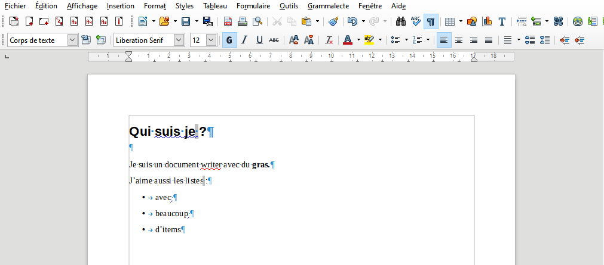
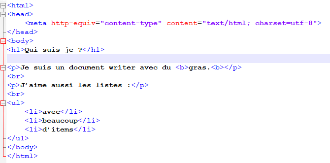

```{r, include=TRUE,echo=FALSE}
knitr::include_graphics("assets/img/rmarkdown/rmarkdownlogo.png",dpi = 100)
```


Formation publications reproductibles avec RMarkdown

1 - Introduction


Maël THEULIERE - Marouane ZELLOU


# Déroulé de l'atelier

- Markdown : un outil de balisage pour écrire des documents

- Rmarkdown : un outil pour mixer du markdown avec du code R

# Le problème

# Le problème


Un document word ou writer est un document lourd au format complexe, qui vous demande d'interagir avec une interface dédiée pour la mise en page.

Cette lourdeur entraine : 
- des risques sur la mise en page (empilement de formattage)
- des risques lorsque vous travaillez à plusieurs (je n'ai pas la même mise en page que toi)
- ne permet pas d'historiser proprement ce qu'on fait


```{r, include=TRUE,echo=FALSE}

```


# La solution

# HTML ?

# HTML


```{r, include=TRUE,echo=FALSE}
knitr::include_graphics("assets/img/rmarkdown/html_rendu.png")
```


```{r, include=TRUE,echo=FALSE}

```


# HTML

Le document html est complexe, le balisage rend compliqué la lecture du document source.

# La solution ?

# markdown


markdown est un langage de balisage 
- éditable en fichier texte
- compréhensible par l'être humain 
- permettant la mise en page rapide du texte


```md
# qui suis je ?

Je suis un document writer avec du **gras**.

J’aime aussi les listes :

- avec
- beaucoup
- d'items
```


# qui suis je ?

Je suis un document writer avec du **gras**.

J’aime aussi les listes :

- avec
- beaucoup
- d'items


# Et bientôt...
## Vous saurez faire...


# Des rapports


```{r, echo=FALSE}
knitr::include_graphics("assets/img/rmarkdown/rapport.png")
```


# Des livres


```{r, echo=FALSE}
knitr::include_graphics("assets/img/rmarkdown/bookdown.png")
```


# Des diaporama


```{r, echo=FALSE}
knitr::include_graphics("assets/img/rmarkdown/diapo.png")
```


# Des sites web


```{r, echo=FALSE}
knitr::include_graphics("assets/img/rmarkdown/website.png")
```


<!-- ## Juste -->

<!-- ## avec -->

<!-- ## markdown -->

<!-- ## Les bases du markdown -->


<!-- ```md -->
<!-- de *l'italique* -->

<!-- du **gras** -->

<!-- de ***l'italique gras*** -->
<!-- ``` -->


<!-- de *l'italique* -->

<!-- du **gras** -->

<!-- de ***l'italique gras*** -->


<!-- ```md -->
<!-- # un titre 1 -->

<!-- ## un titre 2 -->

<!-- ### un titre 3 -->
<!-- ``` -->


<!-- # un titre 1 -->

<!-- ## un titre 2 -->

<!-- ### un titre 3 -->


<!-- ```md -->
<!-- Une liste avec :  -->

<!-- - un item -->
<!-- - un autre item -->
<!-- - un dernier item -->
<!-- ``` -->


<!-- Une liste avec :  -->

<!-- - un item -->
<!-- - un autre item -->
<!-- - un dernier item -->


<!-- - ### Ouvrir Rstudio -->
<!-- - ### Créer un ficher markdown -->
<!-- - ### Créer un texte avec un titre, un paragraphe, une liste d'item -->
<!-- - ### Appuyer sur `preview` -->


<!-- ```{r, echo=FALSE} -->
<!-- knitr::include_graphics("assets/img/rmarkdown/exo_md.png", dpi=150) -->
<!-- ``` -->


<!-- # Aller plus loin sur le formatage markdown -->


<!-- ```md -->
<!-- Une liste avec :  -->

<!-- 1.  un item -->
<!-- 2. un autre item -->
<!-- 3. un dernier item -->
<!-- ``` -->


<!-- Une liste avec :  -->

<!-- 1.  un item -->
<!-- 2. un autre item -->
<!-- 3. un dernier item -->


<!-- ```md -->
<!-- Une liste avec :  -->

<!-- 1.  un item -->
<!-- 2. un autre item -->
<!--   - avec un sous item -->
<!--   - et un autre sous item -->
<!-- 3. un dernier item -->
<!-- ``` -->


<!-- Une liste avec :  -->

<!-- 1.  un item -->
<!-- 2. un autre item -->
<!--   - avec un sous item -->
<!--   - et un autre sous item -->
<!-- 3. un dernier item -->


<!-- ```md -->
<!-- [Ceci](https://fr.wikipedia.org/)  -->
<!-- est un lien vers wikipedia. -->
<!-- ``` -->


<!-- [Ceci](https://fr.wikipedia.org/)  -->
<!-- est un lien vers wikipedia. -->


<!-- ```md -->
<!--  -->

<!-- ``` -->


Crédits : [Kevin Pluck](https://www.flickr.com/photos/27109510@N00), [Creative Commons(https://en.wikipedia.org/wiki/fr:Creative_Commons) [Attribution 2.0 Générique](https://creativecommons.org/licenses/by/2.0/deed.fr)
]

<!-- - ### Reprendre votre texte précédent -->
<!-- - ### Rajouter une image en dessous du titre principal -->
<!-- - ### Rajouter à la fin un lien en savoir plus vers le site de votre choix. -->


## Rmarkdown

```{r, echo=FALSE}
knitr::include_graphics("assets/img/rmarkdown/rmarkdownlogo.png", dpi=200)
```

## Rmarkdown

- Ecrire du texte en markdown
- Intégrer des tableaux et dataviz fait en R
- Pour produire toute sorte de documents : 

  - diaporama
  - publications
  - sites web


```{r, echo=FALSE}

```


<br>
<br>
=>


```{r, echo=FALSE}

```

## Decripter un fichier Rmarkdown

```{r, echo=FALSE}
knitr::include_graphics("assets/img/rmarkdown/comprendre_rmd.png")
```

## Decripter un fichier Rmarkdown

```{r, echo=FALSE}

```

## Decripter un fichier Rmarkdown

```{r, echo=FALSE}

```

## Decripter un fichier Rmarkdown

```{r, echo=FALSE}
knitr::include_graphics("assets/img/rmarkdown/comprendre_rmd_code_R_md_yaml.png")
```

## Decripter un fichier Rmarkdown

```{r, echo=FALSE}
knitr::include_graphics("assets/img/rmarkdown/comprendre_rmd_code_R_md_yaml_knit.png")
```

## Le YAML sert à définir les paramètres de votre document


C'est dans le YAML que vous aller définir : 

- les auteurs
- la date de votre document
- le format de sortie.


```{r, echo=FALSE}

```


<!-- ## Le YAML sert à définir les paramètres de votre document -->

<!-- ```md -->
<!-- author: "Marouane ZELLOU" -->
<!-- date: "22/03/2021" -->
<!-- output: html_document -->

<!-- ## Le YAML sert à définir les paramètres de votre document -->

<!-- On peut rajouter plusieurs auteurs :  -->

<!-- ```md -->
<!-- author:  -->
<!--   - "Maël THEULIERE" -->
<!--   - "Maël THEULIERE" -->
<!-- date: "22/03/2021" -->
<!-- output: html_document -->
<!-- ## Le YAML sert à définir les paramètres de votre document -->

<!-- On peut rajouter des options pour un output :  -->

<!-- ```md -->
<!-- author:  -->
<!--   - "Maël THEULIERE" -->
<!--   - "Marouane ZELLOU" -->
<!-- date: "22/03/2021" -->
<!-- output:  -->
<!--   html_document: -->
<!--     toc: true -->
<!--     theme: flatly -->
<!-- ``` -->


<!-- - `toc: true` permet de rajouter un sommaire à notre document. -->
<!-- - `theme: flatly` permet de changer le thème du document. -->

<!-- ## Le YAML sert à définir les paramètres de votre document -->

<!-- On peut rajouter plusieurs outputs :  -->

<!-- ```md -->
<!-- author:  -->
<!--   - "Maël THEULIERE" -->
<!--   - "Marouane ZELLOU" -->
<!-- date: "22/03/2021" -->
<!-- output:  -->
<!--   pdf_document: default -->
<!--   html_document: -->
<!--     toc: true -->
<!--     theme: flatly -->


<!-- - ### Créer un document rmarkdown html -->
<!-- - ### Mettez vous en auteur du document -->
<!-- - ### Rajouter un theme spécifique -->
<!-- - ### Chercher dans l'aide comment obtenir des titres numérotés -->
<!-- - ### Cliquer sur *knit* pour compiler le document -->
<!-- # Le code R s'insère dans des chunks -->


<!-- C'est dans les chunks que vous pouvoir insérer le code R que vous voulez voir exécuter.  -->
<!-- Chaque chunk doit être nommé, et peut recevoir des options qui permettent par exemple :  -->

<!-- - d'afficher ou non le code (`echo`) -->
<!-- - de lancer ou non la commande rentrée (`eval`) -->
<!-- - d'afficher ou non le résultat du code (`include`) -->
<!-- - de modifier la largeur ou la hauteur d'une figure (`fig.width` et `fig.height`) -->

<!-- Les chunks sont gérés dans `{Rmarkdown}` par `{knitr}`. Il y a plus de 50 options possibles pour un chunk, vous pouvez trouver l'ensemble de la documentation [ici](https://yihui.org/knitr/options/). -->


```{r, echo=FALSE}

```


<!-- Vous pouvez aussi affecter des valeurs par défaut à l'ensemble de vos chunks avec la fonction `knitr::opts_chunk$set()` à intégrer dans votre premier chunk :  -->

<!-- ````md -->
<!-- ```{r, include=FALSE}`r ''` -->
<!-- knitr::opts_chunk$set( -->
<!--   echo = FALSE,  -->
<!--   eval=TRUE,  -->
<!--   include=TRUE,  -->
<!--   fig.width = 6 -->
<!-- ) -->
<!-- ``` -->
<!-- ```` -->


```{r, echo=FALSE}

```


Partout ailleurs, le texte va pouvoir s'écrire avec la syntaxe *markdown*.

Vous pouvez dans le texte insérer du code R avec la syntaxe `` `r ` ``. 

Par exemple je peux écrire :

2 et 2 font `` `r  knitr::inline_expr('2+2')` ``

Et cela s'affichera comme cela : 

2 et 2 font `r 2+2` 


```{r, echo=FALSE}
knitr::include_graphics("assets/img/rmarkdown/comprendre_rmd_md.png")
```


<!-- Vous aurez besoin souvent de pouvoir par exemple définir un document en plusieurs colonne, avec par exemple une illustration sur une moitiée de la page, un texte sur l'autre. -->

<!-- Pour cela vous aller devoir séparer vos deux blocs dans des *"div"*. -->

<!-- Dans rmarkdown, des div commencent par `::: {}` et finissent par `:::`. Pour ensuite que le document aligne ces blocs l'un à coté de l'autre, vous devrez utiliser la propriété css `display: flex;` dans une `div` englobante. -->


````md
# Le mapping

## Les paramètres du mapping

:::: {style="display: flex;"}

::: {}
Dans l'exemple qui suit, la représentation géographique utilisée est le nuage de points **geom_point()**.
D'autres types de représentations géographiques sont présentés dans la partie suivante.

L'aesthetic sert à identifier les variables que l'on souhaite représenter.
Par exemple, si l'on souhaite représenter la longueur de la nageoire en fonction du poids des pingouins :
:::
::: {}

```{r, fig.height=3.5}`r ''`
library(ggplot2)
library(palmerpenguins)
ggplot(data = penguins) +
  geom_point(aes(x = flipper_length_mm, y = body_mass_g))
```
:::
````


# A vous de jouer `r emo::ji("pen")` 

## Insérer un exercice
