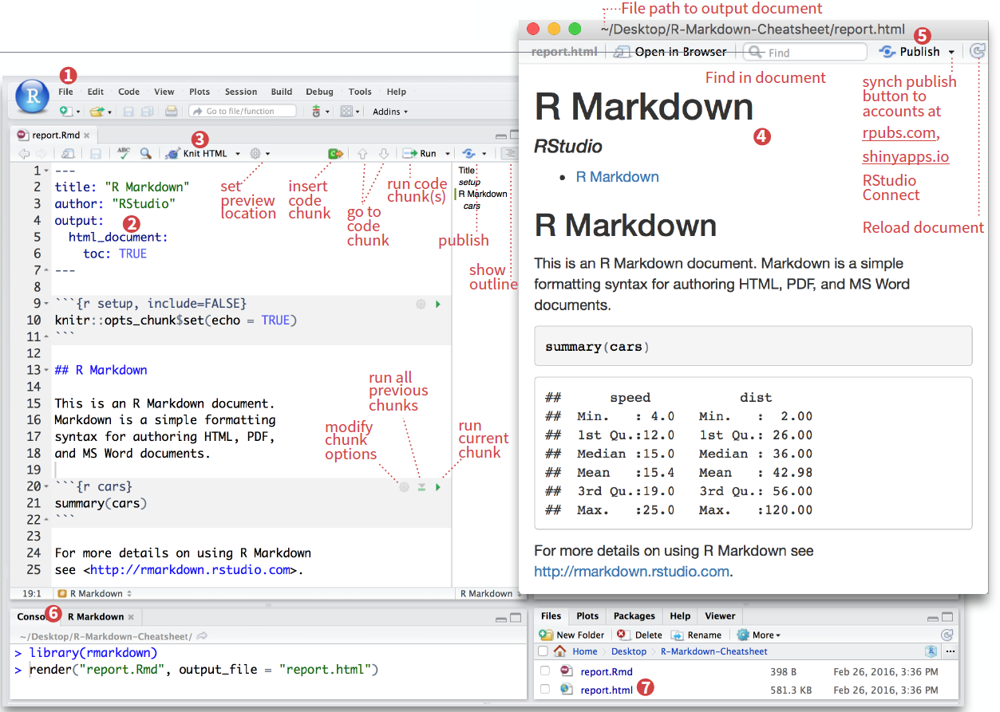
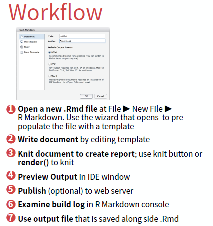
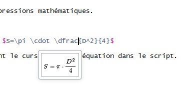

# Le fichier *R Markdown*

La "cheatsheet" rmarkdown est uen aide précieuse pour débuter. Elle est accessible [sur le site de RStudio](https://github.com/rstudio/cheatsheets/raw/master/rmarkdown-2.0.pdf) ou directement depuis RStudio :


## Créer un fichier

Pour utiliser R Markdown, il faut que le package `rmarkdown` soit installé :

```{r install, eval = FALSE, warning = FALSE, error = FALSE}
install.packages ("rmarkdown")
library (rmarkdown)
```

Ensuite :


Puis :


Pour commencer simple, on choisit un format de sortie HTML.
L'extension de ce type de fichier est `.Rmd`.

## Rmarkdown dans RStudio

Un fichier R Markdown est constitué de 3 éléments principaux.


L'en-tête, au format YAML, contient des métadonnées basiques sur le document ainsi que des choix relatifs au format de sortie (PDF, HTML, DOCX, etc.). Il est délimité par deux séries de `---`.

Quand on passe par le menu File $\Rightarrow$ New file $\Rightarrow$ R Markdown, RStudio crée l'en-tête YAML.

> Pour modifier l'en-tête, attention à bien respecter l'alignement des indentations. Ce sont elles qui indiquent la hiérarchie entre les éléments texte.

L'en-tête est suivi du corps du document constitué de morceaux de code (les *chunks*), de texte et d'élements de mise en forme.

Dans l'IDE RStudio, le développeur dispose d'outils qui simplifient la production du fichier R Markdown (**si possible images à reprendre et à traduire**. Source : rmarkdown cheatsheet de 02/2016).



Le travail comprend les étapes suivantes :




## Les éléments d'un fichier .Rmd

### Les éléments texte

Les bases du langage sont très bien expliquées dans cet ouvrage :


Yihui Xie est le créateur du package `rmarkdown`.

#### Le texte simple

Le texte simple est directement interprété sans besoin de balisage.

#### La mise en forme à la volée

Pour les *caractères en italique*, entourer de deux `*` ou deux `_` : `*caractères italiques*`.  
Pour les **caractères gras**, entourer de deux `**` ou deux `__` : `**caractères gras**`.  
Pour les ~indices~ et les ^exposants^, entourer des caractères `~`ou `^` respectivement.  
Pour les ~~barrés~~, entourer des caractères `~~`.  

Pour forcer le retour à la ligne, terminer par un double espace ou sauter une ligne.

#### Les listes

**Liste à puces**

```
+ Premier élément  
+ Deuxième élément     
      - Sous-élément 1  
          - ezgtz  
          - aergtg  
      - Sous-élément 2  

```

Rend :

+ Premier élément  
+ Deuxième élément     
      - Sous-élément 1  
          - ezgtz  
          - aergtg  
      - Sous-élément 2  

**Liste numérotée**

```
1. Premier élément  
2. Deuxième élément     
      i) Sous-élément 1  
          a. ezgtz  
          b. aergtg  
      ii) Sous-élément 2  

```

Rend :

1. Premier élément  
2. Deuxième élément     
      i) Sous-élément 1  
          a. ezgtz  
          b. aergtg  
      ii) Sous-élément 2  

#### Les encarts

Pratique pour les éléments à mettre en valeur comme les "à retenir".

```
> encart
```
> encart


#### Les éléments numérotés

Contrairement à la pratique en R, le `#` indique les titres :

- `#` pour le Titre1
- `##` pour le Titre2
- `###` pour le Titre3

Par défaut ils sont numérotés.

Si l'on souhaite qu'une section ne soit pas numérotée, par exemple pour les annexes ou la bibliographie, il faut faire suivre son titre de `{-}`. Exemple : `# Annexe A {-}`.

On peut insérer des balises qui ne sont pas visibles en html mais permettent des renvois à l'intérieur du document. Pour placer la balise :

`# Qui a répondu à cette enquête ? {#qui-a-repondu}`

Puis pour faire un lien dessus :

`[Cliquer sur le lien](#qui-a-repondu)`

Pour une numérotation automatique des tableaux, figures, cartes, équations, etc. il faut passer au package `bookdown`.

### Les *chunks*
Raccourci d'insersion d'un chunk : Ctrl + Alt + I

#### Les options des *chunks*

Chaque *chunk* peut être paramétré. La liste complète des paramètres proposés est accessible sur : https://yihui.name/knitr/options/


- `eval = TRUE` : Le *chunk* est exécuté.

- `include = TRUE` : Le code contenu dans le *chunk* est éxecuté sans que soient affichés ni le *chunk* ni son résultat. Ses résultats sont utilisables par d'autres *chunks*.

- `echo = FALSE` : permet de ne pas afficher les codes dans le rendu. Par contre le résultat est affiché.

- `message = FALSE` : empêche l'affichage des messages d'information générés par les codes.

- `warning = FALSE` : empêche l'affichage des messages d'alerte générés par les codes.

- `error = FALSE` : empêche l'affichage des messages d'erreur générés par les codes.

- `fig.cap = "..."` : ajoute une légende aux graphiques.

- `fig.align = "..."` : alignement des graphiques (choix : `left`, `right` ou `center`).

- `fig.height = 6, fig.width = 8` : dimensions de la figure (en pouces).

et plus encore : `R.options, aniopts, autodep, background, cache.comments, cache.lazy, cache.rebuild, cache.vars, dev, dev.args, dpi, engine.opts, engine.path, fig.asp, fig.env, fig.ext, fig.keep, fig.lp, fig.path, fig.pos, fig.process, fig.retina, fig.scap, fig.show, fig.showtext, fig.subcap, interval, out.extra, out.height, out.width, prompt, purl, ref.label, render, size, split, tidy.opts`
 
#### Les options globales des chunks

Il est possible d'appliquer des options globales qui seront appliquées chacun des chunks qui sont contenus dans le fichier, sauf spécifications contraires "locales" dans chacun des chunks.

#### Le cache

Si le temps d'éxecution du code est trop long, il est possible d'utiliser l'option de mise en cache de `knitr` afin d'améliorer les performances d'éxécution du code. 

Enchaînement, paramétrage, 


### Insérer des images

La syntaxe la plus simple est la suivante : 

``

On peut adapter les dimensions de l'image :

`{ width=50% }`

>NB : les caractères 'espace' ne sont pas autorisés autour du signe égal `=`, ni entre la parenthèse fermante et l'accolade ouvrante. On a `){`.

On peut aussi utiliser la fonction `knitr::include_graphics` :

````
```{r eval=TRUE} `r ''`
knitr::include_graphics("images/couleuvre.jpg")
```
````
Cette dernière méthode est préconisée quand le format de sortie n'est pas du html.

Des options générales qui s'appliquent aux *chunks* avec `knitr::opts_chunk$set()`. Celles-ci vont s'appliquer par défaut sur chacun des *chunks* sauf si d'autres options sont spécifiées. 


### Insérer des éléments en $\LaTeX$

$\LaTeX$ permet de mettre en forme toutes les expressions mathématiques.

L'équation est à inclure entre deux `$`.

Par exemple `$S=\pi \cdot \dfrec{D^2}{4}$` donne $S=\pi \cdot \dfrac{D^2}{4}$

On peut prévisualiser une équation en positionnant le curseur dans l'équation dans le script :




