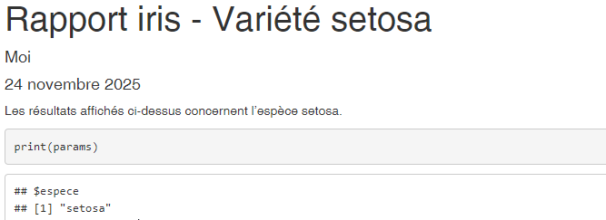

# Paramétrer un rapport

Un des nombreux avantages de R Markdown est la possibilité de reproduire des analyses très facilement en actualisant une partie du travail ou en changeant un des entrants du document. 
Utiliser des paramètres permet d'aller encore plus loin pour créer un document qui peut être réutilisé pour plusieurs scénarios. 
On peut ainsi créer des documents pour des territoires ou des années différents, faire tourner une 
analyse en changeant une des hypothèses ou changer le comportement de `knitr` selon les cas rencontrés.


## Ajouter une entrée `params` dans l'entête yaml

Les paramètres sont spécifiés dans l'en-tête avec l'option `params` dans laquelle plusieurs paramètres, et leur valeur par défaut, sont listés, un par ligne.


Les paramètres peuvent être de type `character`, `numeric`, `integer` et `logical` mais aussi des expressions R tant qu'elles sont précédées de `!r `. 
L'en-tête, et donc le code pouvant y être présent, est exécuté avant le reste du code donc il est nécessaire d'expliciter les packages utilisés.

Par exemple: 


```yml
---
title: "mon_premier_document"
author: "Moi"
date: "31/10/2025"
output: html_document
params:
  annee: 2024
  region: Bretagne
  date: !r lubricate::today()
---
```

Une fois définis dans l'en-tête, ces paramètres sont accessibles depuis le fichier .Rmd (texte ou code) mais aussi depuis la console. 
Ils sont stockés dans une liste nommée *`params`*. 

## Exemple d'utilisation des paramètres

Le code suivant montre quelques exemples d'utilisation des paramètres, dans les options de chunks, ou dans la production des visualisations :

````{verbatim}
---
title: "mon_premier_document"
author: "Moi"
date: "31/10/2022"
output: html_document
params:
  espece: setosa
  printcode: TRUE
---


```{r, setup, include=FALSE}
knitr::opts_chunk$set(
  message = FALSE, 
  warning = FALSE,
  echo = params$printcode
)
```


Les résultats affichés ci-dessus concernent l'espèce `r params$espece`.

```{r}

print(params)

summary(iris)

extrait <- iris %>%
  filter(Species==params$espece)

```

````

Il existe 3 façons de générer un document avec des paramètres :  

  - utiliser le bouton **knit**, ce qui prend les valeur par défaut des paramètres ;
  
  - utiliser l'interface RStudio en sélectionnant l'option **Knit with Parameters** du bouton **knit**. Cela ouvre une nouvelle fenêtre demandant de choisir les valeurs des paramètres indiqués dans l'en-tête ;
  
  - utiliser la fonction `rmarkdown::render()`. Sans autre précision cette fonction utilisera les paramètres par défaut définis dans l'en-tête. On peut aussi définir de nouvelles valeurs en utilisant l'option `params = `. 
  Cela donne par exemple :
  
````{verbatim}
```{r, echo=FALSE}
rmarkdown::render("mon_premier_document.Rmd", 
                  params = list(espece = "versicolor", printcode = FALSE))
```
````

Cette dernière façon de faire, via la fonction `rmarkdown::render()` permet d'automatiser encore plus les choses en générant autant de documents que de valeurs différentes d'un paramètre. 
En effet, dans un script .R, il est possible de créer une fonction ayant en entrée les paramètres que l'on veut 
modifier plusieurs fois mais aussi le nom du document généré.

## Comment compiler un rapport pour une liste de valeurs ?

En reprenant l'exemple précédent, on peut produire la sortie d'un rapport pour toutes les espèces :
  
````{verbatim}
```{r, echo=FALSE}
## Listes des especes contenu dans le datatset iris
liste_especes <- iris %>% 
  pull(Species) %>%  
  unique() %>% 
  as.character()

## une fonction qui génère le rapport en fonction de l'espèce
generer_rapport_par_espece <- function(nom_espece) {
  rmarkdown::render("mon_premier_document.Rmd", 
                    params = list(espece = nom_espece, printcode = FALSE),
                    output_file = paste0("doc-", nom_espece, ".Rmd"))
}

## Application de la fonction à toutes les espèces grâce à lapply
lapply(X = liste_especes, FUN = generer_rapport_par_espece)
``` 
````
  
## Paramétrer le titre du rapport

On peut utiliser du code R pour définir notre titre. 
La seule contrainte est de déplacer notre balise de titre après la définition des éléments dont il dépend.

````{verbatim}
---
author: "Moi"
date: "`r format(Sys.Date(), '%d %B %Y')`"
output: html_document
params:
  espece: setosa
  printcode: TRUE
title: "Rapport iris - Variété `r params$espece`"
---
````


```{r, eval = TRUE, echo=FALSE, out.width="80%"}

```

On peut insérer le titre dans une balise yml ailleurs que dans l'entête placée en début de document si besoin de construire le titre avec des calculs R.

````{verbatim}
---
title: "`r mon_objet_R_contenant_le_titre`"
---
````

## Exercice 5

  - Créer un nouveau .Rmd
  - Ajouter comme paramètre dans le YAML le pays (country) en choisissant "France" comme valeur par défaut
  - Ajouter un titre pour qu'il dépende de ce paramètre
  - Filtrer la dataframe en fonction de ce paramètre
  - Ajouter un graphique construit à partir de cette dataframe filtrée. Son titre peut également dépendre du paramètre country. (voir la [page dédiée à la réalisation de graphique avec ggplot dans le module 5 du parcours R](https://mtes-mct.github.io/parcours_r_module_datavisualisation/package-ggplot2.html), ou réutiliser le code ci-dessous) 

Par exemple, on peut regrouper les fromages par type simplifié et représenter le pourcentage de matières grasses par type.
C'est l'occasion de découvrir ou re-découvrir certaines nouvelles fonctions de dplyr apparues en 2026 :

```{r, eval=FALSE, echo=TRUE}
data_fromage <- tuesdata$cheeses %>% 
  filter_out(when_any(is.na(fat_content),
                      is.na(type))) %>% 
  mutate(type = replace_when(type,
                             str_detect(type, 'soft') ~ 'molle',
                             str_detect(type, 'firm') ~ 'ferme',
                             str_detect(type, 'hard') ~ 'dure')) %>%
  mutate(fat_content = as.numeric(str_extract(fat_content, "^\\d+(\\.\\d+)?"))) %>% 
  filter(country==params$country)


ggplot(data_fromage) +
  geom_violin(aes(x = type, y = fat_content, fill = type)) +
  scale_fill_manual(values = c("dure" = "#EEDC82", "ferme" = "#FFFACD", "molle" = "#FFFAF0")) +
  theme_gouv(plot_title_size = 12,
             subtitle_size = 12) +
  labs(title = "% de matière grasse par type de pâte de fromage",
       subtitle = params$country,
       x = "Type de pâte",
       y = "% de matière grasse") +
  theme(legend.position = 'none')

```

  - Générer ce HTML à l'aide du bouton knit
  - Créer dans un nouveau script une fonction qui génère le HTML à partir d'une liste de pays
  - Appliquer cette fonction à une liste restreinte de pays (par exemple France, Italy, United States)


