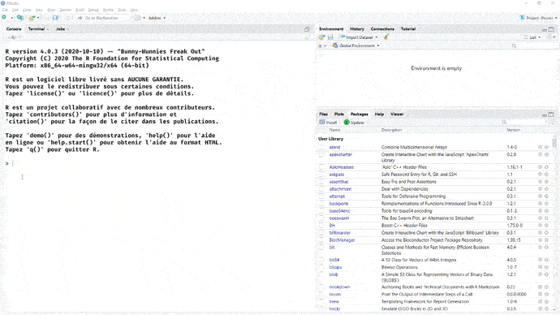

# De la page au livre, le package `{bookdown}`


Lorsqu'une publication comporte un volume important d'éléments, il est très utile d'en organiser le contenu en plusieurs parties.  

Le package `{bookdown}` est là pour nous aider à structurer une publication en plusieurs fichiers Rmd.

La publication devient un projet RStudio à part entière.

La séparation d'un document en plusieurs pages (plusieurs fichiers Rmd) a pour avantages d'autoriser l'envoi de liens vers chacun des chapitres et de réduire le temps d'affichage car chaque page est moins lourde prise séparément.

Des fonctionnalités de mise en forme supplémentaires sont ajoutées, telles que les références croisées et la numérotation des figures, des équations et des tableaux.

Les documents peuvent être exportés dans une gamme de formats adaptés à la publication (PDF, epub, HTML).

::::: {.trucsetastuces}::::::    
  **Trucs & Astuces**  
Comme pour les fichiers Rmd simples :  

- l'export au format pdf nécessite une distribution LaTeX (cf chap \@ref(latex)). 
- et `{pagedown}` peut être mobilisé pour imprimer un ensemble de pages HTML au format pdf, l'assemblage pdf se fait avec` qpdf::pdf_combine()`. 

:::::::::::::::::::::::::::::

<!-- Table des matières -->
<!-- css -->
<!-- liens -->
<!-- images -->
<!-- versioning -->
<!-- mise en page -->
<!-- Table des matières -->
<!-- Homogénéiser la présentation : fonctions graphiques -->


## Comment ça marche ?

Installer bookdown depuis le CRAN

```{r, eval = FALSE}
install.packages('bookdown')
```

Depuis Rstudio, cela vous apporte un nouveau type de projet, accessible depuis `File -> New Project -> New Directory -> Book Project using bookdown`.

Une fois celui-ci créé, vous pouvez cliquer sur `Build book` / `All format` dans l'onglet `Build` de Rstudio. 
Cela vous compilera le document aux formats html, pdf et epub^[Le format epub est adapté pour la lecture sur écran portatif, notamment sur liseuse.] et ouvrira la version html.

A l'instar du package `{rmarkdown}`, qui fournit la fonction `rmarkdown::render(input = "mon_fichier.Rmd")`, `{bookdown}` propose la fonction `bookdown::render_book(input = "mon_dossier")` pour compiler l'ensemble des fichiers .Rmd d'un dossier.

```{r, echo=FALSE}

```

D'un point de vue informatique, la fonction `bookdown::render_book` commence par assembler le contenu de tous les documents Rmd dans un seul fichier .Rmd temporaire, puis compile ce fichier Rmd temporaire. 
En conséquence, les objets R créés dans un chapitre peuvent être mobilisés au chapitre suivant, ou encore, les librairies (packages) n'ont pas besoin d'être appelées dans chacun des chapitres .Rmd avec `library()`. 
Il est conseillé de les appeler toutes au niveau du fichier index.Rmd, dans le 1er chunk. 
En cas d'exécution manuelle d'un chunk, il faudra en revanche exécuter manuellement ceux des pages précédentes dont il dépend.  

Les fichiers créés sont enregistrés dans le dossier `_book`.
On retrouve la publication compilée en ouvrant le fichier index.html dans le navigateur.

Le document par défaut produit présente les principales fonctionnalités de `bookdown`.


## Contenu du projet par défaut

Quand vous créez un projet bookdown, vous avez dans votre projet automatiquement les fichiers suivants : 


- `index.Rmd`, le seul fichier Rmarkdown qui contient comme usuellement un yaml en en-tête. C'est le premier chapitre de votre livre et sa page d'accueil.

- `01-intro.Rmd` à `06-references.Rmd` des fichiers rmarkdown correspondant aux chapitres de vos livres. La structure classique d'un rmarkdown est un document Rmd par chapitre, qui seront ensuite pour la version html votre premier niveau de navigation. Chaque fichier commence par le titre du chapitre.

- `_bookdown.yml` un fichier de configuration de votre document bookdown.

- `_output.yml` un fichier de configuration des formats de sortie de votre document (pdf, html...).

- `book.bib` un fichier de bibliographie au format [BibTeX](https://fr.wikipedia.org/wiki/BibTeX).

- `preamble.tex` et `style.css` des fichiers de configuration de l'apparence de votre document pour sa version pdf (réalisé en LaTeX) et sa version html (réalisé en css).


```md
directory/
├──  index.Rmd
├── 01-intro.Rmd
├── 02-literature.Rmd
├── 03-method.Rmd
├── 04-application.Rmd
├── 05-summary.Rmd
├── 06-references.Rmd
├── _bookdown.yml
├── _output.yml
├──  book.bib
├──  preamble.tex
├──  README.md
└──  style.css
```

## Chaque fichier Rmd correspond à un chapitre. 

Il est recommandé de faire commencer chacun d'eux par un titre de niveau 1, pour s'y retrouver dans le projet. 

On peut, si besoin, regrouper les chapitres au sein de parties. 
Pour commencer une partie, ajouter une première ligne `# (PART) Nom de votre partie {-}` devant la ligne de titre de niveau 1 contenant le nom du chapitre, exemple

````{verbatim}
# (PART) Partie I {-}        --> fichier index.Rmd
# Chapitre un

# Chapitre deux              --> fichier 2e_chap.Rmd

# Chapitre trois             --> fichier 3e_chap.Rmd

# (PART) Partie II {-}       --> fichier 4e_chap.Rmd
# Chapitre quatre
````


Ensuite ce qui a été vu précédemment reste applicable : le code s'écrit dans des chunks, le texte partout ailleurs. 
Il faut relancer la construction (compilation) pour se rendre compte de l'évolution du contenu.

Des chapitres en trop, ou des chapitres à rajouter ? Il suffit de supprimer ou de créer les fichiers `Rmarkdown` correspondant. 

Ils seront agencés selon leur ordre alphabétique, donc pour contrôler l'assemblage des chapitres, une pratique courante est de numéroter les fichiers.

L'en-tête yaml du rapport se trouve dans le fichier `index.Rmd`^[Attention, si le projet contient plusieurs fichiers Rmd présentant un en-tête yaml, le dernier écrase les précédents.].
Il contient des options spécifiques au format bookdown, notamment sur la gestion de la bibliographie.


```yaml
title: "A Minimal Book Example"
author: "Yihui Xie"
date: "`r Sys.Date()`"
site: bookdown::bookdown_site   --> type de sorties site html
documentclass: book
bibliography: [book.bib, packages.bib]
biblio-style: apalike
link-citations: yes
description: "This is a minimal example of using the bookdown package to write a book. The output format for this example is bookdown::gitbook."
```

## La structure du book : le fichier `_bookdown.yml`

Le fichier `_bookdown.yml` permet de spécifier des options de configuration supplémentaires pour construire le livre.

Par exemple : 

- changer le nom du fichier (`book_filename`)
- franciser le préfixe devant le numéro du chapitre (`chapter_name`) ou le préfixe des tableau et des graphiques (`fig` et `tab`)
- changer l'ordre de fusion des fichiers (`rmd_files`)


```yaml
book_filename: "mon_premier_bookdown"
delete_merged_file: true
language:
  ui:
    chapter_name: "Chaptitre "
  label:
    fig: "Graphique "
    tab: "Tableau "
rmd_files: ["index.Rmd", "01-intro.Rmd", "05-summary.Rmd"]
```

## Le paramétrage des formats de sortie : le fichier `_output.yml`

Le fichier `_output.yml` est utilisé pour spécifier les type de format de sortie (pdf, html...) et les options relatives à ces formats.

Pour le format html, c'est là par exemple que vous pouvez spécifier entre autre : 

- la feuille de style css à utiliser
- les textes inscrits en haut et en bas du menu de navigation
- le style de css à appliquer 
- les options de partage sur les réseaux sociaux que vous voulez (si vous en voulez, vous pouvez aussi tous les désactiver avec l'option `sharing` ci contre)

```yml
bookdown::gitbook:
  css: style.css
  config:
    toc:
      before: |
        <li><a href="./">Mon premier bookdown</a></li>
      after: |
        <li>Mon premier bookdown</li>
    download: ["pdf", "epub"]
    sharing: no
    info: no
```

## Pour des rendus stylés  {#styled-outputs}

Le package bookdown propose de multiples [modèles de sortie](https://pkgs.rstudio.com/bookdown/reference/index.html#book-output-formats) : 

 - gitbook  
 - pdf_book  
 - epub_book  
 - bs4_book  
 - bs4_book_theme  
 - html_chapters   
 - html_book   
 - tufte_html_book  

Comme toujours avec R, de nombreux packages étendent ces possibilités.  

Notamment, le package gouvdown propose un template bookdown `gitbook_gouv`, dérivé du format gitbook, accessible depuis le menu des nouveaux projets R, pour des book conforment à la marque État. 

Comme pour les formats de sortie Rmarkdown, il faut avoir en tête que les visualisations optimisées pour un rendu web (HTML), ne seront pas compatibles avec l'export pdf.

## Exercice 6

```{r mod6_exo6, child=charge_exo("m6", "exo6.rmd"), echo=FALSE}
```

