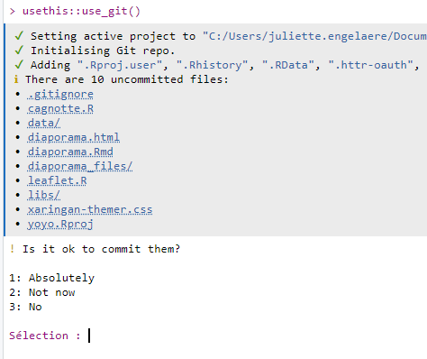
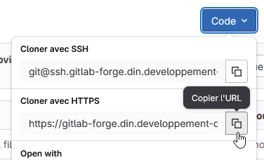
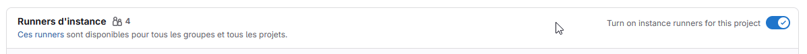

------------------------------------------------------------------------

editor_options: markdown: wrap: sentence ---

# Mettre en ligne les HTML produits avec Rmarkdown

Les fichiers HTML ne peuvent pas simplement venir compléter nos sites institutionnels gérés avec Spip/Giseh. 
Pour les partager en interne, les déposer sur un serveur bureautique suffit. En revanche, pour les partager avec l'extérieur, il est souvent nécessaire d'héberger les documents sur un serveur dédié.

## Publier sur un serveur HTML statique

Le service informatique du pôle ministériel (DNUM/Sous-direction des méthodes et des services de plateforme) propose une offre d'hébergement gratuite pour toute entité du pôle ministériel Ecologie qui la demande.

Il faut au préalable avoir la validation d'une nouvelle url pour votre organisme par la direction de la communication.

Cette offre est décrite sur le catalogue des offres spote : <https://spote.developpement-durable.gouv.fr/offre/webstatic-publication-de-sites-de-contenus-statiques>.

La DNUM procède en deux temps : 1. elle vous livre le serveur et ses identifiants d'utilisation et 2. elle vous indique que le certificat pour bénéficier de la norme https est actif.

Une fois le serveur configuré par la DNUM, on envoie les fichiers HTML à publier par FTP, par exemple avec le logiciel Filezilla.

Exemple de serveur statique : <https://dreal.statistiques.developpement-durable.gouv.fr/>

Mode opératoire pour déposer sur ce serveur : <https://gitlab.com/rdes_dreal/propre.rpls/-/wikis/Diffusion-des-publications>

## Publier grâce aux fonctionnalités de déploiement continu d'une forge git

### Exemple : le parcours R

C'est l'option retenue pour publier les supports de formations du parcours R.

Chaque formation est déposée sur un répertoire github : cela permet d'avoir le suivi des versions, le travail collaboratif sur le contenu source, et surtout le déploiement public et automatique de chaque modification vers <https://mtes-mct.github.io/parcours_r_module_publication_rmarkdown/> par exemple pour le présent module 6.

### Concepts

Github et Gitlab sont deux plateformes web concurrentes, dites forge de développement, utilisées pour le travail collaboratif sur le code. Pour les utiliser, il faut versionner ses projets R avec git. 
Git un exécutable qui s'installe sur son PC, permettant le suivi de version des scripts et permettant le dialogue avec ces forges web.

### Quelle forge choisir ?

Le parcours-R est hébergé sur github car à ses débuts, c'était l'offre la plus populaire.

Le ministère dispose désormais d'une instance officielle de gitlab : <https://gitlab-forge.din.developpement-durable.gouv.fr/> 
Chaque service du pôle ministériel peut disposer d'un dépôt gitlab-forge après avoir formulé une demande officielle, cf fiche spote <https://spote.developpement-durable.gouv.fr/offre/gitlab-forge-logicielle-et-livraison-continue>.

Chaque agent disposant d'un compte CERBERE peut rejoindre un groupe gitlab-forge ou y disposer d'un dépôt personnel.

Si besoin de collaborer avec des personnes qui n'ont pas de compte CERBERE, il est possible de faire une demande pour 'cerberiser' son adresse mail et l'autoriser à écrire sur un dépôt gitlab-forge.  
En attendant, gitlab.com offre une version freemium accessible de tous. 
À la fin de la collaboration, on peut facilement réimporter le travail de gitlab vers gitlab-forge.

### Comment on fait ?

Pour configurer git et RStudio, suivre les fiches tutorielles :  <https://dreal-pdl.gitlab-pages.din.developpement-durable.gouv.fr/csd/geodata4apps.fiches/decouverte.html>

Une fois la configuration de git achevée, imaginons que vous vouliez publier un fichier publi.html généré à partir d'un fichier publi.Rmd. 
Voici un pas à pas de base :

1.  dans votre projet RStudio, placez les fichiers html (et leurs éventuelles dépendances) que vous voulez publier dans un dossier nommé 'public'. 
S'il n'y a qu'un fichier, nommez les index.html, c'est intéressant pour raccourcir l'url.

2.  toujours dans votre projet RStudio, lancer `usethis::use_git()` dans la console pour activer le traking de git pour ce projet. 
RStudio vous propose d'enregistrer une version, sorte de premier point de restauration, de votre projet :  
  
Il faut accepter (Ici : appuyer sur 1 + entrée). 

3.  Acceptez de redémarrer R pour que les fonctionnalités git s'activent dans votre projet Rstudio (nouveau panneau)

A cette étape, votre projet a une version, prête à être partagée sur une forge git, reste à indiquer où.

1.  Depuis votre dépôt gitlab-forge, créer un nouveau projet **vide** (décocher "Initialiser le dépôt avec un README").\

2.  Copier l'url https de ce projet\
    

3.  Retourner dans RStudio pour pointer votre projet R vers ce projet git, pour cela, lancer dans la console : `usethis::use_git_remote(url = "https://gitlab-forge.din.developpement-durable.gouv.fr/groupe/projet.git")`

4.  Dernière étape pour partager le code : il faut connecter les branches et réaliser le premier 'push', en lançant dans la console R :\
    `system("git push -u origin main")`\
    votre projet est alors envoyé sur la forge.

5.  Intégration continue  
Par convention ce qui se situe dans le dossier public, peut être publié automatiquement par gitlab sur gitlab-pages si l'intégration continue est active.\
Pour l'activer, 2 conditions :

- un bouton à cocher dans les paramètres du dépôt (à retrouver au niveau du menu Parametres / CI-CD / Runners)  
- et un fichier .gitlab-ci.yml à mettre à la racine du projet.

Voici un exemple minimaliste de script à placer dans votre projet sous le nom `.gitlab-ci.yml` qui utilise le répertoire public et le rend accessible sur 'Pages'.

```         
pages:
  stage: deploy
  script:
  - echo 'Deploiement en cours'
  artifacts:
    paths:
    - public
  only:
  - master
```

## Exercice 8 (facultatif)

```{r mod7_exo7, child=charge_exo("m6", "exo8.rmd"), echo=FALSE}
```
