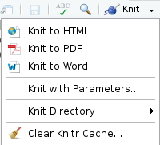
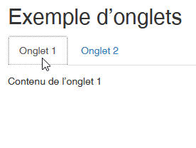

# Pour aller plus loin

Derrière Rmarkdown aujourd'hui existe tout un ecosystème permettant de mixer des traitements réalisés en R et du texte dans des formats très différents, que ce soit en matière de technologie (html, pdf, ...) ou de type de rendu (diaporama, rapport, livre, note, cv, ...).

## Les documents Quarto {#quarto}

Un document Quarto est un format de document qui permet de combiner du
texte, du code et des visualisations dans un seul fichier, comme un
Rmarkdown en somme. En revanche, Quarto n'est ni dépendant de ni
exclusif à R et Rstudio. Il ne s'agit pas d'un package de R, il faut
l'installer "à part" (mais il est inclus dans l'installation de
Rstudio).

Les différences principales sont :

-   l'amélioration du support multi-langage (R, Python, Javascript, Julia) et
    multi-moteur (knitr, Jupyter, Observable) ;

-   un rendu amélioré : Quarto offre des options de rendu plus riches et
    plus flexibles, y compris des thèmes et des styles personnalisés
    pour les documents ;

-   l'interactivité : Quarto facilite l'intégration d'éléments
    interactifs, comme des widgets et des visualisations interactives,
    directement dans les documents (à condition de les coder dans leur
    langage d'origine) ;

-   la publication : Quarto propose des options intégrées pour publier
    des documents en tant que sites web, livres électroniques ou
    présentations, avec une configuration minimale ;

-   les fonctionnalités futures : les concepteurs du format ont annoncé
    qu'ils allaient continuer à assurer le support du format Rmd, mais
    que de nouvelles fonctionnalités ne seraient apportées que sur le
    Quarto.

Si vous voulez tester la transition, dans la majorité des cas, un copier
/ coller direct de votre Rmd dans un qmd fonctionnera ! Et pour un test
rapide, créez un nouveau document dans Rstudio en choisissant le format
"Quarto document" proposé et laissez-vous guider.

Vous trouverez toute la documentation, des exemples mais surtout des
guides très complets pour s'autoformer directement [sur le site de
Quarto](https://quarto.org/) et  également sur le [site de formation à R du ministère de l'Agriculture](https://ssm-agriculture.github.io/site-formations-R/).

## Formats de sortie 

Il existe de nombreux packages packages permettant d'obtenir des formats de sortie spécifiques. 

Utiliser des formats de sorties de type bureautiques est très utile si :   

- on souhaite tirer partie de modèles bureautiques, conformes à une charte graphique que l'on souhaite respecter, 
- on souhaite faire éditer le document produit par des non-Ristes.

Cela peut s'avérer nécessaire pour faire relire et valider le document avant sa publication, mais attention ! Il faudra dans un second temps reporter dans Rmarkdown les modifications opérées en dehors, pour tirer pleinement partie de la reproductibilité offerte par Rmarkdown. 

### odt_document  

Parmi les types de sortie possibles, `{rmarkdown}` propose le format Libre Office Writer .odt 
Il repose pour cela sur Pandoc qui traite la conversion de markdown (fichier .md) en document Libre Office Writer (fichier .odt).
Depuis R, cette conversion offre un nombre limité de paramètres de personnalisation.

:::: {style="display: flex; gap: 50px;"}

::: {}
Paramètres de la fonction `odt_document()` : 
```r
odt_document(
  number_sections = FALSE,
  fig_width = 5,
  fig_height = 4,
  fig_caption = TRUE,
  template = "default",
  reference_odt = "default",
  includes = NULL,
  keep_md = FALSE,
  md_extensions = NULL,
  pandoc_args = NULL
)
```
:::

::: {}

Ce qui donne pour l'entête YML 

```yml 
--- 
title: "mon_premier_document"
author: "Moi"
date: "31/10/2025"
output: 
  odt_document:
    number_sections: false  
    fig_width: 5
    fig_height: 4
    fig_caption: true
    reference_odt: "chemin/vers/le/modele.odt"
--- 
```  
::: 
:::: 

- `number_sections` : TRUE/FALSE, sert à numéroter (ou pas) les titres.    
- `fig_width` / `fig_height` sert à indiquer la largeur / hauteur par défaut (en pouces) pour les figures.      
- `fig_caption` : TRUE/FALSE pour afficher des figures avec des légendes à partir des paramètres de chunks (`fig.cap = "légende de la figure"`).        
- `template` : modèle Pandoc à utiliser pour le rendu, 3 possibilités : 1. laisser à "default" pour utiliser le modèle par défaut du package rmarkdown, 2. indiquer NULL pour revenir au modèle intégré de Pandoc ou 3. indiquer un chemin d'accès vers un modèle pandoc personnalisé. Consulter la [documentation de Pandoc](https://pandoc.org/MANUAL.html) pour plus de détails sur la création de modèles personnalisés.    
- `reference_odt` : pour spécifier un fichier odt dont on souhaite réutiliser les styles. Pour un résultat optimal, le fichier odt de référence doit être une version modifiée d'un fichier odt généré avec pandoc.      
- includes : liste nommée de contenu supplémentaire à inclure dans le document comme un en-tête ou un bas de page (à créer à l'aide de la [fonction `includes()`](https://pkgs.rstudio.com/rmarkdown/reference/includes.html)).     
- `pandoc_args` : options de ligne de commande supplémentaires à transmettre à pandoc.    

Une manière rapide de **styliser** le fichier compilé est de le générer une fois, de l'éditer avec libre office pour y [adapter les styles de titres, listes...](https://help.libreoffice.org/latest/fr/text/swriter/guide/spotlight_styles.html?&DbPAR=WRITER&System=WIN) au rendu souhaité.  

On peut également coder les styles directement en xml cf. [ce tuto en français](https://www.arthurperret.fr/blog/2024-09-13-templates-feuilles-de-styles-pandoc-avantage-odt-sur-docx.html) 

La gestion des **tableaux** est parfois moins souple qu'en HTML/PDF, mais on peut obtenir quelque chose de propre.
Les tableaux simples sont traités correctement avec `knitr::kable()` en spécifiant le format "pandoc".
```r
knitr::kable(head(iris), format = "pipe")
```
Il ne faut pas utiliser les fonctions spécifiques au format HTML (comme `kable_styling()`, `column_spec()`... ) car elles ne sont pas supportées.
Mais `{kableExtra}` sait aussi générer des tableaux LaTeX et les fonctions compatibles avec le format PDF le seront généralement aussi pour ODT.  

Les **graphiques** ne sont pas automatiquement redimensionnés comme dans un format de sortie HTML, il faut rester dans les limites de largeur du corps de la page (environ 6 pouces pour le modèle par défaut). 


### Officer et Officedown

```{r, echo=FALSE, out.width='50%'}
knitr::include_graphics("https://raw.githubusercontent.com/davidgohel/officer/master/inst/medias/officerlogo.svg")
```


To do 
Ajouter logo officedown
Traduire et résumer https://ardata-fr.github.io/officeverse/index.html
Pour les documents bureautiques de type .docx ou .pptx.


Exemple 
https://gitlab-forge.din.developpement-durable.gouv.fr/dreal-pdl/csd/crte/-/blob/master/inst/rmarkdown/templates/portrait_territoire/skeleton/skeleton.Rmd?ref_type=heads&plain=1

### Présentations diaporama HTML

Xaringan 
Pour des présentations de ninja

https://support.posit.co/hc/en-us/articles/360004672913-Rendering-PowerPoint-Presentations-with-the-RStudio-IDE

 
## Mettre des résultats en cache pour gagner du temps de commpilation 

Compiler un document R Markdown peut être long, car il faut à chaque fois exécuter l'ensemble des blocs de code R qui le constituent.

Pour accélérer cette opération, knitr propose un système de mise en cache : les résultats de chaque bloc sont enregistrés dans un fichier et à la prochaine compilation, si le code et les options du bloc n’ont pas été modifiés, c’est le contenu du fichier de cache qui est utilisé, ce qui évite de ré-exécuter ce code R.

On active ou désactive la mise en cache des résultats pour chaque chunk avec l’option `cache = TRUE` ou `cache = FALSE`, et on peut aussi désactiver totalement la mise en cache pour le document en ajoutant `knitr::opts_chunk$set(cache = FALSE)` dans le premier chunk de 'setup'.

Il faut manier cette option avec beaucoup de prudence. 
Le système de cache peut fausser les résultats s'il n'est pas utilisé avec maîtrise, par exemple s'il n'est pas vidé alors que les données source changent. 
Dans ce cas les résultats de certains blocs ne seront pas être mis à jour s'ils sont présents en cache. 
On peut vider le cache du document, ce qui forcera un re-calcul de tous les blocs de code à la prochaine compilation. 
Pour cela, ouvrir le menu Knit (la pelote bleue) et choisir Clear Knitr Cache… (le balai) :



(Source : [guide analyse-R de Joseph Larmarange](https://larmarange.github.io/analyse-R/rmarkdown-les-rapports-automatises.html#mise-en-cache-des-r%C3%A9sultats))

## Rendre le paramétrage interactif 
dernière slide de l'atelier 2

## Transformer les sous-titres en onglets 

Ajouter l'attribut `.tabset` au titre transforme tous les sous-titres en onglets au lieu de sous-sections : 

:::: {style="display: flex; gap: 50px;"}

::: {}

**Code :**

```markdown
### Exemple d'onglets {.tabset}

#### Onglet 1

Contenu de l'onglet 1

#### Onglet 2

Contenu de l'onglet 2

### {.unlisted .unnumbered}
```
:::

::: {}
**Résultat :**  



::: 
:::: 

Pour finir un tabset, commencer un nouveau titre du niveau supérieur vide `### {.unlisted .unnumbered}` pour continuer avec des paragraphes réguliers.   

Plus d'options d'onglets sont présentées dans le livre de recettes Rmarkdown :  <https://bookdown.org/yihui/rmarkdown-cookbook/html-tabs.html/>.

Ce paramétrage en onglets ne fonctionne pas dans les projets de type bookdown car les titres sont déjà mobilisés pour construire le menu de gauche. 

## Bibliographie

Voici quelques éléments bibliographiques pour en savoir plus sur R Markdown mais aussi tous les packages et logiciels en lien avec ce sujet :

-   [Le guide définitif de Rmarkdown](https://bookdown.org/yihui/rmarkdown/markdown-syntax.html)
-   [Le guide de référence](https://www.rstudio.com/wp-content/uploads/2015/03/rmarkdown-reference.pdf)
-   [La syntaxe Markdown sur laquelle s'appuie`rmarkdown`](https://daringfireball.net/projects/markdown/syntax#philosophy)
-   [Pour en savoir plus sur PANDOC](https://pandoc.org/MANUAL.html#pandocs-markdown)
-   [Pour en savoir plus sur TinyTeX](https://yihui.org/tinytex/)
-   [Une vidéo en anglais pour aller plus loin dans l'utilisation de R Markdown](https://www.youtube.com/watch?v=WkF7nqEYF1E)
-   et évidemment les documentations de tous les packages cités !
