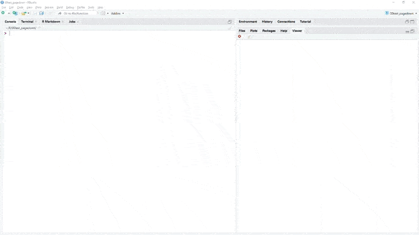
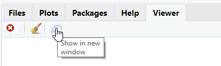
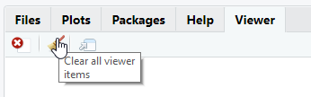

# Pour aller plus loin sur Pagedown

Pagedown est une implémentation pour Rmarkdown de [paged.js](https://www.pagedjs.org/), qui permet de réaliser des documents html paginés.


```{r, echo=FALSE}
knitr::include_graphics("https://user-images.githubusercontent.com/163582/51942716-66be4180-23dd-11e9-8dbc-fdb4f465d1c2.png")
```


## Paged.js


[paged.js](https://www.pagedjs.org/) est une bibliothèque javascript visant à mettre en oeuvre [les propriétés css dédiées au médias paginés(https://www.w3.org/TR/css-page-3/) du W3C.

Ces spécifications visent à pouvoir réaliser des documents prêt pour l'impression avec les technologies du web (html, css, js).

Ces spécifications sont toujours en draft pour le moment au sein du W3C, donc pas vraimente reconnues par les principaux navigateurs. D'où le besoin de cette bibliothèque javascrit pour pouvoir les mettre en oeuvre.
]


```{r, echo=FALSE}
knitr::include_graphics("https://www.pagedmedia.org/wp-content/uploads/2018/12/pagedjs-logo.png")
```


Pour installer pagedown depuis le CRAN : 

```{r, eval = FALSE}
install.packages('rstudio/pagedown')
```

Depuis Rstudio, cela vous apporte un nouveau type de document rmarkdown, accessible depuis `File -> New File -> Rmarkdown... -> From template -> Paged HTML document`.

Une fois celui ci créé, vous pouvez cliquer sur knit de l'interface de Rstudio. Cela vous compilera le document par défaut en html, qui sera accessible dans le répertoire du projet et visible par défaut dans le viewer.


```{r, echo=FALSE}

```


La structure du yaml est relativement proche d'un document Rmarkdown classique.

A noter toutefois une option utile à retenir, la balise `knit: pagedown::chrome_print` qui vous permet de compiler directement votre document en pdf grâce à la fonction `pagedown::chrome_print()` livrée dans le package. 

Cette fonction par ailleurs peut être utilisée pour imprimer en pdf tout document html en pdf ou en format image. Elle utilise la technologie d'impression de google chrome.


```yaml
title: "A Multi-page HTML Document"
author: "Yihui Xie and Romain Lesur"
date: "`r Sys.Date()`"
output:
  pagedown::html_paged:
    toc: true
    \# change to true for a self-contained document, but it'll be a litte slower for Pandoc to render
    self_contained: false
\# uncomment this line to produce HTML and PDF in RStudio:
\#knit: pagedown::chrome_print
```


## Configurer votre yaml

Voici quelques options du yaml intéressantes à connaître : 


```yml
toc-title: sommaire
```


Pour modifier le nom du sommaire du document.


```yml
lot: true
lot-title: "Tableaux"
lof: true
lof-title: "Graphiques"
```


Pour ajouter et configurer une liste de tableau et de graphique dans le sommaire. Si vous ne voulez pas que les graphiques et tableaux apparaissent dans le sommaire, vous pouvez utiliser `lot-unlisted: true`.


```yml
chapter_name: "Chapitre\\ "
```


Pour modifier le préfixe du titre du chapitre. Vous pouvez ensuite insérer un chapitre en utilisant `# Ceci est un titre de chapitre {.chapter}`


Voici quelques options du yaml intéressantes à connaître.


```yml
links-to-footnotes: true
```


Cette option transforme automatiquement un lien url dans votre document en note de bas de page. Ainsi `[CRAN](https://cran.r-project.org/)` sera traduit comme `CRAN[]^(https://cran.r-project.org/)`.


```yml
  pagedown::html_paged:
    front_cover: !expr system.file("help","figures","lter_penguins.png", package = "palmerpenguins")
    back_cover: https://www.r-project.org/Rlogo.png
```

Pour ajouter une image pour la première de couverture et la 4ème de couverture. On peut utiliser le prefix !expr pour insérer du code R créant en sortie une image.


## Quelques balises importantes à connaître


`.page-break-before` et `.page-break-after` vous permettent d'insérer un saut de page.


````{verbatim}
### Nouveau chapitre après un saut de page {.page-break-before}
````


`[Chapitre 1]` vous permet de rajouter un lien vers la section `Chapitre 1`.

## Modifier le CSS

Apprendre à customiser un document pagedown va vous demander d'investir sur l'apprentissage du CSS en général et de pagedjs en particulier pour construire un template ad hoc.

C'est un investissement en soit, qui pourra vous être utile de la même façon que la gestion de la mise en page d'un document bureautique.

Vous pouvez aussi centraliser cet investissement pour votre équipe sur une ou deux personnes, ou travailler avec votre service web sur vos projets.

Quelques ressources pour apprendre le CSS : 

- [Le site de la fondation Mozilla](https://developer.mozilla.org/fr/docs/Learn/Getting_started_with_the_web/CSS_basics)

- [Le site du W3C](https://www.w3.org/Style/Examples/011/firstcss.fr.html)


Voici déjà quelques recettes de base pour commencer à modifier votre document.

Première étape : importer les css par défaut de pagedown dans votre document.

```{r, eval = FALSE}

files <- c("default-fonts", "default-page", "default")
from <- pagedown:::pkg_resource(paste0("css/", files, ".css"))
to <- c("custom-fonts.css", "custom-page.css", "custom.css")
file.copy(from = from, to = to)
```

Ajouter une référence à ces fichiers dans le yaml :

```yaml
output:
  pagedown::html_paged:
    css:
    - custom-fonts.css
    - custom-page.css
    - custom.css
    toc: true
    self_contained: false
```


- Lancer dans la console `xaringan::inf_mr()`, qui permet de compiler un document Rmarkdown en ayant un aperçu live du rendu.


- Appuyer ensuite sur `Show in new window` pour consulter le document sur votre navigateur par défaut.


```{r, echo=FALSE}

```


- Puis sur `Clear all viewer item`, pour que vos modifications puisse s'afficher en live.


```{r, echo=FALSE}

```


## Configurer votre CSS

Vous pouvez commencer à modifier vos fichiers css et voir le résultats immédiatement.

Les 3 fichiers correspondent aux éléments suivants :

- `custom-fonts.css` correspond aux polices de caractères
- `custom-page.css` correspond aux paramètres de la page (format de la page, orientation,...)
- `custom.css` intègre entre autre la façon dont les pages sont affichées à l'écran (couleur de fond, espacement entre les pages...)


[`{pagedreport}`](https://pagedreport.rfortherestofus.com/) est un package permettant de simplifier l'appropriation de pagedown, et notamment évite de devoir rentrer tout de suite dans une modification du css.

Il n'est pas encore sur le cran, pour l'installer : 

```{r, eval = FALSE}
remotes::install_github("rfortherestofus/pagedreport)
```


```{r, echo = FALSE}
knitr::include_graphics("https://mk0rfortheresto0o08q.kinstacdn.com/wp-content/uploads/2021/01/windmill.gif")
```


`{pagedreport}` vous simplifie l'utilisation de pagedown en proposant trois templates avancés paramétrables via de nouvelles options à intégrer dans le yaml :


- `paged_grid::logo` vous permet d'ajouter le logo de votre institution à votre rapport
- `paged_grid::logo` vous permet d'ajouter le logo de votre institution à votre rapport
- `paged_grid::front_img` et `paged_grid::back_img` vous permettent de choisir deux images pour la première et la quatrième de couverture.
- `main-color` et `secondary-color` vous permette de choisir les couleurs principales et secondaires de votre document.
- `main-font` et `header-font` vous permettent de choisir une police de caractère pour le texte et vos titres. Si `google-font` est à TRUE, vous pouvez sélectionner toute police disponible sur google font.


```
subtitle: "Au 1er juin 2021"
author: "Guillaume RRRRRozier"
date: "11 juin 2021"
output: 
    pagedreport::paged_grid:
      logo: "https://upload.wikimedia.org/wikipedia/fr/7/72/Logo_du_Gouvernement_de_la_R%C3%A9publique_fran%C3%A7aise_%282020%29.svg"
knit: pagedown::chrome_print
toc-title: "Sommaire"
main-color: "#000091"
secondary-color: "#000091"
google-font: TRUE
main-font: "Open Sans"
header-font: "Open Sans"
```
