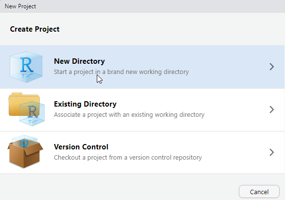

# Bien commencer

## Créer un projet sous Rstudio pour vous permettre de recencer vos travaux.

Pourquoi travailler avec les projets Rstudio plutôt que les scripts R ?

- Cela permet la portabilité : le répertoire de travail par défaut d'un projet est le répertoire où est ce projet. Si vous transmettez celui-ci à un collègue, le fait de lancer un programme ne dépend pas de l'arborescence de votre machine.

> **Fini les `setwd("chemin/qui/marche/uniquement/sur/mon/poste")` !** 

- Toujours sur la portabilité, un projet peut être utiliser avec un outil comme packrat qui va vous internaliser en interne au projet l'ensemble des packages dont vous aurez besoin dans votre projet. Cela permet donc à votre collègue à qui vous passer votre projet de ne pas avoir à les installer et surtout si vous mettez à jour votre environnement R, votre projet restera toujours avec les versions des packages avec lesquelles vous avez fait tourné votre projet à l'époque. Cela évite d'avoir à surbir les effets d'une mise à jour important d'un package qui casserait votre code.

Pour activer packrat sur un projet, aller dans `Tools/Project Options->Packrat`

[En savoir plus sur Packrat](https://www.rstudio.com/resources/webinars/managing-package-dependencies-in-r-with-packrat/)

{#id .class width=500}


- Cela permet de se forcer à travailler en mode projet : on intègre à un seul endroit tous ce qui est lié à un projet : données brutes, données retravaillées, scripts, illustrations, documentations, publications... et donc y compris package avec packrat.

- On peut travailler sur plusieurs projets en même temps, Rstudio ouvre autant de sessions que de projet dans ce cas.

- Les projets Rstudio intègrent une interface avec les outils de gestion de version git et svn. Cela veut dire que vous pouvez versionniser votre projet et l'héberger simplement comme répertoire sur des plateformes de gestion de code telle que github ou gitlab.

**Pour créer un projet : **

- Cliquez sur *Project* en haut à droite puis *New Project*.

{#id .class width=500}

- Cliquez sur *New Directory*.

{#id .class width=500}


## Intégrer vos données

Une bonne pratique est de créer un sous répertoire `/data` pour stocker les données sur lesquelles vous aurez à travailler. 

Vous pouvez le faire de l'explorateur de fichier de votre système d'exploitation ou directement à partir de l'explorateur de fichier de RStudio.

{#id .class width=500}

Cela marche bien quand on a un seul type de données, mais en général on va avoir à travailler sur des données brutes que l'on va retravailler ensuite et vouloir stocker à part. Si par la suite vous souhaitez avoir des exemples de bonnes pratiques sur comment structurer vos données, vous pouvez vous référer au [chapitre data](http://r-pkgs.had.co.nz/data.html) du livre d'Hadley Wickham sur la construction de package R (tout package R étant aussi un projet !)

## Activer les packages nécessaires

Créer un répertoire `/scripts` ou vous mettrez vos scripts R.

Commencer par rajouter un script à votre projet qui commencera par : 

- activer l'ensemble des packages nécessaires

- charger les données dont vous aurez besoins.


```{r eval = F}
library (rmarkdown)
library (tidyverse)

load("data/data_exercices_formation.RData")
load("data/ODD.RData")
```


Pour générer des sorties pdf ou Word, il est nécessaire d'installer une distribution $LaTeX$. Sauf à avoir déjà une installation sur la machine, il est recommandé d'installer [TinyTeX](https://yihui.name/tinytex/):

```{r eval=F}
install.packages("tinytex")
tinytex::install_tinytex()  # install TinyTeX
```


