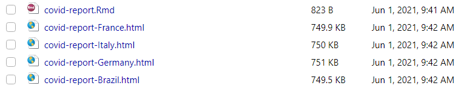
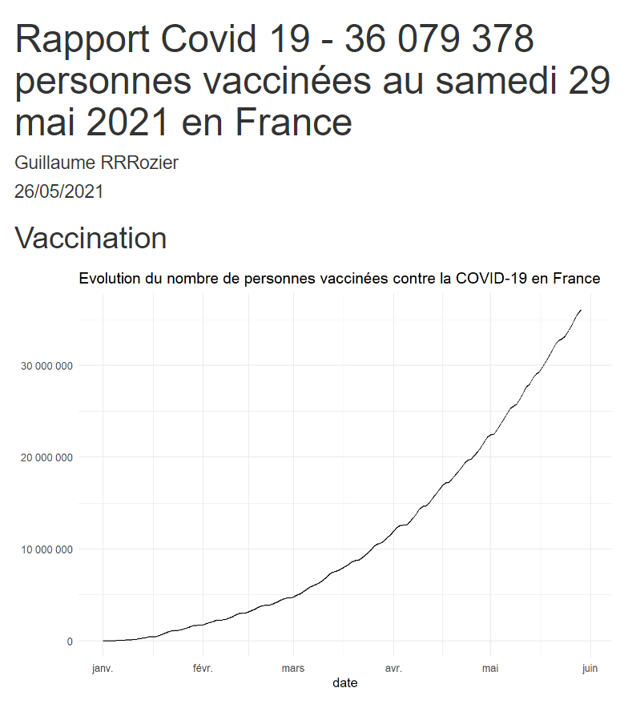
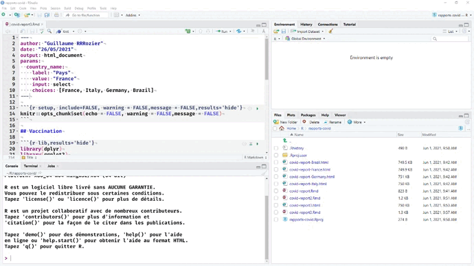

```{css, echo=FALSE}
pre {
  max-height: 300px;
  overflow-y: auto;
}

pre[class] {
  max-height: 100px;
}
```

```{r setup, include=FALSE}
options(htmltools.dir.version = FALSE)
knitr::opts_chunk$set(echo = TRUE, eval=TRUE, warning = FALSE,message = FALSE,error = FALSE)
```

```{r xaringan-themer, include=FALSE, warning=FALSE, eval=TRUE}
library(xaringanthemer)
style_mono_accent(
  base_color = "#000091",
  text_font_family = 'Marianne',
  code_font_family = 'Fira Code',
  background_color = 'white',
  title_slide_text_color = "#000091"
)
```


```{r xaringanpanelset, echo=FALSE, eval=TRUE}
xaringanExtra::use_panelset(in_xaringan = TRUE)
```

```{r share-again, echo=FALSE, eval=TRUE}
xaringanExtra::use_share_again()
```

```{r xaringan-tile-view, echo=FALSE, eval=TRUE}
xaringanExtra::use_tile_view()
```

```{r xaringan-tachyons, echo=FALSE, eval=TRUE}
xaringanExtra::use_tachyons()
```

```{r meta, echo=FALSE, eval=TRUE}
library(metathis)
meta() %>%
  meta_general(
    description = "Les rapports paramétrés avec RMarkdown",
    generator = "xaringan et remark.js"
  ) %>%
  meta_name("github-repo" = "MTES-MCT/parcours_r_module_publication_rmarkdown") %>%
  meta_social(
    title = "Les rapports paramétrés avec RMarkdown",
    url = "https:/MTES-MCT.github.io/parcours_r_module_publication_rmarkdown/atelier2.html",
    image = "https:/MTES-MCT.github.io/parcours_r_module_publication_rmarkdown/slides/www/card-parametres.png",
    image_alt = "Diapo titre du diaporama mes rapports paramétrés avec RMarkdown",
    og_type = "website",
    og_author = "Maël THEULIERE - Marouane ZELLOU",
    twitter_card_type = "summary_large_image"
  )
```

```{r xaringanExtra-clipboard, echo=FALSE, eval=TRUE}
htmltools::tagList(
  xaringanExtra::use_clipboard(
    button_text = "<i class=\"fa fa-clipboard\"></i>",
    success_text = "<i class=\"fa fa-check\" style=\"color: #90BE6D\"></i>",
    error_text = "<i class=\"fa fa-times-circle\" style=\"color: #F94144\"></i>"
  ),
  rmarkdown::html_dependency_font_awesome()
)
```


```{r xaringan-extra-styles, include=FALSE, warning=FALSE}
xaringanExtra::use_extra_styles(
  hover_code_line = TRUE,
  mute_unhighlighted_code = TRUE
)
```

class: center, middle

.fl.w-40.pa2[
```{r, include=TRUE,echo=FALSE}
knitr::include_graphics("www/rmarkdownlogo.png",dpi = 100)
```
]

.fl.w-60.pa2[

.f3[Formation publications reproductibles avec] .yellow.f3[RMarkdown]

.yellow.f1[2 - Les rapports paramétrés avec RMarkdown]
]

.tr[
.f4[Maël THEULIERE - Marouane ZELLOU]
]
---
## Qu'est ce qu'un rapport paramétré ?

Un rapport rmarkdown peut prendre en entrée des *paramètres* à déclarer dans le yaml.

Par exemple le rapport ci contre permet de paramétrer un rapport sur la covid 19 en sélectionnant un pays.

```{r, echo = FALSE, out.width='80%'}
knitr::include_graphics("www/param_premier_rapport.png")
```
---
## Comment déclarer les paramètres ?

Les paramètres se déclarent dans la partie yaml de votre fichier Rmarkdown. La syntaxe est la suivante :


```{yaml}
params:
  country_name: "France"
```

Quand vous compiler votre fichier Rmarkdown classiquement avec le bouton `knit`, la valeur renseigné dans le yaml sera utilisée par défaut.

Les paramètres sont stockés dans R dans une liste appelée `params`. 

Pour utiliser dans notre rapport la valeur de `country_name`, il vous faudra l'appeler comme ceci : `params$country_name`.
---
## Comment changer la valeur d'un paramètre ?

Pour compiler un document Rmarkdown avec des paramètres particuliers, vous pouvez : 

.fl.w-50.pa2[

- utiliser la fonction `render()` de Rmarkdown qui va vous permettre de compiler le document comme avec le bouton `knit`

```{r, eval = FALSE}
library(rmarkdown)
render("covid-report.Rmd", 
       params = list(country_name = "Italy"),
       output_file = "covid-report-italy")
```

- utiliser le bouton `knit with parameter` de l'interface de Rstudio
]

.fl.w-50.pa2[

```{r, echo = FALSE}
knitr::include_graphics("www/knit_with_parameters.png")
```
]
---
## Comment compiler mon rapport pour une liste de valeurs ?

Nous venons de voir comment choisir la valeur de notre paramètre, si nous souhaitons maintenant compiler notre rapport pour une liste de valeur, nous pouvons utiliser les fonctions de mapping de `{purrr}`.

`{glue}` nous permet en plus de paramétrer le nom du fichier de sortie.

.fl.w-50.pa2[

```{r, eval = FALSE}
library(purrr)
library(glue)
pays <- c("France", "Italy","Germany","Brazil")

map(pays, ~render("covid-report.Rmd", 
                  params = list(country_name = .x),
                  output_file = glue("covid-report-{.x}"))
    )
```
]
.fl.w-50.pa2[
```{r, eval = TRUE, echo=FALSE, out.width="80%"}

```
]
---
## Et si je veux paramétrer mon titre ?

Une fois cela réalisé, on voudrait bien pouvoir paramétrer le titre de notre rapport.
Cela peut se faire car on peut utiliser du code r pour définir notre titre. La seule contrainte ici est de déplacer notre balise de titre après la définition des paramètres.

.fl.w-50.pa2[
```{yaml, eval = FALSE}
---
author: "Guillaume RRRozier"
date: "26/05/2021"
output: html_document
params:
  country_name: "France"
title: "Rapport Covid 19 - `r params$country_name`"
---
```
]

.fl.w-50.pa2[
```{r, eval = TRUE, echo=FALSE, out.width="80%"}
knitr::include_graphics("www/param-title.png")
```
]
---
## Aller plus loin dans la paramétrisation du titre

Une balise `yaml` peut s'insérer *n'importe où* dans notre rapport, donc y compris après voir réalisé de premier calculs. Ci dessous un exemple pour insérer les nombres de personnes vaccinées à la dernière date connues dans le titre.


.fl.w-60.pa2[
````md
---
author: "Guillaume RRRozier"
date: "26/05/2021"
output: html_document
params:
  country_name: "France"
---

```{r setup, include=FALSE, warning = FALSE, message = FALSE, results='hide', eval = FALSE}`r ''`
knitr::opts_chunk$set(echo = FALSE, warning = FALSE,message = FALSE)
```

## Vaccination

```{r lib,results='hide', eval = TRUE}`r ''`
library(dplyr)
library(ggplot2)
library(lubridate)
library(COVID19)
data <- covid19()

```

```{r titre, echo = FALSE}`r ''`
titre <- data %>% 
  filter(administrative_area_level_1 == params$country_name,
         !is.na(vaccines)
         ) %>% 
  filter(date == max(date))
titre_valeur <- format(titre$vaccines, big.mark = " ")
titre_date <- format(titre$date,format = "%A %d %B %Y")

```

---
title: "Rapport Covid 19 - `r knitr::inline_expr('titre_valeur')` personnes vaccinées au `r knitr::inline_expr('titre_date')` en `r knitr::inline_expr('params$country_name')`"
---

```{r viz}`r ''`
data %>% 
  filter(administrative_area_level_1 == params$country_name,
         year(date) == 2021) %>% 
  ggplot() + 
  geom_line(aes(x = date, y = vaccines)) + 
  theme_minimal() + 
  scale_y_continuous(labels = scales::number_format(big.mark = " ")) + 
  labs(title = glue::glue("Evolution du nombre de personnes vaccinées contre la COVID-19 en {params$country_name}"), y = NULL)
```
````
]

.fl.w-40.pa2[
```{r, eval = TRUE, echo=FALSE, out.width="80%"}

```
]

---
## Rendre le paramétrage interactif


.fl.w-50.pa2[
Nous pouvons utiliser une interface  graphique (GUI) pour saisir de manière interactive les paramètres d'un rapport. L'interface utilisateur peut être appelée par `rmarkdown :: render("MyDocument.Rmd", params = "ask")` ou en cliquant sur le menu déroulant derrière le bouton `Knit` et en choisissant `Knit with Parameters` dans RStudio.


Pour chaque paramètre, le type de sélecteur (curseurs, les cases à cocher et les zones de saisie de texte) peut être personnalisé.

Il est également possible de spécifier des plages de valeurs autorisées pour chaque paramètre. Par exemple, nous pouvons souhaiter que notre rapport ne puisse être compilé que pour une liste de pays. 

Ceci est particulièrement avantageux si vous souhaitez que d'autres utilisateurs interagissent avec le rapport, car cela empêche les utilisateurs d'essayer d'exécuter des rapports en dehors des limites prévues.
]

.fl.w-50.pa2[
```yaml
---
author: "Guillaume RRRozier"
date: "26/05/2021"
output: html_document
params:
  country_name:
    label: "Pays"
    value: "France"
    input: select
    choices: [France, Italy, Germany, Brazil]
---
```

```{r, eval = TRUE, echo=FALSE, out.width="80%"}

```
]
