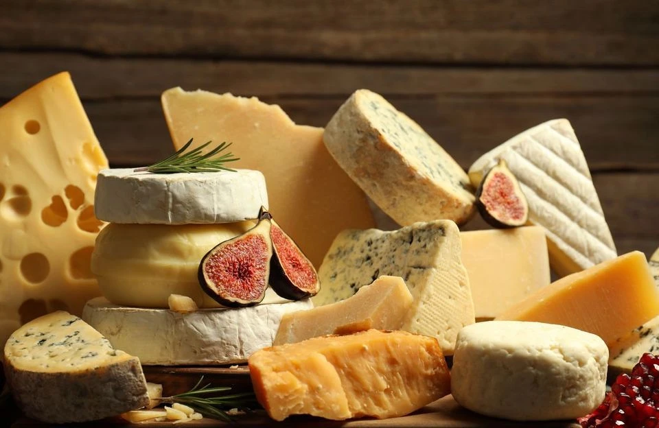
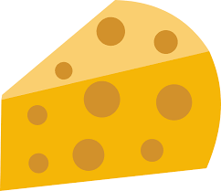

# Introduction

```{r setup, include=FALSE}

knitr::opts_chunk$set(
	echo = FALSE,
	message = FALSE,
	warning = FALSE
)
```

<br>

::: {style="display: table; margin: auto;"}


<p style="font-size: 0.75em; color: #666; margin-top: 4px;">

© Olga Yastremska / iStock images

</p>
:::

<br>

La présente infographie se veut être un exemple parfaitement inutile de ce qu'on peut produire à l'aide du format Rmarkdown.

On y présentera :

- les possibilités rédactionnelles et de mise en page pour mettre en valeur le ***fromage*** ;
- l'intégration d'images, graphiques et cartes pour mieux voir le {width="30" height="24"} ;
- les possibilité de génération automatique à partir d'une série de paramètres pour toujours plus de fromage ;
- un peu d'interactivité pour du fromage 2.0.
