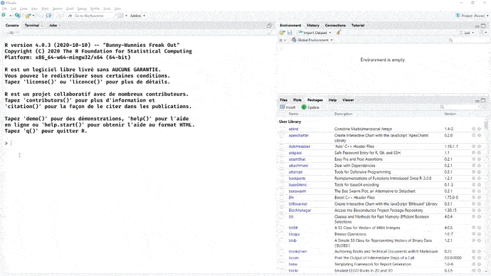
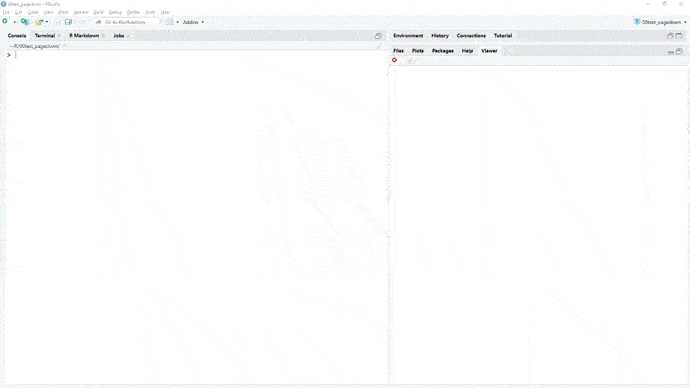
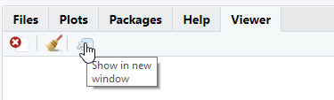
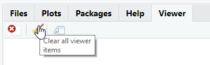

```{r setup, include=FALSE}
options(htmltools.dir.version = FALSE)
knitr::opts_chunk$set(echo = TRUE, eval=TRUE, warning = FALSE,message = FALSE,error = FALSE)
```

```{r xaringan-themer, include=FALSE, warning=FALSE, eval=TRUE}
library(showtext)
library(pagedown)
library(xaringanthemer)
style_mono_accent(
  base_color = "#000091",
  text_font_family = 'Marianne',
  code_font_family = 'Fira Code',
  background_color = 'white',
  title_slide_text_color = "white"
)
```


```{r xaringanpanelset, echo=FALSE, eval=TRUE}
xaringanExtra::use_panelset(in_xaringan = TRUE)
```

```{r share-again, echo=FALSE, eval=TRUE}
xaringanExtra::use_share_again()
```

```{r xaringan-tile-view, echo=FALSE, eval=TRUE}
xaringanExtra::use_tile_view()
```

```{r xaringan-tachyons, echo=FALSE, eval=TRUE}
xaringanExtra::use_tachyons()
```

```{r meta, echo=FALSE, eval=TRUE}
library(metathis)
meta() %>%
  meta_general(
    description = "Aprendre comment intégrer un dataset dans votre package.",
    generator = "xaringan et remark.js"
  ) %>%
  meta_name("github-repo" = "maeltheuliere/ateliers_rpackage") %>%
  meta_social(
    title = "Créer son premier package R - Rajouter un dataset dans votre package",
    url = "https://maeltheuliere.github.io/ateliers_rpackage/atelier3.html",
    image = "https://maeltheuliere.github.io/ateliers_rpackage/slides/www/slide3-card.png",
    image_alt = "Diapo titre du diaporama rajouter un dataset dans votre package",
    og_type = "website",
    og_author = "Maël THEULIERE",
    twitter_card_type = "summary_large_image"
  )
```

```{r xaringanExtra-clipboard, echo=FALSE, eval=TRUE}
htmltools::tagList(
  xaringanExtra::use_clipboard(
    button_text = "<i class=\"fa fa-clipboard\"></i>",
    success_text = "<i class=\"fa fa-check\" style=\"color: #90BE6D\"></i>",
    error_text = "<i class=\"fa fa-times-circle\" style=\"color: #F94144\"></i>"
  ),
  rmarkdown::html_dependency_font_awesome()
)
```


```{r xaringan-extra-styles, include=FALSE, warning=FALSE}
xaringanExtra::use_extra_styles(
  hover_code_line = TRUE,
  mute_unhighlighted_code = TRUE
)
```

class: center, middle

.fl.w-40.pa2[
  ```{r, include=TRUE,echo=FALSE}
  knitr::include_graphics("www/rmarkdownlogo.png",dpi = 100)
  ```
]

.fl.w-60.pa2[

  .f3[Formation publications reproductibles avec] .yellow.f3[RMarkdown]

  .f1[2 - Les principaux templates pour créer des ] .f1[publications]
]

.tr[
  .f4[Maël THEULIERE - Marouane ZELLOU]
]
---
# Introduction

Derrière Rmarkdown aujourd'hui existe tout un ecosystème permettant de mixer des traitements réalisés en R et du texte dans des formats très différents, que ce soit en matière de technologie (html, pdf, ...) ou de type de rendu (diaporama, rapport, livre, note, cv, ...).

---

# Déroulé

.fl.w-third.pa2.tc[
## Bookdown


```{r, echo=FALSE, out.width='50%'}
knitr::include_graphics("https://bookdown.org/yihui/bookdown/images/logo.png")
```

]
.fl.w-third.pa2.tc[
## Pagedown

```{r, echo=FALSE, out.width='50%'}
knitr::include_graphics("https://user-images.githubusercontent.com/163582/51942716-66be4180-23dd-11e9-8dbc-fdb4f465d1c2.png")
```

]
.fl.w-third.pa2.tc[
## Officer
```{r, echo=FALSE, out.width='50%'}
knitr::include_graphics("https://raw.githubusercontent.com/davidgohel/officer/master/inst/medias/officerlogo.svg")
```

]


---
class: inverse, center, middle
# Bookdown
---
## Bookdown

.fl.w-60.pa2[
Le format Bookdown permet de gérer des projets Rmarkdown plus large qu'un simple document de quelques pages.

Par ailleurs, le format bookdown apporte plusieurs améliorations : 

- Les livres et les rapports peuvent être créés à partir de plusieurs fichiers R Markdown.

- Des fonctionnalités de mise en forme supplémentaires sont ajoutées, telles que les références croisées et la numérotation des figures, des équations et des tableaux.

- Les documents peuvent être facilement exportés dans une gamme de formats adaptés à la publication (PDF, epub, HTML).
]
.fl.w-40.pa2.tc[
```{r, echo=FALSE, out.width='50%'}
knitr::include_graphics("https://bookdown.org/yihui/bookdown/images/logo.png")
```
]
---
## Comment créer son premier bookdown
.fl.w-40.pa2[

Installer bookdown depuis le CRAN

```{r, eval = FALSE}
install.packages('bookdown')
```

- Depuis Rstudio, cela vous apporte un nouveau type de projet, accessible depuis `File -> New Project -> New Directory -> Book Project using bookdown`.

- Une fois celui ci créé, vous pouvez cliquer sur `Build book` dans l'onglet `Build` de Rstudio. Cela vous compilera le document en html, qui sera accessible dans le répertoire du projet et visible par défaut dans le viewer.
]
.fl.w-60.pa2[

```{r, echo=FALSE}

```
]
---
## La structure du projet

Quand vous créé un projet bookdown, vous avez dans votre projet automatiquement les fichiers suivants : 

.fl.w-70.pa2[
- `index.Rmd`, le seul fichier Rmarkdown qui contient comme usuellement un yaml en entête. C'est le premier chapitre de votre livre.

- `01-intro.Rmd` à `06-references.Rmd` des fichiers rmarkdown correspondant aux chapitres de vos livres. La structure classique d'un rmarkdown est un document Rmd par chapitre, qui seront ensuite pour la version html votre premier niveau de navigation. Chaque fichier comment par le titre du chapitre.

- `_bookdown.yml` Un fichier de configuration de votre document bookdown.

- `_output.yml` Un fichier de configuration des formats de sortie de votre document (pdf, html...).

- `book.bib` un fichier de bibliographie au format [BibTeX](https://fr.wikipedia.org/wiki/BibTeX).

- `preamble.tex` et `style.css` des fichiers de configuration de l'apparence de votre document pour sa version pdf (réalisé en LaTeX) et sa version html (réalisé en css).
]
.fl.w-30.pa2[

```md
directory/
├──  index.Rmd
├── 01-intro.Rmd
├── 02-literature.Rmd
├── 03-method.Rmd
├── 04-application.Rmd
├── 05-summary.Rmd
├── 06-references.Rmd
├── _bookdown.yml
├── _output.yml
├──  book.bib
├──  preamble.tex
├──  README.md
└──  style.css
```
]
---
## La structure du projet - index.Rmd

La balise yaml du fichier `index.Rmd` contient des options spécifiques au format bookdown sur la gestion de la bibliographie.

```yaml
title: "A Minimal Book Example"
author: "Yihui Xie"
date: "`r Sys.Date()`"
site: bookdown::bookdown_site
documentclass: book
bibliography: [book.bib, packages.bib]
biblio-style: apalike
link-citations: yes
description: "This is a minimal example of using the bookdown package to write a book. The output format for this example is bookdown::gitbook."
```
---

## La structure du projet - _bookdown.yml

.fl.w-50.pa2[

Le fichier `_bookdown.yml` permet de spécifier des options de configuration supplémentaires pour construire le livre.

Par exemple : 

- changer le nom du fichier (`book_filename`)
- franciser le préfixe devant le numéro du chapitre (`chapter_name`) ou le préfixe des tableau et des graphiques (`fig` et `tab`)
- changer l'ordre de fusion des fichiers (`rmd_files`)
]
.fl.w-50.pa2[

```yaml
book_filename: "mon_premier_bookdown"
delete_merged_file: true
language:
  ui:
    chapter_name: "Chaptitre "
  label:
    fig: "Graphique "
    tab: "Tableau "
rmd_files: ["index.Rmd", "01-intro.Rmd", "05-summary.Rmd"]
```
]
---
## La structure du projet - _output.yml

.fl.w-50.pa2[


Le fichier `_output.yml` est utilisé pour spécifier les type de format de sortie (pdf, html...) et les options relatives à ces formats.


Pour le format html, c'est là par exemple que vous pouvez spécifier entre autre : 

- la feuille de style css à utiliser
- les textes inscrit en haut et en bas du menu de navigation
- les options de partage sur les réseaux sociaux que vous voulez (si vous en voulez, vous pouvez aussi tous les désactiver avec l'option `sharing` ci contre)
]

.fl.w-50.pa2[
```yaml
bookdown::gitbook:
  css: style.css
  config:
    toc:
      before: |
        <li><a href="./">Mon premier bookdown</a></li>
      after: |
        <li>Mon premier bookdown</li>
    download: ["pdf", "epub"]
    sharing: no
    info: no
```

]
---
## Quelques trucs et à astuces

- Vous pouvez exclure un chapitre de la numérotation, en rajoutant `{-}` devant son nom dans le fichier Rmd.

- Vous pouvez structurer vos chapitres en partie. 
Pour commencer une partie rajouter `# ( PART) Nom de votre partie {-}` devant un chapitre.

---

class: inverse, center, middle

# Pagedown
---

## Pagedown

.fl.w-70.pa2[


Pagedown est une implémentation pour Rmarkdown de [paged.js](https://www.pagedjs.org/), qui permet de réaliser des documents html paginés.

]

.fl.w-30.pa2[

```{r, echo=FALSE}
knitr::include_graphics("https://user-images.githubusercontent.com/163582/51942716-66be4180-23dd-11e9-8dbc-fdb4f465d1c2.png")
```

]

---

## Paged.js

.fl.w-70.pa2[

[paged.js](https://www.pagedjs.org/) est une bibliothèque javascript visant à mettre en oeuvre [les propriétés css dédiées au médias paginés](https://www.w3.org/TR/css-page-3/) du W3C.

Ces spécifications visent à pouvoir réaliser des documents prêt pour l'impression avec les technologies du web (html, css, js).

Ces spécifications sont toujours en draft pour le moment au sein du W3C, donc pas vraimente reconnues par les principaux navigateurs. D'où le besoin de cette bibliothèque javascrit pour pouvoir les mettre en oeuvre.
]

.fl.w-30.pa2[


```{r, echo=FALSE}
knitr::include_graphics("https://www.pagedmedia.org/wp-content/uploads/2018/12/pagedjs-logo.png")
```
]
---
# Comment créer son premier pagedown

.fl.w-40.pa2[

Pour installer pagedown depuis le CRAN : 

```{r, eval = FALSE}
install.packages('rstudio/pagedown')
```

Depuis Rstudio, cela vous apporte un nouveau type de document rmarkdown, accessible depuis `File -> New File -> Rmarkdown... -> From template -> Paged HTML document`.

Une fois celui ci créé, vous pouvez cliquer sur knit de l'interface de Rstudio. Cela vous compilera le document par défaut en html, qui sera accessible dans le répertoire du projet et visible par défaut dans le viewer.
]
.fl.w-60.pa2[
```{r, echo=FALSE}

```
]
---
# La structure du yaml


.fl.w-50.pa2[

La structure du yaml est relativement proche d'un document Rmarkdown classique.

A noter toutefois une option utile à retenir, la balise `knit: pagedown::chrome_print` qui vous permet de compiler directement votre document en pdf grâce à la fonction `pagedown::chrome_print()` livrée dans le package. 

Cette fonction par ailleurs peut être utilisée pour imprimer en pdf tout document html en pdf ou en format image. Elle utilise la technologie d'impression de google chrome.


]
.fl.w-50.pa2[

```yaml
title: "A Multi-page HTML Document"
author: "Yihui Xie and Romain Lesur"
date: "`r Sys.Date()`"
output:
  pagedown::html_paged:
    toc: true
    \# change to true for a self-contained document, but it'll be a litte slower for Pandoc to render
    self_contained: false
\# uncomment this line to produce HTML and PDF in RStudio:
\#knit: pagedown::chrome_print
```
]

---
#### Configurer votre document pagedown
# Configurer votre yaml

Voici quelques options du yaml intéressantes à connaître : 

.fl.w-100.pa2[
.fl.w-30.pa2[
```md
toc-title: sommaire
```
]

.fl.w-70.pa2[
Pour modifier le nom du sommaire du document.
]
]
.fl.w-100.pa2[
.fl.w-30.pa2[
```md
lot: true
lot-title: "Tableaux"
lof: true
lof-title: "Graphiques"
```
]

.fl.w-70.pa2[
Pour ajouter et configurer une liste de tableau et de graphique dans le sommaire. Si vous ne voulez pas que les graphiques et tableaux apparaissent dans le sommaire, vous pouvez utiliser `lot-unlisted: true`.
]
]
.fl.w-100.pa2[
.fl.w-30.pa2[
```md
chapter_name: "Chapitre\\ "
```
]
.fl.w-70.pa2[
Pour modifier le préfixe du titre du chapitre. Vous pouvez ensuite insérer un chapitre en utilisant `# Ceci est un titre de chapitre {.chapter}`
]
]
---
#### Configurer votre document pagedown
# Configurer votre yaml

Voici quelques options du yaml intéressantes à connaître.

.fl.w-100.pa2[
.fl.w-30.pa2[
```md
links-to-footnotes: true
```
]

.fl.w-70.pa2[
Cette option transforme automatiquement un lien url dans votre document en note de bas de page. Ainsi `[CRAN](https://cran.r-project.org/)` sera traduit comme `[CRAN]^(https://cran.r-project.org/)`.
]
]

.fl.w-100.pa2[
.fl.w-30.pa2[
```md
---
output:
  pagedown::html_paged:
    front_cover: !expr system.file("help","figures","lter_penguins.png",package = "palmerpenguins")
    back_cover: https://www.r-project.org/Rlogo.png
---
```
]
.fl.w-70.pa2[
Pour rajouter une image pour la première de couverture et la 4ème de couverture. On peut utiliser le prefix !expr pour insérer du code R créant en sortie une image.
]
]


---
#### Configurer votre document pagedown
# Quelques balises importantes à connaître

.fl.w-100.pa2[
.fl.w-40.pa2[
`.page-break-before` et `.page-break-after` vous permettent d'insérer un saut de page.
]
.fl.w-60.pa2[
```md
### Nouveau chapitre après un saut de page {.page-break-before}
```
]
]
.fl.w-100.pa2[
`[Chapitre 1]` vous permet de rajouter un lien vers la section `Chapitre 1`.
]
---
#### Configurer votre document pagedown
# Modifier le CSS

Apprendre à customiser un document pagedown va vous demander d'investir sur l'apprentissage du CSS en général et de pagedjs en particulier pour construire un template ad hoc.

C'est un investissement en soit, qui pourra vous être utile de la même façon que la gestion de la mise en page d'un document bureautique.

Vous pouvez aussi centraliser cet investissement pour votre équipe sur une ou deux personnes, ou travailler avec votre service web sur vos projets.

Quelques ressources pour apprendre le CSS : 

- [Le site de la fondation Mozilla](https://developer.mozilla.org/fr/docs/Learn/Getting_started_with_the_web/CSS_basics)

- [Le site du W3C](https://www.w3.org/Style/Examples/011/firstcss.fr.html)

---
#### Configurer votre document pagedown
# Modifier le CSS

Voici déjà quelques recettes de base pour commencer à modifier votre document.

Première étape : importer les css par défaut de pagedown dans votre document.

```{r, eval = FALSE}

files <- c("default-fonts", "default-page", "default")
from <- pagedown:::pkg_resource(paste0("css/", files, ".css"))
to <- c("custom-fonts.css", "custom-page.css", "custom.css")
file.copy(from = from, to = to)
```

Ajouter une référence à ces fichiers dans le yaml :

```yaml
output:
  pagedown::html_paged:
    css:
    - custom-fonts.css
    - custom-page.css
    - custom.css
    toc: true
    self_contained: false
```
---
#### Configurer votre document pagedown
# Modifier le CSS

- Lancer dans la console `xaringan::inf_mr()`, qui permet de compiler un document Rmarkdown en ayant un aperçu live du rendu.
.fl.w-100.pa2[
.fl.w-60.pa2[

- Appuyer ensuite sur `Show in new window` pour consulter le document sur votre navigateur par défaut.
]
.fl.w-40.pa2[

```{r, echo=FALSE}

```
]
]
.fl.w-100.pa2[
.fl.w-60.pa2[
- Puis sur `Clear all viewer item`, pour que vos modifications puisse s'afficher en live.
]
.fl.w-40.pa2[

```{r, echo=FALSE}

```
]
]
---
---
#### Configurer votre document pagedown
# Modifier le CSS

Vous pouvez commencer à modifier vos fichiers css et voir le résultats immédiatement.

Les 3 fichiers correspondent aux éléments suivants :

- `custom-fonts.css` correspond aux polices de caractères
- `custom-page.css` correspond aux paramètres de la page (format de la page, orientation,...)
- `custom.css` intègre entre autre la façon dont les pages sont affichées à l'écran (couleur de fond, espacement entre les pages...)

---
# Simplifier l'usage de {pagedown} avec {pagedreport}

.fl.w-60.pa2[
[`{pagedreport}`](https://pagedreport.rfortherestofus.com/) est un package permettant de simplifier l'appropriation de pagedown, et notamment évite de devoir rentrer tout de suite dans une modification du css.

Il n'est pas encore sur le cran, pour l'installer : 

```{r, eval = FALSE}
remotes::install_github("rfortherestofus/pagedreport)
```
]

.fl.w-40.pa2[
```{r, echo = FALSE}
knitr::include_graphics("https://mk0rfortheresto0o08q.kinstacdn.com/wp-content/uploads/2021/01/windmill.gif")
```
]
---
# Simplifier l'usage de {pagedown} avec {pagedreport}

`{pagedreport}` vous simplifie l'utilisation de pagedown en proposant trois templates avancés paramétrables via de nouvelles options à intégrer dans le yaml :

.fl.w-50.pa2[
- `paged_grid::logo` vous permet d'ajouter le logo de votre institution à votre rapport
- `paged_grid::logo` vous permet d'ajouter le logo de votre institution à votre rapport
- `paged_grid::front_img` et `paged_grid::back_img` vous permettent de choisir deux images pour la première et la quatrième de couverture.
- `main-color` et `secondary-color` vous permette de choisir les couleurs principales et secondaires de votre document.
- `main-font` et `header-font` vous permettent de choisir une police de caractère pour le texte et vos titres. Si `google-font` est à TRUE, vous pouvez sélectionner toute police disponible sur google font.

]

.fl.w-50.pa2[
```{yaml}
---
title: "Vaccination contre la covid 19 en France"
subtitle: "Au 1er juin 2021"
author: "Guillaume RRRRRozier"
date: "11 juin 2021"
output: 
    pagedreport::paged_grid:
      logo: "https://upload.wikimedia.org/wikipedia/fr/7/72/Logo_du_Gouvernement_de_la_R%C3%A9publique_fran%C3%A7aise_%282020%29.svg"
knit: pagedown::chrome_print
toc-title: "Sommaire"
main-color: "#000091"
secondary-color: "#000091"
google-font: TRUE
main-font: "Open Sans"
header-font: "Open Sans"
---

```
]
---
