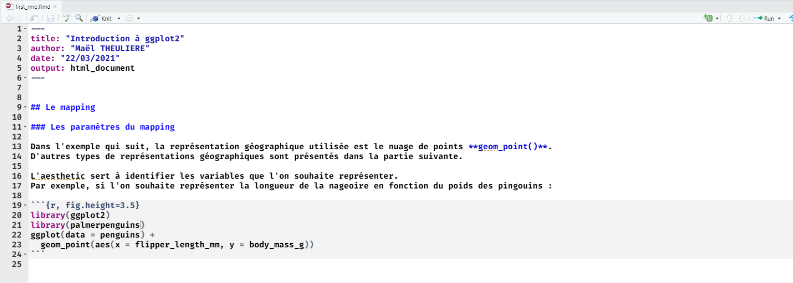

```{r setup, include=FALSE}
options(htmltools.dir.version = FALSE)
knitr::opts_chunk$set(echo = TRUE, eval=TRUE, warning = FALSE,message = FALSE,error = FALSE)
```

```{r xaringan-themer, include=FALSE, warning=FALSE, eval=TRUE}
library(showtext)
library(xaringanthemer)
style_mono_accent(
  base_color = "#000091",
  text_font_family = 'Marianne',
  code_font_family = 'Fira Code',
  background_color = 'white',
  title_slide_text_color = "#000091"
)
```


```{r xaringanpanelset, echo=FALSE, eval=TRUE}
xaringanExtra::use_panelset(in_xaringan = TRUE)
```

```{r share-again, echo=FALSE, eval=TRUE}
xaringanExtra::use_share_again()
```

```{r xaringan-tile-view, echo=FALSE, eval=TRUE}
xaringanExtra::use_tile_view()
```

```{r xaringan-tachyons, echo=FALSE, eval=TRUE}
xaringanExtra::use_tachyons()
```

```{r meta, echo=FALSE, eval=TRUE}
library(metathis)
meta() %>%
  meta_general(
    description = "Aprendre comment intégrer un dataset dans votre package.",
    generator = "xaringan et remark.js"
  ) %>% 
  meta_name("github-repo" = "maeltheuliere/ateliers_rpackage") %>% 
  meta_social(
    title = "Créer son premier package R - Rajouter un dataset dans votre package",
    url = "https://maeltheuliere.github.io/ateliers_rpackage/atelier3.html",
    image = "https://maeltheuliere.github.io/ateliers_rpackage/slides/www/slide3-card.png",
    image_alt = "Diapo titre du diaporama rajouter un dataset dans votre package",
    og_type = "website",
    og_author = "Maël THEULIERE",
    twitter_card_type = "summary_large_image"
  )
```

```{r xaringanExtra-clipboard, echo=FALSE, eval=TRUE}
htmltools::tagList(
  xaringanExtra::use_clipboard(
    button_text = "<i class=\"fa fa-clipboard\"></i>",
    success_text = "<i class=\"fa fa-check\" style=\"color: #90BE6D\"></i>",
    error_text = "<i class=\"fa fa-times-circle\" style=\"color: #F94144\"></i>"
  ),
  rmarkdown::html_dependency_font_awesome()
)
```


```{r xaringan-extra-styles, include=FALSE, warning=FALSE}
xaringanExtra::use_extra_styles(
  hover_code_line = TRUE,
  mute_unhighlighted_code = TRUE
)
```

class: center, middle

.fl.w-40.pa2[
```{r, include=TRUE,echo=FALSE}
knitr::include_graphics("www/rmarkdownlogo.png",dpi = 100)
```
]

.fl.w-60.pa2[

.f3[Formation publications reproductibles avec] .yellow.f3[RMarkdown]

.yellow.f1[1 - Introduction]
]

.tr[
.f4[Maël THEULIERE - Marouane ZELLOU]
]


---
class: inverse,center, middle

# Déroulé de l'atelier

--

- .yellow.f2[Markdown] .f2[: un outil de balisage pour écrire des documents]

--

- .yellow.f2.f2[Rmarkdown]  .f2[: un outil pour mixer du markdown avec du code R]

---
class: inverse,center, middle

# Le problème

---

# Le problème

.pull-left[
Un document word ou writer est un document lourd au format complexe, qui vous demande d'interagir avec une interface dédiée pour la mise en page.

Cette lourdeur entraine : 
- des risques sur la mise en page (empilement de formattage)
- des risques lorsque vous travaillez à plusieurs (je n'ai pas la même mise en page que toi)
- ne permet pas d'historiser proprement ce qu'on fait
]

.pull-right[
.shadow-1[
```{r, include=TRUE,echo=FALSE}
knitr::include_graphics("www/writer.png")
```
]
]
---
class: inverse,center, middle

# La solution

--

# HTML ?

---

# HTML

.pull-left[
.shadow-1[
```{r, include=TRUE,echo=FALSE}

```
]
]

.pull-right[
.shadow-1[
```{r, include=TRUE,echo=FALSE}
knitr::include_graphics("www/html_source.png")
```
]
]
---

# HTML

Le document html est complexe, le balisage rend compliqué la lecture du document source.

---
class: inverse,center, middle

# La solution ?

--

# markdown

---
# markdown

.f2[.b.light-blue[markdown] est un langage de balisage 
- .b.light-blue[éditable] en fichier texte
- .b.light-blue[compréhensible] par l'être humain 
- permettant la mise en page .b.light-blue[rapide] du texte
]
---
# Exemple
.pull-left[
```md
# qui suis je ?

Je suis un document writer avec du **gras**.

J’aime aussi les listes :

- avec
- beaucoup
- d'items
```
]
.pull-right[
# qui suis je ?

Je suis un document writer avec du **gras**.

J’aime aussi les listes :

- avec
- beaucoup
- d'items
]

---
class: inverse,center, middle

# Et bientôt...
--

## Vous saurez faire...

---
class: inverse,center, middle

.pull-left[
# Des rapports
]

.pull-right[
.shadow-3[
```{r, echo=FALSE}

```
]
]
---
class: inverse,center, middle


.pull-left[
# Des livres
]

.pull-right[
.shadow-3[
```{r, echo=FALSE}

```
]
]
---
class: inverse,center, middle

.pull-left[
# Des diaporama
]

.pull-right[
.shadow-3[
```{r, echo=FALSE}

```
]
]
---
class: inverse,center, middle

.pull-left[
# Des sites web
]

.pull-right[
.shadow-3[
```{r, echo=FALSE}
knitr::include_graphics("www/website.png")
```
]
]
---
class: inverse,center, middle

## Juste

--

## avec

--

## markdown

---
class: inverse, center, middle

## Les bases du markdown
---
# Formater du texte

.pull-left[
```md
de *l'italique*

du **gras**

de ***l'italique gras***
```

]

.pull-right[
de *l'italique*

du **gras**

de ***l'italique gras***
]
---
# Mettre des titres

.pull-left[
```md
# un titre 1

## un titre 2

### un titre 3
```

]

.pull-right[
# un titre 1

## un titre 2

### un titre 3
]
---
# Des listes non numérotées

.pull-left[
```md
Une liste avec : 

- un item
- un autre item
- un dernier item
```

]

.pull-right[

Une liste avec : 

- un item
- un autre item
- un dernier item

]
---
class: inverse, center, middle
# A vous de jouer `r emo::ji("pen")`
---
# A vous de jouer `r emo::ji("pen")`  

.pull-left[
- ### Ouvrir Rstudio
- ### Créer un ficher markdown
- ### Créer un texte avec un titre, un paragraphe, une liste d'item
- ### Appuyer sur `preview`
]
.pull-right[
```{r, echo=FALSE}
knitr::include_graphics("www/exo_md.png", dpi=150)
```

]
---
class: inverse, center, middle

# Aller plus loin sur le formatage markdown

---
# Des listes numérotées

.pull-left[
```md
Une liste avec : 

1.  un item
2. un autre item
3. un dernier item
```

]

.pull-right[

Une liste avec : 

1.  un item
2. un autre item
3. un dernier item

]
---
# Des listes imbriquées

.pull-left[
```md
Une liste avec : 

1.  un item
2. un autre item
  - avec un sous item
  - et un autre sous item
3. un dernier item
```

]

.pull-right[

Une liste avec : 

1.  un item
2. un autre item
  - avec un sous item
  - et un autre sous item
3. un dernier item

]
---
# Des liens hypertexte

.pull-left[

```md
[Ceci](https://fr.wikipedia.org/) 
est un lien vers wikipedia.
```
]

.pull-right[
[Ceci](https://fr.wikipedia.org/) 
est un lien vers wikipedia.
]
---
# Des images


.pull-left[
```md


```
]

.pull-right[
.shadow-1[

]
]
.tr.f6[
Crédits : [Kevin Pluck](https://www.flickr.com/photos/27109510@N00), [Creative Commons](https://en.wikipedia.org/wiki/fr:Creative_Commons) [Attribution 2.0 Générique](https://creativecommons.org/licenses/by/2.0/deed.fr)
]
---
class: inverse, center, middle
# A vous de jouer `r emo::ji("pen")` 
---
# A vous de jouer `r emo::ji("pen")` 

- ### Reprendre votre texte précédent
- ### Rajouter une image en dessous du titre principal
- ### Rajouter à la fin un lien en savoir plus vers le site de votre choix.

---
class: inverse, center, middle
## Comment utiliser markdown avec R ?

--

## Rmarkdown

```{r, echo=FALSE}
knitr::include_graphics("www/rmarkdownlogo.png", dpi=200)
```

---

## Rmarkdown

- Ecrire du texte en .b.green[markdown]
- Intégrer des tableaux et dataviz fait en .b.green[R]
- Pour produire toute sorte de .b.green[documents] : 

  - diaporama
  - publications
  - sites web

.fl.w-40.pa2.shadow-1[
```{r, echo=FALSE}
knitr::include_graphics("www/rmakdown_code.png")
```
]
.fl.w-10.pa2.f2.tc.b.green[
<br>
<br>
=>
]
.fl.w-40.pa2.shadow-1[
```{r, echo=FALSE}
knitr::include_graphics("www/rmakdown_render.png")
```
]
---

## Decripter un fichier Rmarkdown
.shadow-1[
```{r, echo=FALSE}

```
]
---

## Decripter un fichier Rmarkdown
.shadow-1[
```{r, echo=FALSE}
knitr::include_graphics("www/comprendre_rmd_code_R.png")
```
]
---

## Decripter un fichier Rmarkdown
.shadow-1[
```{r, echo=FALSE}
knitr::include_graphics("www/comprendre_rmd_code_R_md.png")
```
]
---

## Decripter un fichier Rmarkdown
.shadow-1[
```{r, echo=FALSE}

```
]
---

## Decripter un fichier Rmarkdown
.shadow-1[
```{r, echo=FALSE}

```
]
---

## Le YAML sert à définir les paramètres de votre document

.pull-left[
C'est dans le YAML que vous aller définir : 

- les auteurs
- la date de votre document
- le format de sortie.
]

.pull-right[
.shadow-1[
```{r, echo=FALSE}
knitr::include_graphics("www/comprendre_rmd_yaml.png")
```
]
]

---

## Le YAML sert à définir les paramètres de votre document

```md
---
title: "Introduction à rmarkdown"
author: "Marouane ZELLOU"
date: "22/03/2021"
output: html_document
---
```

---

## Le YAML sert à définir les paramètres de votre document

On peut rajouter plusieurs auteurs : 

```md
---
title: "Introduction à rmarkdown"
author: 
  - "Maël THEULIERE"
  - "Maël THEULIERE"
date: "22/03/2021"
output: html_document
---
```
---

## Le YAML sert à définir les paramètres de votre document

On peut rajouter des options pour un output : 
.pull-left[
```md
---
title: "Introduction à rmarkdown"
author: 
  - "Maël THEULIERE"
  - "Marouane ZELLOU"
date: "22/03/2021"
output: 
  html_document:
    toc: true
    theme: flatly
---

```
]

.pull-right[

- `toc: true` permet de rajouter un sommaire à notre document.
- `theme: flatly` permet de changer le thème du document.
]
---

## Le YAML sert à définir les paramètres de votre document

On peut rajouter plusieurs outputs : 

```md
---
title: "Introduction à rmarkdown"
author: 
  - "Maël THEULIERE"
  - "Marouane ZELLOU"
date: "22/03/2021"
output: 
  pdf_document: default
  html_document:
    toc: true
    theme: flatly
---
```
---
class: inverse, center, middle
# A vous de jouer `r emo::ji("pen")` 

---
# A vous de jouer `r emo::ji("pen")` 

- ### Créer un document rmarkdown html
- ### Mettez vous en auteur du document
- ### Rajouter un theme spécifique
- ### Chercher dans l'aide comment obtenir des titres numérotés
- ### Cliquer sur *knit* pour compiler le document
---

# Le code R s'insère dans des chunks

.pull-left[
C'est dans les chunks que vous pouvoir insérer le code R que vous voulez voir exécuter. 
Chaque chunk doit être nommé, et peut recevoir des options qui permettent par exemple : 

- d'afficher ou non le code (`echo`)
- de lancer ou non la commande rentrée (`eval`)
- d'afficher ou non le résultat du code (`include`)
- de modifier la largeur ou la hauteur d'une figure (`fig.width` et `fig.height`)

Les chunks sont gérés dans `{Rmarkdown}` par `{knitr}`. Il y a plus de 50 options possibles pour un chunk, vous pouvez trouver l'ensemble de la documentation [ici](https://yihui.org/knitr/options/).
]
.pull-right[
.shadow-1[
```{r, echo=FALSE}
knitr::include_graphics("www/comprendre_rmd_code_R.png")
```
]
]

---
# Le code R s'insère dans des chunks

.pull-left[
Vous pouvez aussi affecter des valeurs par défaut à l'ensemble de vos chunks avec la fonction `knitr::opts_chunk$set()` à intégrer dans votre premier chunk : 

````md
```{r, include=FALSE}`r ''`
knitr::opts_chunk$set(
  echo = FALSE, 
  eval=TRUE, 
  include=TRUE, 
  fig.width = 6
)
```
````
]


.pull-right[
.shadow-1[
```{r, echo=FALSE}
knitr::include_graphics("www/comprendre_rmd_code_R.png")
```
]
]

---
# Le texte s'écrit partout ailleurs

.pull-left[
Partout ailleurs, le texte va pouvoir s'écrire avec la syntaxe *markdown*.
]

.pull-right[
.shadow-1[
```{r, echo=FALSE}

```
]
]
---
# Formater un document en plusieurs colonnes
.pull-left[
Vous aurez besoin souvent de pouvoir par exemple définir un document en plusieurs colonne, avec par exemple une illustration sur une moitiée de la page, un texte sur l'autre.

Pour cela vous aller devoir séparer vos deux blocs dans des *"div"*.

Dans rmarkdown, des div commencent par `::: {}` et finissent par `:::`. Pour ensuite que le document aligne ces blocs l'un à coté de l'autre, vous devrez utiliser la propriété css `display: flex;` dans une `div` englobante.
]
.pull-right[
.shadow-1[
````md
# Le mapping

## Les paramètres du mapping

:::: {style="display: flex;"}

::: {}
Dans l'exemple qui suit, la représentation géographique utilisée est le nuage de points **geom_point()**.
D'autres types de représentations géographiques sont présentés dans la partie suivante.

L'aesthetic sert à identifier les variables que l'on souhaite représenter.
Par exemple, si l'on souhaite représenter la longueur de la nageoire en fonction du poids des pingouins :
:::
::: {}

```{r, fig.height=3.5}`r ''`
library(ggplot2)
library(palmerpenguins)
ggplot(data = penguins) +
  geom_point(aes(x = flipper_length_mm, y = body_mass_g))
```
:::
````
]
]
---
class: inverse,center,middle

# A vous de jouer `r emo::ji("pen")` 
---
# A vous de jouer `r emo::ji("pen")` 

## Insérer un exercice
