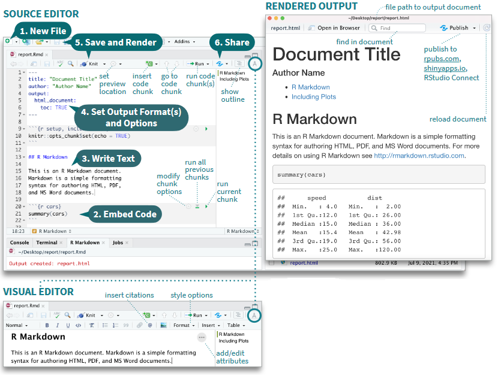
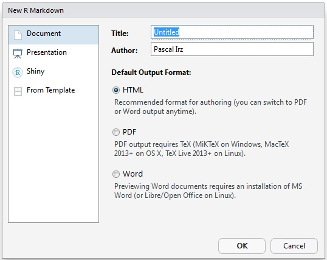
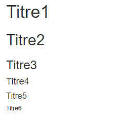
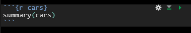

<!-- --- -->
<!-- title: "xx_rmarkdown_decortique" -->
<!-- output: -->
<!--   html_document: -->
<!--     md_extensions: +fenced_divs+ascii_identifiers -->
<!--     toc: yes -->
<!--     toc_float: yes -->
<!--     toc_depth: 5 -->
<!--   pdf_document: -->
<!--     toc: yes -->
<!--     toc_depth: '5' -->
<!-- css: assets/css/style.css -->
<!-- editor_options: -->
<!--   chunk_output_type: console -->
<!-- --- -->

remplace "chap 1", "chap 5" et "chap 051" chap 6 et chap 061
chapitre 04 à peaufiner avec chap 7 et 9
rediviser ce rmd en chapitre
<!-- 

Codification utilisée dans le cadre de l'élaboration du document

ASK: marqueur pour identifier les sujets à débattre
ANS: possible réponse
<a name="TD-1"/>TD.1  : marquage des TD

-->


# Le fichier *R Markdown*

Ce chapitre n'a pas l'ambition de se substituer au 
[Le guide définitif de Rmarkdown](https://bookdown.org/yihui/rmarkdown/markdown-syntax.html) 
(un des auteurs, Yihui Xie, est le créateur du package `rmarkdown`) ou au
[guide de référence](https://www.rstudio.com/wp-content/uploads/2015/03/rmarkdown-reference.pdf) 
mais peut faciliter à un certain nombre de lecteurs francophones l'approche 
et la compréhension du système de production de documents **R Markdown** 
car à notre connaissance ces guides n'ont pas encore été traduits. 

{class='centered' width='30%'}

Au-delà de ces manuels de référence, certes complets mais imposants, il existe une 
[anti-sèche (cheatsheet) rmarkdown](https://raw.githubusercontent.com/rstudio/cheatsheets/main/rmarkdown.pdf) 
qui réussit en deux pages à synthétiser l'essentiel de ce qu'il faut savoir 
pour exploiter le système de production proposé au travers de RStudio.
La formation proposée et le présent chapitre ont d'ailleurs pour principal 
objectif de permettre à tout un chacun de pouvoir complètement en tirer profit.

Le guide officiel (R Markdown Reference Guide) ainsi que l'antisèche 
(R Markdown Cheat Sheet) sont accessibles facilement depuis RStudio en passant 
par le menu Aide/Help.


## R markdown dans RStudio

Pour utiliser R Markdown, il faut que le package `rmarkdown`
soit installé :

```{r install2, eval = FALSE, warning = FALSE, error = FALSE}
install.packages ("rmarkdown")
library (rmarkdown)
```

Dans l'environnement de développement intégré RStudio de votre bureau,
le développeur dispose d'outils qui simplifient la production d'un
fichier R Markdown.



Le travail comprend généralement les étapes suivantes, toutefois les
étapes 2 à 4 peuvent se faire dans n'importe quel ordre :

  1. Ouvrir un nouveau fichier .Rmd (prérempli avec des exemples)
  2. Écrire des instructions de traitement des données
  3. Compléter le document en ajoutant du texte
  4. Adapter l'en-tête
  5. Lancer la génération du document
  6. Publier le document (cas particulier, facultatif)

### Créer un fichier .Rmd

> ASK: Début d'un TD (travail dirigé) ?
> --- LBn
> ANS: le mettre avant
> et inclure la modif de l'entete dans le TD 2 --- CCn ok!!!!!

On crée un nouveau fichier de type Rmarkdown en allant dans le menu
File $\Rightarrow$ New file $\Rightarrow$ R Markdown


Une pop-up s'ouvre alors pour donner quelques informations afin
d'initialiser le fichier qui va être créé en remplissant quelques champs 
imposés ou fortement recommandés par le processus global.



Pour commencer simplement, on choisit un format de sortie HTML. C'est
le format de sortie par défaut, très utilisé (nous verrons les autres
formats de sortie par la suite).  RStudio crée un fichier contenant
des exemples des éléments structurant un fichier R markdown.
L'extension de ce type de fichier est `.Rmd`.

### Lancer la génération du document

Une fois le fichier .Rmd complété et enregistré, vous pouvez
visualiser la table des matières en cliquant sur l'icône
.  Vous pouvez aussi
prévisualiser le document en sortie en cliquant sur l'icône **compas**
qui donne accès au "visual editor".

Pour générer un document à partir du fichier .Rmd, il suffit de
cliquer sur le bouton **knit**.  Un fichier (html si vous avez choisi
ce format de sortie) portant le même nom que le fichier.Rmd est alors
créé dans le repertoire de travail (là où vous avez créé votre projet
R), et en même temps le document généré s'ouvre dans le viewer de R
Studio (ou dans une pop-up).


:::{.trucsetastuces}
  **Trucs & Astuces**
  
  On peut générer le document d'autres façons: 

    rmarkdown::render(nom_fichier.Rmd)

  ou grâce au raccourci <span class="kbd">Ctrl + Shift + K</span>
:::


Ce document contient l'ensemble des informations du fichier .Rmd, que
cela soit le texte (mis en forme), la visualisation du code intégré
(si celle-ci est demandée) et ce qui est produit par ce code.

> ASK: Est ce qu'on met une image des icones? 
> Est ce qu'on met une image du document généré par le fichier de
> base? cela permettrait que les stagiaires visualisent 
> directement de quoi on parle
OK
> --- CCn

## Les éléments d'un fichier .Rmd

Un fichier R Markdown est constitué de 3 éléments principaux.


L'**en-tête** contient les métadonnées pour guider la génération du
document.  Il est suivi du corps du futur document, constitué de
**morceaux de code** (les *chunks*) à éxécuter et de partie de
**textes** à afficher avec des élements de mise en forme.

Dans les sections suivantes ces composants seront détaillés un par un.

### L'en-tête

L'en-tête s'écrit au format YAML c'est un
[format](https://fr.wikipedia.org/wiki/YAML) ayant pour objectif de
représenter des informations plus élaborées que le simple CSV en
gardant cependant une lisibilité presque comparable.  

L'en-tête est parfois appelé le Header ou le YAML. Il sert à définir les
paramètres de votre document comme les informations basiques sur le
document ainsi que des choix relatifs au format de sortie (PDF, HTML,
DOCX, etc.).  Il est délimité par deux séries de `---`.


::::: {.trucsetastuces}::::::    
  **Trucs & Astuces**
  
  Pour modifier l'en-tête, attention à bien respecter l'alignement des indentations.
  Ce sont elles qui indiquent la hiérarchie entre les éléments texte.
:::::::::::::::::::::::::::::


C'est dans le YAML que vous allez définir notamment :

  - le titre (initialisé lors de la création du fichier)
  - les auteurs
  - la date de votre document
  - le format de sortie (initialisé lors de la création du fichier)
  - des options
  - des paramètres.


``` {.md}
title: "mon_premier_document"
author: "Moi"
date: "31/10/2022"
output: html_document
```


On peut rajouter plusieurs auteurs :


``` {.md}
title: "mon_premier_document"
author: 
  - "Moi"
  - "Toi"
date: "31/10/2022"
output: html_document
```

On peut rajouter des options pour un output, ce qui sera vu en détail 
dans le paragraphe 1.3.1.


Il est possible de rajouter plusieurs outputs :

``` {.md}
title: "mon_premier_document"
author: 
  - "Moi"
  - "Toi"
date: "31/10/2022"
output: 
  pdf_document: default
  html_document:
    toc: true
    theme: flatly
```


::: {.exo}
**Exercice 1**

  - Ouvrir Rstudio
  - Créer un fichier markdown, format html
  - prévisualiser le document avant toutes modifications
  - Mettez-vous en auteur du document
  - Rajouter un theme spécifique
  - Cliquer sur *knit* pour compiler le document et identifier 
    les correspondances entre fichier .Rmd et fichier html
:::

### Les éléments texte

Le texte s'écrit en syntaxe Markdown, qui est en fait du PANDOC pour
Markdown.  Vous trouverez la documentation complète sur le PANDOC pour
Markdown [ici](https://pandoc.org/MANUAL.html#pandocs-markdown).


::::: {.trucsetastuces}::::::    
  **Trucs & Astuces**
  
  De manière générale, il est préférable de laisser au moins une ligne
  blanche entre différentes éléments (par exemple entre un titre et le
  paragraphe).  
  Cela évite toute confusion lors de la génération du
  document (tous les processus de génération n'interpretent pas exactement
  la même chose pour une même synthaxe).
:::::::::::::::::::::::::::::


#### Le texte simple

Le texte simple est directement interprété sans besoin de balisage.

#### La mise en forme à la volée

Pour les *caractères en italique*, entourer de deux `*` ou deux `_` : 
`*caractères italiques*`.\

Pour les **caractères gras**, entourer de deux `**` ou deux `__` : 
`**caractères gras**`.\

Pour les ~indices~ et les ^exposants^, entourer des caractères `~indices~`ou
`^exposants^` respectivement.\

Pour les ~~barrés~~, entourer des caractères `~~barrés~~`.\

Pour un style `code`, entourer des caractères `` `code` ``.\

Pour un bloc de code, entourer des caractères ```` ``` ```` 
ou on commence chaque ligne par au moins 4 espaces.

Pour forcer le retour à la ligne, terminer par un double espace 
ou un `\` ou sauter une ligne.

##### Les titres

Contrairement à la pratique en R, le `#` indique les titres. Par
défaut, dans Rmarkdown, ils ne sont pas numérotés.

-   `#` pour le Titre1
-   `##` pour le Titre2
-   `###` pour le Titre3
-   `####` pour le Titre4
-   `#####` pour le Titre5
-   `######` pour le Titre6

Rend:\


Pour une numérotation automatique des titres, tableaux, figures,
cartes, équations, etc. il faut passer au package `bookdown` (voir
partie suivante).

##### Les listes

**Liste à puces**

Les listes à puces, sans ordre, commencent par `-` ou `*` ou `+`, en précédant la liste par une ligne vide.
On peut créer des listes imbriquées en indentant la sous-liste.

    - Premier élément  
    - Deuxième élément     
          - Sous-élément 1  
              - ezgtz  
              - aergtg  
          - Sous-élément 2  

Rend :

-   Premier élément\
-   Deuxième élément\
    -   Sous-élément 1\
        -   aaaa\
        -   bbbb\
    -   Sous-élément 2

**Liste numérotée**

    1. Premier élément  
    2. Deuxième élément     
          1) Sous-élément 1  
              a- aaaa  
              b- bbbb  
          ii) Sous-élément 2  

Rend :

1.  Premier élément\
2.  Deuxième élément
    1)  Sous-élément 1\
        a-  aaaa\
        b-  bbbb\ 
    ii) Sous-élément 2 


##### Les mentions

Les "mentions" sont pratiques pour mettre en valeur les éléments "à retenir".

    > Texte à mettre en mention

Rend : 

> Texte à mettre en mention

##### Liens et note de bas de page

Pour faire un lien vers un site internet, on met le texte affiché entre `[]` 
et l'adresse http  entre `()`  

`[Cliquer sur le lien](https://mtes-mct.github.io/parcours-r/)` 

rend

[Cliquer sur le lien](https://mtes-mct.github.io/parcours-r/)


Les notes de bas de page s'écrivent à l'intérieur de `^[]`. 
`^[Ceci est une note de bas de page]` rend ^[Ceci est une note de bas de page].

::: {.exo}
**Exercice 2**

 - Partir du fichier .Rmd de l'exercice précédent
 - Créer un texte avec un titre, un paragraphe, une liste d'item, 
   un encart et un lien
 - Appuyer sur `visual` pour avoir un aperçu du rendu final
:::

### Les *chunks* 

Les parties de code R sont contenues dans des blocs, appelés
*chunks*. 

Ces chunks commencent et finissent par les balises ```` ``` ````. 

C'est dans les chunks que vous pouvoir insérer le code R que vous
voulez voir exécuter.



On peut créer un nouveau chunk en cliquant sur le bouton 

 ou grâce au raccourci clavier `Ctrl + Alt + I`.

Ces chunks peuvent être nommés (avec des caractères alphanumériques
minuscules et majuscules et des tirets `-`). Dans l’exemple précédent,
le nom du chunk est cars.

#### Les options des *chunks*

Au début de chaque chunk se trouve une accolade contenant la lettre
r. C’est dans cette accolade, après la lettre r (qu'il ne faut pas
enlever) que les options vont pouvoir être passées. Elles permettent
de controller finement ce qui est produit par le chunk, pour choisir
de faire apparaître, ou non, le code dans le rapport dynamique, ainsi
que les résultats, ou encore pour définir la taille des plots.

Chaque chunk peut recevoir des options. Voici quelques exemples utilisés 
fréquemment :

  - `eval = TRUE` : Le chunk est exécuté.

  - `include = FALSE` : Le code contenu dans le chunk est éxecuté
    sans que soient affichés ni le chunk ni son résultat.  Ses
    résultats sont utilisables par d'autres chunks.

  - `echo = FALSE` : permet de ne pas afficher les codes dans le rendu.
    Par contre le résultat est affiché.

  - `message = FALSE` : empêche l'affichage des messages d'information générés par les codes.

  - `warning = FALSE` : empêche l'affichage des messages d'alerte générés par les codes.

  - `error = FALSE` : empêche l'affichage des messages d'erreur générés par les codes.

  - `fig.cap = "..."` : ajoute une légende aux graphiques.

  - `fig.align = "..."` : aligne les graphiques (choix : `left`, `right` ou `center`).

  - `fig.height = 6, fig.width = 8` : permet de modifier les dimensions 
  de la figure (en pouces).
  
  - `fig.pos = "..."` : permet de définir la position des graphiques 
  (choix : ????).

> ASK: comment on utilise l'option fig.pos? 
> --- CCn

Les chunks sont gérés dans `{Rmarkdown}` par le package `{knitr}`.

Il y a plus de 50 options possibles pour un chunk, vous pouvez trouver
l'ensemble de la documentation
[ici](https://yihui.org/knitr/options/).


#### Les options globales des chunks

Il est possible de définir des options globales qui seront appliquées à
chacun des chunks qui sont contenus dans le fichier, sauf
spécifications contraires dans les options d'un chunk.

 
```{embed, file = "./hack_verbatim_chunks/insverba-e.Rmd"}
```


Ce chunk *setup* se trouve en dessous de l’en-tête, il permet de
régler les options par défaut de tous les chunks grâce à la fonction 
`knitr::opts_chunk$set()`. Par exemple, on va
pouvoir indiquer que l’on ne veut pas faire apparaitre les messages et
les warnings qui pourraient être générés lors de l’exécution des
chunks. Au lieu de le faire pour tous les chunks, on peut le faire une
seule fois ici.

 
#### Utiliser des outputs 

A l'intérieur du chunk, de nombreuses choses peuvent être faites,
comme traiter des données, produire une table, des graphiques ou du
texte.

Pour cela, on utilise différentes fonctions R comme
`plot` ou `kable` dans un chunk.


On peut par exemple inclure un **graphique**:

```{embed, file = "./hack_verbatim_chunks/insverba-a.Rmd"}
```

ce qui affiche le graphique dans le document, directement après le chunk:

```{r, echo=FALSE}
plot(pressure)
```

Ou des **données** non mises en forme

```{embed, file = "./hack_verbatim_chunks/insverba-b.Rmd"}
```


```{r, echo=FALSE}
summary(cars)
```

Ou des **tableaux**


```{embed, file = "./hack_verbatim_chunks/insverba-c.Rmd"}
```


qui rend 

```{r, echo=FALSE}
knitr::kable(iris[1:5, ], caption = 'A caption')
```


#### Les insertions de code en ligne

Enfin, il est possible d'**insérer la valeur d'objets R** (variable,
liste, résultat de calcul simple...) dans du texte. Pour cela il faut
inclure l'objet R entre `` `r knitr::inline_expr("...code...")` ``.

```{r echo=FALSE,include=FALSE}
numero <- 6
```

Par exemple le code suivant:

```{embed, file = "./hack_verbatim_chunks/insverba-d.Rmd"}
```
permet d'afficher dans le document:

Je suis actuellement en train de me former au module  `r numero`.


#### Exécuter le code des chunks

Les codes contenus dans les chunks d’un document.Rmd peuvent être
exécutés comme les codes contenus dans un script R en .R. Vous pouvez
exécuter l’ensemble en faisant CTRL + A pour tout sélectionner et
CRTL + ENTER pour exécuter.  Vous pouvez aussi exécuter le code chunk
par chunk en placer votre souris au début d’un chunk puis en utilisant
CTRL + ENTER ou en cliquant sur le bouton **play vert** en haut du
chunk. D’autres options sont disponibles dans le menu déroulant du
bouton run en haut à droite.


Lorsque le code est excécuté, par défaut les résultats (sorties) et
les plots sont affichés dans le document .Rmd. Pour afficher les
sorties dans la console et les plots dans la fenêtre graphique, il
faut choisir l’option “Chunk Output in Console“.


### Insérer des images

La syntaxe la plus simple pour insérer une image est la suivante :

``

On peut adapter les dimensions de l'image :

`{ width=50% }`


::::: {.trucsetastuces}::::::    
  **Trucs & Astuces**
  
  NB : les caractères 'espace' ne sont pas autorisés autour du signe
  égal `=`, 
  ni entre la parenthèse fermante et l'accolade ouvrante.
  On a `){`.
:::::::::::::::::::::::::::::


On peut aussi utiliser la fonction `knitr::include_graphics` :

```{r eval=TRUE}
knitr::include_graphics("assets/img/couleuvre.jpg")
```

Cette dernière méthode, préconisée quand le format de sortie n'est pas
du html, permet de mieux controller l'affichage de l'image.

::: {.exo}
**Exercice 3**

> ASK: dans ce exercice est ce qu'on doit expliciter les traitements 
> de données et le graphique attendu? oui!
> il faut prévoir un temps pour expliciter les données utilisées (RPLS) 
> --- CCn


  - Partir du fichier .Rmd de l'exercice précédent
  - Définir des options générales
  - Ajouter un chunk créant une table, qui sera traitée mais non
    affichée dans le document final
  - Ajouter un chunk créant un graphique, qui sera traité et affiché dans 
    le document final 
  - Ajouter une image
  - Générer le document

:::


### Autres 

#### Commentaires 

Pour mettre une partie du fichier en commentaires, non traitée, il
faut encadrer la partie par `<!-- commentaires -->`.

Pour cela on peut utiliser le raccourci clavier `Ctrl + Shift + C` ou
la commande dans le menu "Code".


## Convertir le fichier Rmarkdown pour utilisation

### Les formats de sortie

Lors de la création du fichier .Rmd, vous avez dû choisir le format
par défaut du document qui sera généré. Ce choix se retrouve dans
l'option `output`de l'en-tête.

Il est possible de modifier le format du document généré, soit en
modifiant l'option de l'en-tête ou celle de la fonction knit (via sur la flèche
vers le bas du bouton knit ou via les options de la ligne de code).

Il existe deux types de format dans le package `rmarkdown`: documents
et présentations. Tous les formats possibles sont listés ci-dessous:

  - beamer_presentation
  - context_document
  - github_document
  - html_document
  - ioslides_presentation
  - latex_document
  - md_document
  - odt_document
  - pdf_document
  - powerpoint_presentation
  - rtf_document
  - slidy_presentation
  - word_document

Chaque format a son propre lot d'options, qui sont documentées dans la 
documentation de la fonction associée (par exemple `?rmarkdown::html_document`).


::: {.trucsetastuces}
  **Trucs & Astuces**
  
 Attention : quand on inclut du code R dans un document, il faut s'assurer que 
 les packages R utilisés sont compatibles avec le(s) format(s) choisi(s).
 Les packages du tidyverse sont compatibles avec les formats HTML et PDF. 
 La compatibilité entre packages et formats doit être vérifiée au cas par cas.
:::


Nous allons vous présenter les formats les plus utiles.

#### HTML

A l'origine, Markdown a été conçu pour générer du HTML; c'est ce
format qui a le plus de possibilités parmi tous les formats. C'est aussi celui 
qui est le plus compatible avec les différents packages R de production
d'output.

Pour obtenir un document HTML, il faut mettre l'option `output:
html_document` dans l'en-tête.

Voici les options utilisées fréquemment:

  - `toc: true` permet d'ajouter une table des matières 
    (table of contents en anglais) à notre document.
  - `toc_depth: 2` permet de définir le niveau de titre le plus bas à mettre 
    dans la table des matières (par défaut 3). 
  - `toc_float : true` permet de rendre la table des matières flottante. 
     Elle sera systématiquement visible, meme si on défile le document. 
     Ce paramètre accepte des options.
  - `number_sections : true` permet de numéroter les titres.
  - `theme: flatly` permet de changer le thème du document 
    (tiré de la librairie [Bootswatch](https://bootswatch.com/3/).
  - `fig_width : 7` et  `fig_height : 5` permettent de définir par défaut 
    la largeur et la hauteur des figures.
  - `fig_caption : true` permettent de définir les figures contiennent 
    une légende.


``` {.md}
title: "mon_premier_document"
author: 
  - "Moi"
  - "Toi"
date: "31/10/2022"
output: 
  html_document:
    toc: true
    theme: flatly
```


L'ensemble des options est listé page 5 du 
[document de référence Rmarkdown](https://www.rstudio.com/wp-content/uploads/2015/03/rmarkdown-reference.pdf)


#### PDF

Pour générer des documents PDF, il est nécessaire d'avoir installé LaTeX. 
Pour ceux qui ne l'ont pas déjà installé, nous conseillons 
[TinyTeX](https://yihui.name/tinytex/) qui est une distribution LaTeX légère, 
portable et facile à maintenir. Le package `tinytex` installe automatiquement 
les packages LaTeX manquants lors que la compilation de documents R Markdown 
en PDF.

Le code suivant permet d'installer `tinytex` :

```{embed, file = "./hack_verbatim_chunks/insverba-f.Rmd"}
```

LaTeX est un logiciel externe qui vient en complément de R pour produire des 
PDF. Pour pouvoir l'utiliser il faut l'installer (via TinyTeX) mais aussi 
prévenir R du lieu de ces nouveaux éxécutables. Pour cela, il faut modifier 
le fichier caché .Renviron présent dans notre Home. 
Il faut ajouter les lignes de code suivantes:


``` {.md}
TINYTEX_HOME="${LOCALAPPDATA}\TinyTex\bin\win32"
PATH="${TINYTEX_HOME};${PATH}"
```

> ASK: est ce que cela est correct et clair?
> install_tinytex ne fonctionne toujours pas chez moi! multirow.sty non trouvé
> --- CCn

Il est important de noter qu'en LaTeX, les figures sont flottantes par défaut.
Même si on crée un graphique dans un bout de code présent sur la 1ere page, 
celui-ci peut finalement apparaitre sur la page suivante. LaTeX a tendance à 
faire apparaitre les figures au début ou à la fin des pages. Nous vous 
conseillons de ne traiter le posionnement des figures à la fin, une fois la 
totalité du contenu écrite. Pour cela il faudra utiliser les options de 
positionnement dans les chunks (par exemple fig_pos = "h")


Pour obtenir un document PDF, il faut mettre l'option `output:
pdf_document` dans l'en-tête.

Voici les options utilisées fréquemment:

  - `toc: true` permet d'ajouter une table des matières 
    (table of contents en anglais) à notre document.
  - `toc_depth: 2` permet de définir le niveau de titre le plus bas à mettre 
    dans la table des matières (par défaut 2). 
  - `number_sections : true` permet de numéroter les titres.
  - `fig_width : 7` et  `fig_height : 5` permettent de définir par défaut 
    la largeur et la hauteur des figures (par défaut 6.5x4.5).
  - `fig_caption : true` permettent de définir les figures contiennent 
    une légende (par défaut `true`).
  
  
  

::::: {.trucsetastuces}::::::    
  **Trucs & Astuces**
  
 Si vous souhaitez accéder à plus d'options de mise en forme de tableau, le 
 package `kableExtra` contient des fonctions compatibles avec les formats 
 HMTL et PDF. 
 Cependant cela reste compliqué de mettre en forme des tableaux complexes, 
 en particulier si vous souhaitez plusieurs formats en sortie. Nous vous 
 conseillons d'adapter la mise en forme pour chaque format ou de trouver 
 une nouvelle façon de représenter la donnée.
:::::::::::::::::::::::::::::


::: {.exo}
**Exercice 4**

En repartant du fichier .Rmd de l'exercice précédent :

  - Modifier les options pour avoir un sommaire flottant affichant un seul 
  niveau de titre
  - Changer le thème utilisé
  - Générer le document 
  - Repartir du fichier .Rmd pour générer un document PDF. Il est important 
  de vérifier la compatibilité des éléments définits avec ce nouveau format.
:::

### Ajouter des paramètres

Un des nombreux avantages de R Markdown est la possibilité de reproduire des 
analyses très facilement en actualisant une partie du travail ou en changeant 
un des entrants du document.
Utiliser des paramètres permet d'aller encore plus loin pour créer un document 
qui peut être réutilisé pour plusieurs scenarios. On peut ainsi créer des 
documents pour des territoires ou des années différents, faire tourner une 
analyse en changeant une des hypothèses ou changer le comportement de `knitr` 
selon les cas rencontrés.


Les paramètres sont spécifiés dans l'en-tête avec l'option `params` dans 
laquelle plusieurs paramètres, et leur valeur par défaut, sont listés, un par ligne.


Les paramètres peuvent etre de type `character`, `numeric`, `integer` et 
`logical` mais aussi des expressions R tant qu'elles sont précédées de `!r `. 
L'en-tête, et donc le code pouvant y être présent, est éxécuté avant le reste 
du code donc il est nécéssaire d'expliciter les packages utilisés.

Par exemple: 


``` {.md}
title: "mon_premier_document"
author: "Moi"
date: "31/10/2022"
output: html_document
params:
  annee: 2022
  region: Bretagne
  date: !r lubricate::today()
```

Une fois définis dans l'en-tête, ces parametres sont accessibles depuis le 
fichier .RMD (texte ou code) mais aussi depuis la console. Ils sont stockés 
dans une liste en lecture nommée *params*. 

Le code suivant montre quelques exemples d'utilisation des paramètres :

```{embed, file = "./hack_verbatim_chunks/insverba-g.Rmd"}
```

Il existe 3 façons de générer un document avec des paramètres:
  - utiliser le bouton **knit**, ce qui prend les valeur par défaut des paramètres
  
  - utiliser l'interface RStudio selectionnant l'option **Knit with Parameters** du bouton **knit**. Cela ouvre une nouvelle fenêtre demandant de choisir les valeurs des paramètres indiqués dans l'en-tête.
  
  - utiliser la fonction `rmarkdown::render()`. Sans autre option cette fonction 
  utilisera les paramètres par défaut définis dans l'en-tête. On peut aussi 
  définir de nouvelles   valeurs en utilisant l'option `params=`. 
  Cela donne par exemple :
  
```{embed, file = "./hack_verbatim_chunks/insverba-h.Rmd"}
```

Cette dernière façon de faire, via la fonction `rmarkdown::render()` permet 
d'automatiser encore plus les choses en générant autant de documents que de 
valeurs différentes d'un paramètre. En effet, dans un script .R, il est 
possible de créer une fonction ayant en entrée les paramètres que l'on veut 
modifier plusieurs fois mais aussi le nom du document généré.

En reprenant l'exemple précédant, on peut faire:
  
```{embed, file = "./hack_verbatim_chunks/insverba-i.R"}
```


## Pour aller plus loin


#### Affichages sur plusieurs colonnes

cela se fait très bien en format PDF, c'est plus compliqué en HTML.
Vous pourrez avoir besoin de définir un document
en plusieurs colonnes, avec par exemple une illustration sur une
moitiée de la page, un texte sur l'autre.

Pour cela vous aller devoir séparer vos colonnes dans des *"div"*.

Dans rmarkdown, des div commencent par `::: {}` et finissent par `:::`.

Pour ensuite que le document aligne ces blocs l'un à coté de l'autre,
vous devrez utiliser la propriété css `display: flex;` dans une `div`
englobante.


> ASK: est ce que vous pouvez me donner un exemple à ajouter ?
https://bookdown.org/yihui/rmarkdown-cookbook/custom-blocks.html
> --- CCn


### Autres formats de sortie


Il existe des packages permettant d'obtenir des formats de sortie spécifiques. 
A chaque fois il convient de vérifier que ces formats des sorties et votre 
code sont compatibles.
  
pagedown pour faire du PDF sans Latex?
gouvdown? où on trouve la doc?
distill? 
les présentations
xaringan ?
officer et officedown?

#### odt_document  --> TODO

les tableaux faits en kableExtra et knitr::kable ne sortent pas correctement. 
les graphiques ne sont pas complets (titres coupés par ex)
ce format pourrait etre utile uniquement pour le texte. 
les graphiques seraient à faire séparement?


### reference .R files 

### Le cache 

Si le temps d'éxecution du code est trop long, il est possible
d'utiliser l'option de mise en cache de `knitr` afin d'améliorer les
performances d'éxécution du code.

> ASK: Est ce qu'on parle de cela ou non? 
> --- CCn

## Bibliographie 

Voici quelques éléments bibliographiques pour en savoir plus sur R Markdown 
mais aussi tous les packages et logiciels en lien avec ce sujet:

  - [Le guide définitif de Rmarkdown](https://bookdown.org/yihui/rmarkdown/markdown-syntax.html)
  - [Le guide de référence](https://www.rstudio.com/wp-content/uploads/2015/03/rmarkdown-reference.pdf) 
  - [La syntaxe Markdown sur laquelle s'appuie `rmarkdown`]`(https://daringfireball.net/projects/markdown/syntax#philosophy)
  - [Pour en savoir plus sur PANDOC](https://pandoc.org/MANUAL.html#pandocs-markdown)
  - [Pour en savoir plus sur TinyTeX](https://yihui.org/tinytex/)
  - [Une vidéo en anglais pour aller plus loin dasn l'utilisation de R Markdown](https://www.youtube.com/watch?v=WkF7nqEYF1E)
  - et évidemment les documentations de tous les packages cités!

