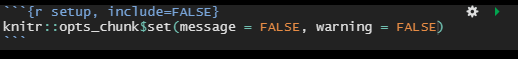

# Le fichier *R Markdown*

La "cheatsheet" rmarkdown et le [document de référence](https://www.rstudio.com/wp-content/uploads/2015/03/rmarkdown-reference.pdf) sont une aide précieuse.
Ils sont accessibles [sur le site de RStudio](https://www.rstudio.com/resources/cheatsheets/) ou directement depuis RStudio :


## R markdown dans RStudio

Pour utiliser R Markdown, il faut que les packages `rmarkdown` et `markdown` soient installés :

```{r install, eval = FALSE, warning = FALSE, error = FALSE}
install.packages ("rmarkdown")
library (rmarkdown)
install.packages ("markdown")
library (markdown)
```

Dans l'environnement de développement intégré RStudio de votre bureau, le développeur dispose d'outils qui simplifient la production d'un fichier R Markdown.


Le travail comprend les étapes suivantes :\
1.
Ouvrir un nouveau fichier .Rmd prérempli avec des exemples\
2 et 3
. Compléter le document en ajoutant du code et en écrivant le texte (à partir des exemples proposés si on le souhaite)\
4. Modifier l'en-tête
\
5. Enregistrer le fichier et lancer la génération du documen
t\
6. Publier le docu
ment

### Créer un fichier .Rmd

On crée un nouveau fichier de type Rmarkdown en allant dans le menu File $\Rightarrow$ New file $\Rightarrow$ R Markdown


Une pop-up s'ouvre alors pour parametrer le fichier créé:


Pour commencer simplement, on choisit un format de sortie HTML.
C'est le format de sortie par défaut, très utilisé (nous verrons les autres formats de sortie par la suite).
RStudio crée un fichier contenant des exemples des éléments structurant un fichier R markdown.
L'extension de ce type de fichier est `.Rmd`.

### Lancer la génération du document

Une fois le fichier .Rmd complété et enregistré, vous pouvez visualiser la table des matières en cliquant sur l'icône .
Vous pouvez aussi prévisualiser le document en sortie en cliquant sur l'icône **compas** qui donne accès au "visual editor".

Pour générer un document à partir du fichier .Rmd, il suffit de cliquer sur le bouton **knit**.
Un fichier (html si vous avez choisi ce format de sortie) portant le même nom que le fichier.Rmd est alors créé dans le repertoire de travail (là où vous avez créé votre projet R), et en même temps le document généré s'ouvre dans le viewer de R Studio (ou dans une pop-up).

> On peut générer le document d'autres façons: render(nom_fichier.Rmd) ou grâce au raccourci `Ctrl + Shift + K`

Ce document contient l'ensemble des informations du fichier .Rmd, que cela soit le texte (mis en forme), la visualisation du code intégré (si celle-ci est demandée) et ce qui est produit par ce code.

*est ce qu'on met une image des icones?* *est ce qu'on met une image du document généré par le fichier de base?*

## Les éléments d'un fichier .Rmd

Un fichier R Markdown est constitué de 3 éléments principaux.


L'en-tête contient les métadonnées pour guider la génération du document.
Il est suivi du corps du futur document, constitué de morceaux de code (les *chunks*) à éxécuter et du texte à afficher avec des élements de mise en forme.

### L'en-tête

L'en-tête s'écrit au format YAML ([format](https://fr.wikipedia.org/wiki/YAML) ayant pour objectif de représenter des informations plus élaborées que le simple CSV en gardant cependant une lisibilité presque comparable).
Il est parfois appelé le Header ou le YAML.\
Il sert à définir les paramètres de votre document comme les informations basiques sur le document ainsi que des choix relatifs au format de sortie (PDF, HTML, DOCX, etc.).
Il est délimité par deux séries de `---`.

> Pour modifier l'en-tête, attention à bien respecter l'alignement des indentations.
> Ce sont elles qui indiquent la hiérarchie entre les éléments texte.

C'est dans le YAML que vous allez définir :

-   le titre (initialisé lors de la création du fichier)
-   les auteurs
-   la date de votre document
-   le format de sortie (initialisé lors de la création du fichier)
-   des options
-   des paramètres.

``` {.md}
title: "mon_premier_document"
author: "Moi"
date: "31/10/2022"
output: html_document
```

On peut rajouter plusieurs auteurs :

``` {.md}
title: "mon_premier_document"
author: 
  - "Moi"
  - "Toi"
date: "31/10/2022"
output: html_document
```

*je mettrai bien le passage sur les options des output dans le $ dédié à la fin*
On peut rajouter des options pour un output (ces options dépendant du type d'output demandé):

``` {.md}
title: "mon_premier_document"
author: 
  - "Moi"
  - "Toi"
date: "31/10/2022"
output: 
  html_document:
    toc: true
    theme: flatly
```

-   `toc: true` permet de rajouter un sommaire à notre document.
-   `theme: flatly` permet de changer le thème du document.
-   `toc_depth: 2` permet de définir le niveau de titre le plus bas à mettre dans le sommaire. 

L'ensemble des options est listé page 5 du [document de référence Rmarkdown](https://www.rstudio.com/wp-content/uploads/2015/03/rmarkdown-reference.pdf)

On peut rajouter plusieurs outputs :

``` {.md}
title: "mon_premier_document"
author: 
  - "Moi"
  - "Toi"
date: "31/10/2022"
output: 
  pdf_document: default
  html_document:
    toc: true
    theme: flatly
```

#### exo0

-   Ouvrir Rstudio
-   Créer un fichier markdown, format html
-   Mettez-vous en auteur du document
-   Rajouter un theme spécifique
-   Cliquer sur *knit* pour compiler le document et identifier les correspondances entre fichier .Rmd et fichier html

### Les éléments texte

Les bases du langage sont très bien expliquées dans [Le guide définitif de Rmarkdown](https://bookdown.org/yihui/rmarkdown/markdown-syntax.html).
Un des auteurs, Yihui Xie, est le créateur du package `rmarkdown`.


Le texte s'écrit en syntaxe Markdown, qui est en fait du PANDOC pour Markdown.
Vous trouverez la documentation complète sur le PANDOC pour Markdown [ici](https://pandoc.org/MANUAL.html#pandocs-markdown).

> De manière générale, il est préférable de laisser au moins une ligne blanche entre différentes éléments (par exemple entre un titre et le paragraphe).
> Cela évite toute confusion lors de la génération du document (tous les processus de génération n'interprete pas exactement la même chose pour une même synthaxe).

#### Le texte simple

Le texte simple est directement interprété sans besoin de balisage.

#### La mise en forme à la volée

Pour les *caractères en italique*, entourer de deux `*` ou deux `_` : `*caractères italiques*`.\
Pour les **caractères gras**, entourer de deux `**` ou deux `__` : `**caractères gras**`.\
Pour les ~indices~ et les ^exposants^, entourer des caractères `~indices~`ou `^exposants^` respectivement.\
Pour les ~~barrés~~, entourer des caractères `~~barrés~~`.\
Pour un style `code`, entourer des caractères `` `code` ``.\
Pour un bloc de code, entourer des caractères ```` ``` ```` ou on commence chaque ligne par au moins 4 espaces.

Pour forcer le retour à la ligne, terminer par un double espace ou un `\` ou sauter une ligne.

#### Les titres

Contrairement à la pratique en R, le `#` indique les titres. Par défaut, dans Rmarkdown, ils ne sont pas numérotés.

-   `#` pour le Titre1
-   `##` pour le Titre2
-   `###` pour le Titre3
-   `####` pour le Titre4
-   `#####` pour le Titre5
-   `######` pour le Titre6

Rend:\


Pour une numérotation automatique des titres, tableaux, figures, cartes, équations, etc. il faut passer au package `bookdown` (voir partie suivante).

#### Les listes

**Liste à puces**

Les listes à puces, sans ordre, commence par `-` ou `*` ou `+`, en précédant la liste par une ligne vide.
On peut créer des listes imbriquées en indentant la sous-liste.

    - Premier élément  
    - Deuxième élément     
          - Sous-élément 1  
              - ezgtz  
              - aergtg  
          - Sous-élément 2  

Rend :

-   Premier élément\
-   Deuxième élément\
    -   Sous-élément 1\
        -   aaaa\
        -   bbbb\
    -   Sous-élément 2

**Liste numérotée**

    1. Premier élément  
    2. Deuxième élément     
          1) Sous-élément 1  
              a- aaaa  
              b- bbbb  
          ii) Sous-élément 2  

Rend :

1.  Premier élément\
2.  Deuxième élément
    1)  Sous-élément 1\
        a-  aaaa\
        b-  bbbb\ 
    ii) Sous-élément 2 


#### Les encarts

Les encarts sont pratiques pour mettre en valeur les éléments "à retenir".

    > Texte à mettre dans un encart

Rend : 

> Texte à mettre dans un encart

#### Liens et note de bas de page

Pour faire un lien vers un site internet, on met le texte affiché entre `[]` et l'adresse http  entre `()`  

`[Cliquer sur le lien](https://mtes-mct.github.io/parcours-r/)` rend [Cliquer sur le lien](https://mtes-mct.github.io/parcours-r/)

_comment faire un renvoi vers un paragraphe du document? # ne fonctionne pas_
`[Retour vers le paragraphe](#Les éléments texte)` rend [Retour vers le paragraphe](## Les éléments d'un fichier .Rmd)

Les notes de bas de page s'écrivent à l'intérieur de `^[]`. `^[Ceci est une note de bas de page]` rend ^[Ceci est une note de bas de page].

#### exo1

-   Partir du fichier .Rmd de l'exercice précédent
-   Créer un texte avec un titre, un paragraphe, une liste d'item, un encart et un lien
-   Appuyer sur `visual` pour avoir un aperçu du rendu final


### Les *chunks* 

Les parties de code R sont contenues dans des blocs, appelés *chunks*. Ces chunks commencent et finissent par les balises ```` ``` ````. 

C'est dans les chunks que vous pouvoir insérer le code R que vous voulez voir exécuter. 

 

On peut créer un nouveau chunk en cliquant sur le bouton  ou grâce au raccourci clavier `Ctrl + Alt + I`.

Ces chunks peuvent être nommés (avec des caractères alphanumériques minuscules et majuscules et des tirets `-`). Dans l’exemple précédent, le nom du chunk est cars.

#### Les options des *chunks*

Au début de chaque chunk se trouve une accolade contenant la lettre r. C’est dans cette accolade, après la lettre r (il ne faut pas l’enlever) que les options vont pouvoir être passées. Elles permettent de controller finement ce qui est produit par le chunk, pour choisir de faire apparaître, ou non, le code dans le rapport dynamique, ainsi que les résultats, ou encore pour définir la taille des plots.

Chaque chunk peut recevoir des options. Voici quelques exemples utilisés fréquemment :

-   `eval = TRUE` : Le chunk est exécuté.

-   `include = FALSE` : Le code contenu dans le chunk est éxecuté sans que soient affichés ni le chunk ni son résultat.
    Ses résultats sont utilisables par d'autres chunks.

-   `echo = FALSE` : permet de ne pas afficher les codes dans le rendu.
    Par contre le résultat est affiché.

-   `message = FALSE` : empêche l'affichage des messages d'information générés par les codes.

-   `warning = FALSE` : empêche l'affichage des messages d'alerte générés par les codes.

-   `error = FALSE` : empêche l'affichage des messages d'erreur générés par les codes.

-   `fig.cap = "..."` : ajoute une légende aux graphiques.

-   `fig.align = "..."` : alignement des graphiques (choix : `left`, `right` ou `center`).

-   `fig.height = 6, fig.width = 8` : dimensions de la figure (en pouces).


Les chunks sont gérés dans `{Rmarkdown}` par `{knitr}`.
Il y a plus de 50 options possibles pour un chunk, vous pouvez trouver l'ensemble de la documentation [ici](https://yihui.org/knitr/options/).


#### Les options globales des chunks

Il est possible définir des options globales qui seront appliquées à chacun des chunks qui sont contenus dans le fichier, sauf spécifications contraires dans les options d'un chunk.

 

Ce chunk *setup* se trouve en dessous de l’en-tête, il permet de régler les options par défaut de tous les chunks. Par exemple, on va pouvoir indiquer que l’on ne veut pas faire apparaitre les messages et les warnings qui pourraient être générés lors de l’exécution des chunks. Au lieu de le faire pour tous les chunks, on peut le faire une seule fois ici.

 
#### Utiliser des outputs 

A l'intérieur du chunk, de nombreuses choses peuvent être faites, comme traiter des données, produire une table, des graphiques ou du textes.
Pour cela, on utilise, dans un chunk, différentes fonctions R comme `plot` ou `kable`.

On peut par exemple inclure un **graphique**:

```` {.md}
```{r, echo=FALSE}`r ''`
plot(pressure)
```
````
ce qui affiche dans le document, directement après le chunk:

```{r, echo=FALSE}
plot(pressure)
```

Ou des **données** non mises en forme
```` {.md}
```{r, echo=FALSE}`r ''`
summary(cars)
```
````

```{r, echo=FALSE}
summary(cars)
```

Ou des **tableaux**
```` {.md}
```{r, echo=FALSE}`r ''`
knitr::kable(iris[1:5, ], caption = 'A caption')
```
````

```{r, echo=FALSE}
knitr::kable(iris[1:5, ], caption = 'A caption')
```

**est ce qu'on parle de cela ou non? si oui où?**

PDF documents are generated through the LaTeX files generated from R Markdown. A highly surprising fact to LaTeX beginners is that figures float by default: even if you generate a plot in a code chunk on the first page, the whole figure environment may float to the next page. This is just how LaTeX works by default. It has a tendency to float figures to the top or bottom of pages. Although it can be annoying and distracting, we recommend that you refrain from playing the “Whac-A-Mole” game in the beginning of your writing, i.e., desparately trying to position figures “correctly” while they seem to be always dodging you. You may wish to fine-tune the positions once the content is complete using the fig.pos chunk option (e.g., fig.pos = 'h').

If you are looking for more advanced control of the styling of tables, you are recommended to use the kableExtra package, which provides functions to customize the appearance of PDF and HTML tables. Formatting tables can be a very complicated task, especially when certain cells span more than one column or row. It is even more complicated when you have to consider different output formats. For example, it is difficult to make a complex table work for both PDF and HTML output. We know it is disappointing, but sometimes you may have to consider alternative ways of presenting data, such as using graphics.
**fin**


Enfin, il est possible d'**insérer la valeur d'objets R** (variable, liste, résultat de calcul simple...) dans du texte. Pour cela il faut inclure l'objet R entre `` `r ` ``.

Par exemple le code suivant:
```` {.md}
```{r, echo=FALSE}`r ''`
numero = 6  
```
Je suis actuellement en train de me former au module `r '\x60r numero\x60'`.
````
donne dans le document:

 ```{r, echo=FALSE}
 numero = 6
 ```

 Je suis actuellement en train de me former au module  `r numero`.

#### Le cache (*à garder?*)

Si le temps d'éxecution du code est trop long, il est possible d'utiliser l'option de mise en cache de `knitr` afin d'améliorer les performances d'éxécution du code.

Vous pouvez aussi affecter des valeurs par défaut à l'ensemble de vos chunks avec la fonction `knitr::opts_chunk$set()` à intégrer dans votre premier chunk :

```` {.md}
```{r, include=FALSE}`r ''`
knitr::opts_chunk$set(
  echo = FALSE, 
  eval=TRUE, 
  include=TRUE, 
  fig.width = 6
)
```
````

#### Exécuter le code des chunks
Les codes contenus dans les chunks d’un document.Rmd peuvent être exécutés comme les codes contenus dans un script R en .R. Vous pouvez exécuter l’ensemble en faisant CTRL + A pour tout sélectionner et CRTL + ENTER pour exécuter. 
Vous pouvez aussi exécuter le code chunk par chunk en placer votre souris au début d’un chunk puis en utilisant CTRL + ENTER ou en cliquant sur le bouton **play vert** en haut du chunk. D’autres options sont disponibles dans le menu déroulant du bouton run en haut à droite.

Lorsque le code est excécuté, par défaut les résultats (sorties), et les plots sont affichés dans le document .Rmd. Pour afficher les sorties dans la console et les plots dans la fenêtre graphique, il faut choisir l’option “Chunk Output in Console“.

#### exo3

-   Partir du fichier .Rmd de l'exercice précédent
-   Définir des options générales
-   Ajouter un chunk créant une table, qui sera traité mais non affiché dans le document final *quel traitement de données?*
-   Ajouter un chunk créant un graphique, qui sera traité et affiché dans le document final *quel output*
-   Générer le document 


### Insérer des images

La syntaxe la plus simple pour insérer une image est la suivante :

``

On peut adapter les dimensions de l'image :

`{ width=50% }`

> NB : les caractères 'espace' ne sont pas autorisés autour du signe égal `=`, ni entre la parenthèse fermante et l'accolade ouvrante.
> On a `){`.

On peut aussi utiliser la fonction `knitr::include_graphics` :

    ```{r eval=TRUE} `r ''`
    knitr::include_graphics("assets/img/couleuvre.jpg")
    ```

Cette dernière méthode, préconisée quand le format de sortie n'est pas du html, permet de mieux controller l'affichage de l'image.


### Autres 

#### Commentaires 

Pour mettre une partie du fichier en commentaires, non traitée, il faut encadrer la partie par `<!-- commentaires -->`. 
Pour cale on peut utiliser le raccourci clavier `Ctrl + Shift + C` ou la commande dans le menu "Code".


*indentation auto?*

#### Affichages sur plusieurs colonnes

Vous aurez besoin souvent de pouvoir par exemple définir un document en plusieurs colonne, avec par exemple une illustration sur une moitiée de la page, un texte sur l'autre.

Pour cela vous aller devoir séparer vos deux blocs dans des *"div"*.

Dans rmarkdown, des div commencent par `::: {}` et finissent par `:::`.
Pour ensuite que le document aligne ces blocs l'un à coté de l'autre, vous devrez utiliser la propriété css `display: flex;` dans une `div` englobante.


## Convertir le fichier Rmarkdown pour utilisation

### Les formats de sortie

Lors de la création du fichier .Rmd, vous avez dû choisir le format par défaut du document qui sera généré. Ce choix se retrouve dans l'option `output`de l'en-tête.

Il est possible de modifier le format du document généré, soit en modifiant l'option de l'en-tête ou en cliquant sur la flèche vers le bas, du bouton knit.

Il existe deux types de format dans le package `rmarkdown`: documents et présentations. Tous les formats possibles sont listés ci-dessous:

- beamer_presentation
- context_document
- github_document
- html_document
- ioslides_presentation
- latex_document
- md_document
- odt_document
- pdf_document
- powerpoint_presentation
- rtf_document
- slidy_presentation
- word_document

*est ce qu'on parle des présentations?*
Nous allons vous présenter les formats les plus courants.

#### HTML

A l'origine, Markdown a été conçu pour générer du HTML; c'est ce format qui a le plus de possibilités parmi tous les formats.
Pour obtenir un document HTML, il faut mettre l'option `output: html_document` dans l'en-tête.

Voici les options utilisées fréquemment:

-   `toc: true` permet d'ajouter une table des matières (table of contents en anglais) à notre document.
-   `toc_depth: 2` permet de définir le niveau de titre le plus bas à mettre dans la table des matières (par défaut 3). 
-   `toc_float : true` permet de rendre la table des matières flottante. Elle sera systématiquement visible, meme si on défile le document. Ce paramètre accepte des options.
-   `number_sections : true` permet de numéroter les titres.
-   `theme: flatly` permet de changer le thème du document (tiré de la librairie [Bootswatch](https://bootswatch.com/3/).
-   `fig_width : 7` et  `fig_height : 5` permettent de définir par défaut la largeur et la hauteur des figures.
-   `fig_caption : true` permettent de définir les figures contiennent une légende.

#### PDF !!!!

... $3.3 
```{r, eval=FALSE}
install.packages('tinytex')
tinytex::install_tinytex() 

```

#### exo4

#### Documentation
L'ensemble des options est listé page 5 du [document de référence Rmarkdown](https://www.rstudio.com/wp-content/uploads/2015/03/rmarkdown-reference.pdf)  

Each output format is often accompanied with several format options. All these options are documented on the R package help pages. For example, you can type ?rmarkdown::html_document in R to open the help page of the html_document format. When you want to use certain options, you have to translate the values from R to YAML
The translation is often straightforward. Remember that R’s TRUE, FALSE, and NULL are true, false, and null, respectively, in YAML. Character strings in YAML often do not require the quotes (e.g., dev: 'svg' and dev: svg are the same), unless they contain special characters, such as the colon :. 

### Ajouter des parametres

dans l'entete puis utilisation comme variables

#### exo5
